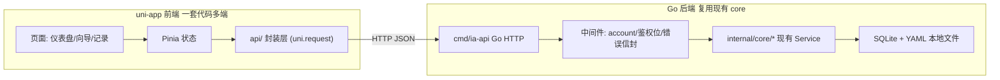

# 友好前端与 HTTP API（H8 / MVP-2 起步）

## 决策已定
- 前端：**uni-app（Vue3 + TS）** —— 一套代码编译 H5 / 微信小程序 / iOS / Android。
- 部署：**本地优先、为托管预留**。现在 API 跑 localhost、单用户、暂不实装登录；但 account 维度与鉴权中间件位预留。
- 范围：**核心决策闭环**（仪表盘 + 建仓/加仓/卖出/巡检向导 + 记录查看）。library/tags/backup 管理面暗藏，后续迭代。

## 总体架构

关键点：前端只认 `ApiSdk` 的 baseURL（配置项），localhost→服务器仅改配置即可移植；`uni.request` 在三端通用。后端 HTTP handler 仿照已有 `internal/coreingest/server.go`「API 调 core service」的先例，零业务重写。

## 一、后端：新增 `cmd/ia-api`（Go HTTP）

新建 `cmd/ia-api/main.go` + `internal/api/`（router、handler、中间件、响应信封）。路由用标准库 `net/http` + 轻量 mux（`chi`，免 CGO），与现有 `internal/cli` 平行复用 core。

- account 解析复用 [internal/core/account/context.go](internal/core/account/context.go) 的 `ResolveFromEnv()` / `WithAccount()`；per-request 通过 `X-Account-Id` header（缺省 default），为多账户预留。
- 鉴权中间件**占位**（默认放行，留 TODO 与接口位）。
- 统一响应信封 `{ "data": ..., "error": {code,message} }`，彻底解决「命令后要记 id」——所有写接口返回完整 Result（含新生成 id），前端存入状态、用户看不到 id。

首版接口（薄封装 core）：
- 仪表盘读：`GET /api/portfolio`、`GET /api/watchlist` → 复用 [internal/core/query/read.go](internal/core/query/read.go) `Reader.GetPortfolio/GetWatchlist`。
- 表单 schema：`GET /api/checklist/schema?type=buy` → 返回**字段 schema**（见第三节），驱动前端动态表单。
- 向导写：`POST /api/checklist`（draft）、`POST /api/checklist/{id}/submit`、`POST /api/checklist/{id}/plan`（sell）、`POST /api/checklist/{id}/approve`、`POST /api/checklist/{id}/reject` → 复用 [internal/core/checklist/service.go](internal/core/checklist/service.go) `CreateDraft/Submit/List/Get` 与 `approve.go`/`sell_plan.go`。
- 记录读：`GET /api/journals`、`GET /api/journals/{id}`、`GET /api/checklists` → 复用 `Reader.SearchJournal/GetJournal` 与 `Service.List`。
- 风控预检：`POST /api/risk/check` → `Reader.CheckPositionAgainstRules`。
- 体检：`GET /api/doctor?scope=all` → 复用 [internal/core/doctor](internal/core/doctor) 校验函数。

新增 CLI 入口 `inv api`（或直接 `cmd/ia-api` 二进制）启动 HTTP，与现有 `inv mcp` 区分。

## 二、前端：uni-app 工程（`frontend/`）

技术栈：uni-app + Vue3 `<script setup>` + TS + Pinia + uni-ui 组件库。目录：
- `frontend/src/api/`：HTTP 封装层（`request.ts` 包 `uni.request`，统一信封解包/错误提示；`baseURL` 走 `config`）。
- `frontend/src/store/`：Pinia（当前向导 session 持有 cs_id 等，用户无感）。
- `frontend/src/pages/`：`dashboard`（持仓/观察池卡片）、`wizard`（动态表单向导）、`records`（决策记录）。
- `frontend/src/components/DynamicForm.vue`：按字段 schema 渲染表单（label + tip 气泡 + 默认值 + 分组分列）。

「傻瓜式」落地：
- **功能项即命令、命名自解释**：首页用大按钮「我要买入」「我要加仓」「我要卖出」「巡检持仓」，而非 `checklist --type buy`。次级用 tips 补充说明。
- **向导自动串联**：用户点「我要买入」→ 填表 → 点「下一步」前端自动 `draft`→`submit`，展示 M7 结果（含 hard_block 例外说明输入框）→ 点「确认买入」自动 `approve`。全程前端内部持有 cs_id，**用户从不接触 id**。
- **智能模板**：进入表单即预填**最详细默认模板**（来自 schema 的 default），用户改值即可；字段分组分列、每项带释义 tip。

## 三、字段 Schema（驱动表单的核心，"智能模板"）

新增 `internal/core/checklist/formschema.go`：为 7 类（首版先 buy/add/sell/inspect）定义结构化字段 schema，单一数据源，CLI 与前端共用。每字段含：`key / label(中文) / type(text|number|enum|textarea|array) / required / default / tip(释义) / group(分组) / options(枚举)`。

- 数据来源：把已有 [docs/manual/ref-checklist-types.md](docs/manual/ref-checklist-types.md) 的字段语义 + [internal/core/checklist/service.go](internal/core/checklist/service.go) `DefaultPayloadTemplate` 的默认值，结构化为 Go schema。
- `GET /api/checklist/schema` 直接吐这份 schema；前端 `DynamicForm.vue` 据此渲染，新增字段只改一处。
- 与现有 `Reader.GetChecklistTemplate` 协同：schema 给「怎么填+释义」，template 给「默认值草稿」。

## 四、可移植性保障（满足扩展性要求）
- 前端业务逻辑与端无关：只通过 `api/` 与 Pinia 交互，不直接用平台 API；DOM/浏览器特有写法禁用，统一用 uni 组件 → H5/小程序/APP 同源。
- 后端无状态、按 account 维度，鉴权中间件位已留 → 未来加 JWT + 多用户即可上服务器。
- baseURL/环境用 `frontend/src/config/` 区分 dev(localhost)/prod(hosted)。

## 五、交付与验证
- 后端：`go build ./cmd/ia-api`；`go test ./internal/api/...`（handler 表驱动测试，复用 smoke account）。
- 前端：`npm run dev:h5` 浏览器联调；产出 README 写「如何起后端 + 起 H5 + 未来编译小程序」。
- 端到端：浏览器走一遍 买入→加仓→巡检→卖出 全程不输入任何 id/命令；对照 [docs/manual/MVP1-验收跑通.md](docs/manual/MVP1-验收跑通.md) 路径 A 的等价 GUI 验收。
- 文档：新增 `docs/manual/H8-web-api与前端.md`；更新 [docs/05-MVP-Roadmap.md](docs/05-MVP-Roadmap.md) 把「Web/API + 前端」列入 MVP-2 H8。

## 不在首版（明确取舍）
- 登录/多用户鉴权实装、library/tags/backup 管理 UI、小程序/APP 真机打包发布（仅保证架构可编译）、worker 行情在表单里的自动联动。
