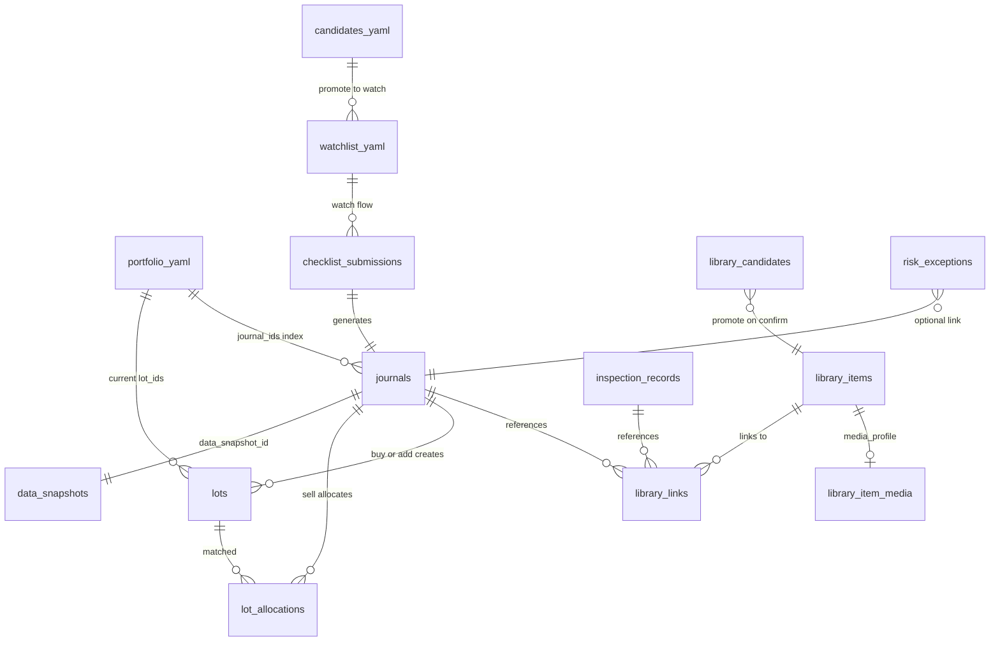
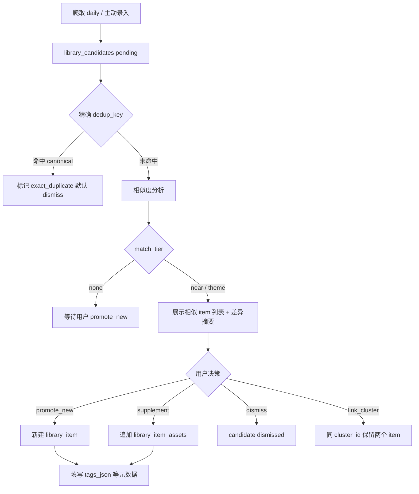
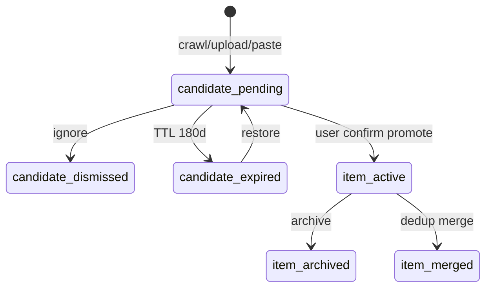
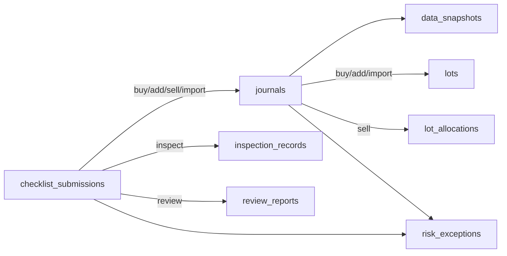
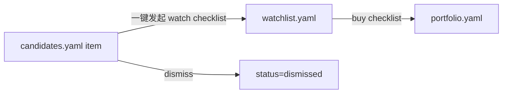
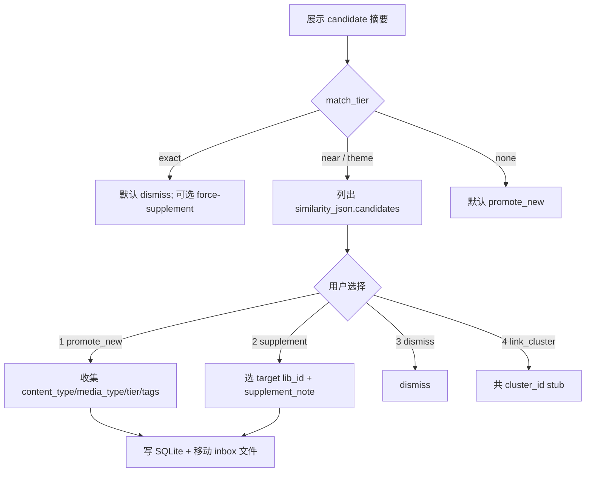
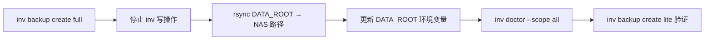

# 03 - 数据架构与数据源

> 文档版本：v0.9（Round 5 备份与 NAS 迁移）
> 最后修订：2026-05-19
> 上一阶段：[02-核心场景与功能边界](02-核心场景与功能边界.md)（v1.1）
> 下一阶段：[04-技术架构](04-技术架构.md)（v0.1 Round 1 已启动；实现见阶段 4）

---

## 一、本阶段目标

阶段 2（[02-核心场景与功能边界](02-核心场景与功能边界.md) v1.1）已定义场景、Checklist 字段与 MVP 边界。

阶段 3 要回答：

1. 哪些数据是人类可维护配置？哪些进 SQLite？哪些进文件系统？
2. **YAML 与 SQLite 各自的「真相源」是什么？** 如何避免双写不一致？
3. L1 **多模态素材**的元数据如何归纳、持久化，避免变成无序「仓库」？
4. 每个核心实体（Journal / lot / Checklist / 快照 / 素材）的字段与关系？
5. 决策快照如何冻结？lot 卖出如何匹配？
6. 外部数据源的优先级与 MVP-1 采集范围？
7. **运行时数据**如何与 Git 仓库分离？MVP-1 本地持久化、后续服务器持久化如何演进？
8. **数据模型与目录命名**如何预留**多用户（多 account）**扩展，避免 MVP-1 写死单用户？

本文档仍不讨论 Go / Python 接口、服务拆分、API 协议；这些放到阶段 4。

---

## 二、数据架构总原则

### 1. 人类可读优先（Layer A）

用户需要长期审阅、手工调整的**当前态**，放 YAML，路径在 `data/state/`（见第六节）。

### 2. 行为流水进 SQLite（Layer B）

所有持续增长、需要查询、统计、复盘、不可篡改的**流水与归因**，进 SQLite。

### 3. 原文与附件进文件系统（Layer C）

大文件、多模态二进制不进 SQLite；库内只存**元数据 + 路径 + 派生索引**。

### 4. 决策快照冻结

`data_snapshots` 一旦写入只读；L1 后续更新不得覆盖。复盘区分 `decision_snapshot` vs `current_data`（与 02 §4.5 一致）。

### 5. source / tier / timestamp

任何可能影响决策的数据，必须带这三元组；C/D 级主要依据须 `tier_acknowledgement`（与 02 §4.6 一致）。

### 6. 真相源（SoT）—— Round 1 定稿 ✅

| 决策项 | 选择 | 含义 |
|---|---|---|
| Q1 持仓主存 | **A** | **当前持仓**以 `data/state/portfolio.yaml` 为 SoT；SQLite **不**维护可变的「当前持仓表」 |
| Q2 观察池文件 | **A** | `watchlist.yaml` 与 `portfolio.yaml` **分文件**；`watching` 不进 portfolio |
| Q3 Checklist 存法 | **A** | `checklist_submissions` 存完整提交 JSON；通过后生成 `journals`，Journal 引用 `checklist_submission_id` |
| Q4 lot 卖出匹配 | **C** | 系统按 FIFO **推荐**匹配 lot，用户确认后可调整，再写入 `lot_allocations` |
| Q5 快照存储 | **A** | `data_snapshots` **独立表**；`journals.data_snapshot_id` 外键引用 |

**推论**：

- 改持仓、改 thesis、改 target/stop → 只能通过合法 Checklist / 导入流程更新 YAML + 追加 Journal。
- SQLite 负责「发生过什么」；YAML 负责「现在是什么」。
- 不在两处各存一份完整 thesis 并长期双写；Journal + 快照保留历史，YAML 只保留**当前有效版本**（可带 `thesis_version`）。

### 7. 多模态元数据「归纳」而非「堆文件」—— 见第八节

L1 不是网盘：入库须过**分类 + 必填元数据 + 去重 + 生命周期**，多模态差异落在 `media_profile`，语义分类落在 `content_type` / 受控标签。

### 8. 运行时数据与仓库代码分离—— 见第四节

`data/` 整体不进 Git；仓库内只保留 `config/*.example.yaml` 模板与文档。

### 9. 多用户扩展（account 隔离）—— Round 1.5 定稿 ✅

产品当前主要服务**一个真实用户**，但数据层与命名**不得写死单用户**；未来可能场景：

- 同一台机器 / NAS 上多个家庭成员各自账户；
- 本地服务多 account 登录（阶段 4+）；
- 服务器部署时按 account 隔离数据与备份。

**定稿原则**：

| 项 | 决策 | 说明 |
|---|---|---|
| 分区键名 | **`account_id`** | 不用 `user_id`（易与 OS 用户混淆），不用 `tenant_id`（偏 B2B SaaS 语义） |
| 物理隔离 | **每 account 独立子目录** | `data/accounts/{account_id}/` 下含 state、db、library、reports |
| SQLite | **每 account 一个库文件** | `{account}/db/assistant.sqlite`；MVP-1 不强制所有表加 `account_id` 列 |
| MVP-1 行为 | **单 active account** | 环境变量 `IA_ACCOUNT_ID`，默认 `default`；CLI/API 通过 `AccountContext` 解析路径 |
| 共享只读配置 | **仓库 `config/*.example`** | 模板可共享；实例化后写入各 account 的 `state/` |
| 跨 account | **默认禁止** | 无「合并持仓 / 共享素材库」；若未来需要，另开 `shared/` 设计，不进 MVP |

**MVP-1 实现约束（避免过度工程）**：

- 不做登录鉴权、不做 account 管理 UI；仅目录与上下文预留。
- 所有写路径经 `ResolveAccountDataRoot(account_id)`，禁止硬编码 `data/state/`。
- ID 生成仍用 `j_20260519_001` 等形式；**不必**加 account 前缀（库文件已物理隔离）。

**阶段 4+ 若改为「单库多 account」**：所有业务表补 `account_id NOT NULL` + 复合索引；迁移工具从 per-account sqlite 合并。03 阶段只记录此演进路径，MVP-1 不采用。

---

## 三、实体关系总览



### 三条主数据流（MVP-1 必须打通）

| 链路 | 步骤 |
|---|---|
| **建仓** | `checklist_submission(buy)` → `journal(buy)` + `data_snapshot` + `lot` → 更新 `portfolio.yaml` |
| **加仓** | `checklist_submission(add)` → `journal(add)` + 新 `lot` → 更新 `portfolio.yaml` |
| **卖出** | `checklist_submission(sell)` → 系统 **推荐 lot 匹配** → 用户确认 → `journal(sell)` + `lot_allocations` → 更新 `portfolio.yaml` / `closed` |

| 链路 | 步骤 |
|---|---|
| **素材入库** | 爬取/录入 → `library_candidate` → 相似分析 → promote/supplement/dismiss → `library_item` + `library_item_assets` |
| **存量导入** | `checklist_submission(import)` 或简化表单 → `journal(import)` + 初始 `lot` + `legacy_flags` → `portfolio.yaml` |

---

## 四、运行时目录与 Git 边界

### 4.1 目录布局（MVP-1 本地持久化 + 多 account 预留）

环境变量：

| 变量 | 默认 | 说明 |
|---|---|---|
| `DATA_ROOT` | `./data` | 所有运行时数据根 |
| `IA_ACCOUNT_ID` | `default` | 当前活跃 account |

```text
investment-assistant/
├── config/                              # Git：模板（共享）
│   ├── portfolio.yaml.example
│   ├── watchlist.yaml.example
│   ├── candidates.yaml.example
│   ├── risk_rules.yaml.example
│   ├── personal_redlines.yaml.example
│   ├── backup.yaml.example              # 见 §10D.3 O5
│   ├── controlled_tags.yaml.example     # 见 §8.5 / §十一 O4
│   └── data_sources.yaml.example
├── data/                                # .gitignore
│   ├── accounts/
│   │   └── {account_id}/                # 如 default、family_dad
│   │       ├── state/                   # Layer A
│   │       │   ├── portfolio.yaml
│   │       │   ├── watchlist.yaml
│   │       │   ├── candidates.yaml
│   │       │   ├── risk_rules.yaml
│   │       │   ├── personal_redlines.yaml
│   │       │   ├── data_sources.yaml
│   │       │   └── controlled_tags.yaml # 实例化自 example（O4 选定方案后）
│   │       ├── db/
│   │       │   └── assistant.sqlite     # Layer B（本 account 独占）
│   │       ├── library/                 # Layer C
│   │       │   ├── inbox/               # 候选暂存
│   │       │   ├── docs/<year>/
│   │       │   ├── snapshots/<year>/
│   │       │   ├── uploads/<year>/
│   │       │   ├── media/<year>/
│   │       │   └── derived/<year>/
│   │       ├── reports/<year>/
│   │       └── (legacy) backups/        # 已废弃；见 §10D.2 BACKUP_ROOT
│   ├── _backups/                        # 默认备份根（与 accounts 平级，见 Round 5）
│   └── accounts.yaml                    # 可选：≥2 account 时必填（O6）
└── docs/
```

**路径解析（实现命名约定）**：

```text
AccountStateDir(account_id)   → DATA_ROOT/accounts/{account_id}/state
AccountDbPath(account_id)     → DATA_ROOT/accounts/{account_id}/db/assistant.sqlite
AccountLibraryDir(account_id) → DATA_ROOT/accounts/{account_id}/library
```

**首次启动**：若 `accounts/{IA_ACCOUNT_ID}/state/portfolio.yaml` 不存在，从 `config/*.example.yaml` 复制到该 account 的 `state/`。

> **与 v0.2 差异**：原 `data/state/` 平铺改为 `data/accounts/{account_id}/`；单用户时仅使用 `default` account，行为与单用户等价。

### 4.2 .gitignore 原则

| 进 Git | 不进 Git |
|---|---|
| 代码、文档、`config/*.example.yaml` | `data/` 全部 |
| 空目录占位可用 `.gitkeep` | `*.sqlite`、`*.db` |
| | 用户上传的 PDF/截图/音视频 |
| | 生成的报告、备份 |

### 4.3 持久化演进

> **Round 5 定稿见 §十D**（备份、NAS、`BACKUP_ROOT`、O5/O6）。

| 阶段 | 方案 | 说明 |
|---|---|---|
| **MVP-1** | 本地 `DATA_ROOT` + 每周 full backup | `_backups/` 或 `BACKUP_ROOT` |
| **MVP-2+** | NAS / 服务器挂载 | 只改 `DATA_ROOT` 指向；结构不变 |
| **后续** | restic / rclone 增量 | 阶段 4 实现；03 保留策略约定 |

> **注意**：服务器持久化不改变 SoT 模型，只改变 `DATA_ROOT` 指向；避免把业务数据写进容器无状态层。

---

## 五、存储分层（更新）

### Layer A：`data/accounts/{account_id}/state/*.yaml`

| 文件 | MVP-1 | SoT 内容 |
|---|---|---|
| `portfolio.yaml` | 是 | 当前持仓（**本 account 独占**） |
| `watchlist.yaml` | 是 | 观察池 |
| `candidates.yaml` | 是 | M6 候选池 |
| `risk_rules.yaml` | 是 | 仓位阈值 |
| `personal_redlines.yaml` | 是 | 个人禁区 |
| `data_sources.yaml` | 是 | 数据源与 tier 映射 |
| `controlled_tags.yaml` | 是 | 受控标签词表（O4 方案选定后实例化） |
| `narrative_signals.yaml` | MVP-2 | 六维阈值 |
| `overseas_peers.yaml` | MVP-2 | 海外同业映射 |

### Layer B：`data/accounts/{account_id}/db/assistant.sqlite`

| 表 | MVP-1 | 说明 |
|---|---|---|
| `checklist_submissions` | 是 | Checklist 完整 payload（JSON） |
| `journals` | 是 | 决策流水 |
| `data_snapshots` | 是 | 冻结快照 |
| `lots` / `lot_allocations` | 是 | 批次与卖出匹配 |
| `library_items` | 是 | L1 canonical 逻辑条目；`tags_json` |
| `library_item_assets` | 是 | 1:N 物理文件（primary + supplement） |
| `library_item_media` | 是 | primary 资产的模态扩展 |
| `library_candidates` | 是 | 候选队列；**TTL 180 天（O2）** |
| `library_links` | 是 | 素材关联 |
| `inspection_records` | 是 | 巡检 |
| `monitor_events` | 是 | 监控 |
| `risk_exceptions` | 是 | 风险例外 |
| `review_reports` | 是 | 复盘元数据 |
| `narrative_*` / `missed_pattern_*` | MVP-2 | 叙事与错过模式 |

> **不建** `library_tags` 关联表（O1 已定）；MVP-2 若标签统计复杂再拆表并迁移 `tags_json`。

### Layer C：`data/accounts/{account_id}/library/` + `.../reports/`

| 路径 | MVP-1 | 说明 |
|---|---|---|
| `library/docs/` | 是 | PDF 等文档 |
| `library/snapshots/` | 是 | HTML 网页快照 |
| `library/uploads/` | 是 | 用户上传 |
| `library/media/` | 是 | 图片 / 音频 / 视频等 |
| `library/derived/` | 是 | OCR 文本、摘要文本文件（非结论） |
| `reports/inspections/` | 是 | 巡检 Markdown |
| `reports/reviews/` | 是 | 复盘 Markdown |
| `reports/narrative/` | MVP-2 | 叙事报告 |

---

## 六、Round 1 定稿：核心表最小字段（草案）

> **Round 2b 完整字典见 §十A**；本节保留 Round 1 摘要。

### 6.1 `checklist_submissions`

| 字段 | 类型 | 说明 |
|---|---|---|
| `id` | TEXT PK | 如 `cs_20260519_001` |
| `checklist_type` | TEXT | watch / buy / add / inspect / sell / review / import |
| `code` | TEXT | 标的，可空（主题级观察） |
| `payload_json` | TEXT | 用户提交的完整字段（权威） |
| `status` | TEXT | draft / submitted / rejected / approved |
| `tier_acknowledgement` | INTEGER | 0/1，C/D 主要依据时必填 |
| `risk_guardrail_result_json` | TEXT | 护栏检查结果 |
| `created_at` | TEXT | ISO8601 |
| `submitted_at` | TEXT | 可空 |

### 6.2 `journals`

| 字段 | 类型 | 说明 |
|---|---|---|
| `id` | TEXT PK | 如 `j_20260519_001` |
| `action_type` | TEXT | buy / add / sell / import / rule_change |
| `code` | TEXT | |
| `checklist_submission_id` | TEXT FK | Q3A |
| `data_snapshot_id` | TEXT FK | Q5A，import 可简化快照 |
| `payload_json` | TEXT | 与 02 Journal 示例对齐的核心字段 |
| `created_at` | TEXT | |

### 6.3 `data_snapshots`

| 字段 | 类型 | 说明 |
|---|---|---|
| `id` | TEXT PK | |
| `snapshot_json` | TEXT | 02 §4.5 最小字段组 |
| `created_at` | TEXT | 冻结时间，不可更新 |

### 6.4 `lots` / `lot_allocations`（Q4C）

**`lots`**

| 字段 | 说明 |
|---|---|
| `id` | lot id |
| `journal_id` | 哪次 buy/add 创建 |
| `code` | |
| `open_at` | 开仓时间 |
| `initial_pct` / `current_pct` | 仓位占比演进 |
| `cost_basis` | 成本 |
| `status` | open / partial / closed |

**`lot_allocations`**（卖出时写入）

| 字段 | 说明 |
|---|---|
| `id` | |
| `sell_journal_id` | 卖出 journal |
| `lot_id` | |
| `allocated_pct` | 本次从该 lot 卖出的占比 |
| `match_method` | recommended_fifo / user_adjusted |
| `user_confirmed` | 1 |

**Q4C 流程**：系统默认 FIFO 生成推荐 → CLI 展示 → 用户确认或调整 → 写入 allocations → 再允许 journal 定稿。

### 6.5 `portfolio.yaml` 与 SQLite 同步规则

> **Round 3 完整字段与同步矩阵见 §十B**；本节保留摘要。

| 事件 | YAML 更新 | SQLite 追加 |
|---|---|---|
| 建仓通过 | 新增/更新 position，`state=holding`，追加 `lot_ids`、`journal_ids` | journal + lot + snapshot |
| 加仓通过 | 更新 `position_pct`，追加 lot | 同上 |
| 卖出通过 | 减少仓位或 `state=closed` | journal + lot_allocations |
| 存量导入 | 批量写入 positions，`legacy_over_limit` 标记 | journal(import) + lots |

**禁止**：直接手改 YAML 中的 `journal_ids` / `lot_ids` 而不产生对应 SQLite 流水（CLI 可提供 `doctor` 校验，见 §10B.8）。

---

## 七、决策快照 `data_snapshot` 结构（承接 02 §4.5）

`data_snapshots.snapshot_json` 建议固定 schema 版本：

```json
{
  "schema_version": 1,
  "snapshot_at": "2026-05-19T10:00:00+08:00",
  "price_snapshot": {},
  "valuation_snapshot": {},
  "market_snapshot": {},
  "library_refs": [{"library_item_id": "lib_xxx", "tier": "A", "title": "..."}],
  "watchlist_context": null,
  "risk_context": {"triggered_rules": [], "position_pct_after": 5}
}
```

---

## 八、L1 多模态元数据架构（回应「避免变成仓库」）

### 8.1 问题定义

素材来源多模态：公告 PDF、网页 HTML、截图、语音纪要、视频、结构化行情导出、用户笔记等。  
若只有一张 `library_items` 平表 + 随意 `tags`，半年后会变成**无法检索、无法引用、不敢删**的仓库。

### 8.2 设计目标

1. **归纳**：统一 canonical 模型 + 分模态扩展，而不是每种文件一个随意目录名。
2. **可追溯**：原文、派生文本、元数据分层；决策引用的是入库时的 id + 快照 tier。
3. **可治理**：候选 → 确认 → 活跃 → 归档/合并；去重与合并有明确规则。
4. **可扩展**：MVP-1 可只实现 text/pdf/html/image；schema 预留 audio/video。

### 8.3 两层入库（Staging → Canonical）

| 层 | 表/目录 | 作用 |
|---|---|---|
| **候选** | `library_candidates` + `data/library/inbox/` | 爬取/粘贴/上传的**待确认**区；可 TTL 清理 |
| **正式** | `library_items` + 类型化子目录 | 用户确认后才进入；可被 Checklist / Journal 引用 |

未确认的被动发现**不得**出现在 `related_library_ids` 合法校验中。

### 8.4 元数据模型：语义 × 模态 分离

| 维度 | 字段 | 说明 | 示例 |
|---|---|---|---|
| **语义类型** | `content_type` | 这条素材**是什么** | announcement / report / article / note / transcript / data |
| **载体模态** | `media_type` | **怎么存** | text / pdf / html / image / audio / video / structured |
| **模态扩展** | `media_profile` JSON | 模态特有属性 | 见下表 |
| **可信度** | `source`, `tier`, `timestamp` | 必填 | |
| **关联** | `related_stocks_json`, `tags_json` | 标的与**受控分类标签**（见 §8.9）；**不负责**去重/合并 |
| **生命周期** | `status` | active / archived / merged | |
| **去重** | `dedup_key`, `duplicate_of` | 合并链 | |

**`media_profile` 示例（按 `media_type` 分 schema，存 `library_item_media` 表或 JSON 列）**

| media_type | media_profile 字段 |
|---|---|
| pdf | `page_count`, `file_sha256`, `has_text_layer` |
| html | `url`, `crawl_at`, `snapshot_path` |
| image | `width`, `height`, `ocr_derived_text_path` |
| audio | `duration_sec`, `transcript_path`, `language` |
| video | `duration_sec`, `transcript_path` |
| structured | `schema_name`, `row_count`（如 CSV 财务导出） |

**派生物**不进 `library_items` 主行，放 `library/derived/<year>/`，用 `derived_assets` 或在 `media_profile` 中记路径：

- `extracted_text_path`：全文检索用（MVP-2 FTS 消费）
- `thumbnail_path`：预览用

### 8.5 避免「仓库化」的治理规则

| 规则 | 说明 |
|---|---|
| **入库门槛** | 进入 `library_items` 必须：`title` + `content_type` + `media_type` + source/tier/timestamp |
| **受控标签** | **O4:C** 分层词表 `controlled_tags.yaml`（§8.8）；`tags_json` 仅允许 `system(enabled)` + `user` |
| **去重** | `dedup_key = hash(source + canonical_url)` 或 `hash(title + date + primary_stock)`；重复进入合并流程 |
| **合并** | `status=merged`，`merged_into_id` 指向保留条目 |
| **归档** | 长期未引用且已 supersede 的素材可 `archived`（默认不删文件，MVP-2 再讨论冷存储） |
| **候选过期** | `library_candidates` **180 天**未处理 → 标记 `expired`，进清理队列（可恢复为 candidate） |
| **禁止** | 把未审核爬取结果直接 bulk insert 到 `library_items` |

### 8.6 与 Checklist / Journal 的引用

- Checklist 只引用 `library_items.id`（canonical）。
- Journal 快照中冻结 `library_refs[]`（id + tier + title），不冻结文件路径（路径可变，id 不变）。
- `library_links` 记录：`entity_type`（journal / checklist / inspection）+ `entity_id` + `library_item_id` + `link_role`（evidence / context / counter_evidence）。

### 8.7 MVP-1 vs MVP-2（L1 数据）

| 能力 | MVP-1 | MVP-2 |
|---|---|---|
| media_type | text, pdf, html, image, structured；**audio/video 可进 candidate，确认后 canonical（O3）** | 转写/预览增强 |
| 候选队列 | 有；TTL **180 天** | 自动填充增强 |
| 受控标签 | **O4:C** 三层词表；MVP-2 可迁 SQLite `tag_vocab` | |
| 全文检索 | 精确匹配 + derived 文本文件 | FTS5 on derived text |
| 相似检索 | MVP-1 规则相似（§8.11） | 向量/语义增强 |

---

## 8.9 `tags_json` 职责边界（归纳 ≠ 打标签）

**结论：`tags_json` 不是 L1「归纳」的实现手段，而是 canonical 素材上的受控分类索引。**

| 机制 | 解决什么问题 | 发生在哪一步 |
|---|---|---|
| **`library_candidates` 候选区** | 先暂存、待审，禁止直接进仓库 | 录入/爬取后**第一步** |
| **`dedup_key` 精确去重** | 同一 URL / 同一文件 | 候选创建时**自动** |
| **相似度分析 `similarity_*`** | 主题相近但正文不同 | 候选创建后**自动** |
| **用户决策 promote / supplement / dismiss** | 新建、补充已有、丢弃 | **归纳的核心** |
| **`library_item_assets` 多份正文** | 同一主题多来源「合并补充」 | supplement 时写入 |
| **`tags_json`** | 行业/主题/事件等**检索维度** | promote/supplement **之后**人工或半自动选择 |
| **`cluster_id`（可选）** | 弱关联：相关但不合并 | 用户选「关联但不合并」 |

```text
归纳（防无序扩张）        ≠        分类（便于检索）
─────────────────                  ─────────────────
候选 → 去重/相似 → 人决策           tags_json + content_type
→ canonical / supplement            + related_stocks
```

**`tags_json` 定义（定稿）**

- 类型：`string[]`，元素为 `controlled_tags.yaml` 中 **有效 tag id**（`enabled(system) ∪ user`）。
- 作用：检索、过滤、复盘统计（「这类标签的素材在决策中表现如何」）。
- 不做：内容去重、正文合并、相似度判断。
- 可选：AI **建议** tag id 列表，用户勾选后写入（禁止 AI 直接写入 item）。

---

## 8.10 L1 归纳流水线（爬取 + 主动录入统一）

两类入口**必须先进入同一套候选与分析流程**，差异只在调度与交互强度。

### 入口 A：系统爬取（被动）

| 项 | 定稿 |
|---|---|
| 默认频率 | **每日 1 次**（可配置，见 `data_sources.yaml` → `library_crawl`） |
| 范围 | 当前 account 的 **持仓 + 观察池** 标的相关公告/财报列表等（MVP-1 简版） |
| 产物 | 仅写入 `library_candidates`，**不**直接写 `library_items` |
| 人工环节 | 每日（或按需）运行 `library review-candidates` 批量审阅 |

### 入口 B：主动录入（manual）

| 项 | 定稿 |
|---|---|
| 触发 | CLI 粘贴 URL / 上传文件 / 文本 |
| 产物 | 同样先写 `library_candidates` |
| 人工环节 | **录入后立即**走交互式审阅（相似提示 + 三选一/四选一） |

### 统一流水线



**配置示例**（`config/data_sources.yaml.example` 已扩展 `library_crawl` 段）：

```yaml
library_crawl:
  enabled: true
  schedule: daily          # daily | cron（MVP-2）
  run_at: "08:00"
  timezone: Asia/Shanghai
  scopes: [portfolio, watchlist]
  source_types: [announcement, earnings_calendar]
```

---

## 8.11 相似度、合并补充与丢弃（具体语义）

### 三层匹配（由强到弱）

| `match_tier` | 含义 | 系统默认建议 | 用户可 override |
|---|---|---|---|
| `exact` | `dedup_key` 相同或 file hash 相同 | **dismiss**（不新增） | 强制 supplement（极少） |
| `near` | 同标的 + 高标题/摘要重叠，或同 URL 路径变体 | **supplement** 或 dismiss | promote_new |
| `theme` | 同 related_stocks / 同主题标签重叠，正文差异大 | **提示** supplement vs new vs cluster | 用户必选 |
| `none` | 无可靠相似 | **promote_new** | — |

相似度 MVP-1 可用**规则引擎**（同 code + 标题 token 重叠 + 时间窗 + tags 交集），MVP-2 再加 embedding；**设计上一致**：结果写入 candidate 的 `similarity_json`。

**`similarity_json` 示例（candidate 字段，§9.2 扩展）**

```json
{
  "match_tier": "theme",
  "candidates": [
    {"library_item_id": "lib_20260501_003", "score": 0.72, "reason": "same_stock+title_overlap"}
  ],
  "diff_summary": "新文多一段管理层表态；旧文缺少销量数据",
  "analyzed_at": "2026-05-19T08:05:00+08:00"
}
```

### 四种用户决策（归纳的核心）

| 决策 | 代码 | 效果 | 何时用 |
|---|---|---|---|
| **新建 canonical** | `promote_new` | 新 `library_item` + primary `library_item_assets` | 确为新主题/新角度 |
| **合并补充** | `supplement` | 向已有 item **追加 asset**；`tags_json` **并集去重合并**（tags:A）；可更新 `summary_by_user` | 同主题、正文有增量 |
| **丢弃** | `dismiss` | candidate → dismissed | 精确重复或无价值 |
| **关联不合并** | `link_cluster` | 两个 item 共 `cluster_id`，各保留独立 id | 相关但不应合成一篇 |

**Supplement 时 `tags_json`（tags:A ✅）**

```
tags_json_new = unique( tags_json_existing ∪ tags_json_candidate ∪ tags_user_added )
```

- 合并后仍须通过 O4:C 词表校验（仅 `enabled(system) ∪ user`）。
- CLI 展示合并 diff（新增了哪些 tag、保留了哪些）。
- 用户可在 supplement 交互中删减 tag，但不能写入词表外 id。

**「合并补充」不等于 `status=merged`**

- `supplement`：**保留**原 `library_item.id`（Checklist 引用不断），**增加**一份来源文件。
- `merged`：旧 item 退役，引用应迁移到 `merged_into_id`（用于错误 duplicate 修正，少用于日常补充）。

### 爬取 vs 主动录入的交互差异

| | 爬取 | 主动录入 |
|---|---|---|
| 相似提示 | 批处理列表中展示 | **立即**交互式提示 |
| 默认动作 | 批量审阅，无默认自动 promote | 必须用户确认才 promote/supplement |
| AI 角色 | 可生成 `diff_summary`、tag **建议** | 同左 |
| AI 禁止 | 自动 promote / 自动 supplement / 写 tags_json | 同左 |

---

## 8.8 受控标签 O4:C 分层词表（已定稿 ✅）

**设计原则**：schema 与流程一次定好；MVP-1 可先实现 `system + user` 校验，`suggested` 流程预留 CLI 命令即可。

### 三层语义

| 层 | 写入者 | 能否进 `tags_json` | MVP-1 |
|---|---|---|---|
| `system` | 随版本发布 / example 初始化 | ✅（`enabled: true`） | **实现** |
| `user` | 用户 CLI `tags add` | ✅ | **实现** |
| `suggested` | 复盘 / 批量建议（非 AI 自动生效） | ❌ 须 `tags confirm` 晋升到 `user` | **预留** |

### 校验规则

1. `library_items.tags_json` 内每个 id 必须 ∈ `enabled(system) ∪ user`。
2. `suggested` 中的 id 出现在 tags_json → **拒绝提交**。
3. 自由文本只允许写入 `user_notes`， never 作为 tag。
4. 复盘若产出新主题词，写入 `suggested`；用户 confirm 后 append 到 `user`（可记录 `source_review_id`）。

### 预留 CLI

> **完整命令面见 §十C**（Round 4 定稿）。MVP-1 须实现 `system + user` 校验；`suggested` 流程可 stub。

| 命令组 | 核心 |
|---|---|
| `inv library …` | ingest / review / promote / supplement / dismiss / merge |
| `inv tags …` | list / add / confirm / reject |
| `inv doctor` | YAML ↔ SQLite 一致性 |

完整 example：`config/controlled_tags.yaml.example`（`schema_version: 2`）。

---

## 九、Round 2：`library_*` 表字段字典

> **范围**：L1 四表 + 文件路径约定 + 状态机 + MVP 实现边界。  
> **account 隔离**：以下表均位于 `data/accounts/{account_id}/db/assistant.sqlite`，无需 `account_id` 列。

### 9.1 总览与关系



| 表 | 职责 |
|---|---|
| `library_candidates` | 待确认区（staging）+ 相似度分析结果 |
| `library_items` | canonical **逻辑条目**（一个「研究主题/材料包」） |
| `library_item_assets` | 物理文件 **1:N**（primary + supplement） |
| `library_item_media` | primary 资产的模态扩展 1:1 |
| `library_links` | 素材 ↔ 业务实体 |

**ID 约定**

| 实体 | 格式 | 示例 |
|---|---|---|
| candidate | `lc_{YYYYMMDD}_{seq}` | `lc_20260519_001` |
| library_item | `lib_{YYYYMMDD}_{seq}` | `lib_20260519_001` |
| link | `ll_{YYYYMMDD}_{seq}` | `ll_20260519_001` |

### 9.2 `library_candidates`

入库前队列；**禁止**被 Checklist `related_library_ids` 引用。

| 字段 | 类型 | 必填 | 填写者 | 说明 |
|---|---|---|---|---|
| `id` | TEXT PK | 是 | 系统 | |
| `status` | TEXT | 是 | 系统/用户 | `pending` / `dismissed` / `promoted` / `expired` |
| `source_entry` | TEXT | 是 | 系统 | `manual` / `passive_discovery` / `crawl` / `import_batch` |
| `title` | TEXT | 是 | 系统/用户 | 可用户改 |
| `source` | TEXT | 是 | 系统/用户 | 来源名称 |
| `tier` | TEXT | 是 | 系统/用户 | S/A/B/C/D |
| `timestamp` | TEXT | 是 | 系统 | 原始发布或采集时间 ISO8601 |
| `author` | TEXT | 否 | 系统 | |
| `content_type` | TEXT | 条件 | 系统/用户 | promote 前必填 |
| `media_type` | TEXT | 条件 | 系统/用户 | promote 前必填 |
| `related_stocks_json` | TEXT | 否 | 系统/用户 | JSON 数组，如 `["002624","600519"]` |
| `tags_json` | TEXT | 否 | 用户 | promote 时校验；候选阶段可空 |
| `dedup_key` | TEXT | 是 | 系统 | 见 §9.6；UNIQUE |
| `staging_path` | TEXT | 否 | 系统 | 相对 `library/inbox/` 的原文件 |
| `canonical_url` | TEXT | 否 | 系统 | 网页类去重主键之一 |
| `extract_json` | TEXT | 否 | 系统/AI | 结构化抽取（标题/时间/标的候选），**非结论** |
| `summary_draft` | TEXT | 否 | AI | 事实摘要草稿；promote 时可拷贝到 item |
| `similar_item_ids_json` | TEXT | 否 | 系统 | **deprecated → 用 `similarity_json`** |
| `similarity_json` | TEXT | 否 | 系统 | §8.11：match_tier、候选列表、diff_summary |
| `match_tier` | TEXT | 否 | 系统 | none / exact / near / theme（冗余索引，便于筛选） |
| `resolution` | TEXT | 否 | 用户/系统 | pending / promote_new / supplement / dismiss / link_cluster |
| `resolution_target_item_id` | TEXT | 否 | 用户 | supplement/cluster 时指向已有 item |
| `expires_at` | TEXT | 是 | 系统 | `created_at + 180d` |
| `promoted_library_item_id` | TEXT | 否 | 系统 | promote 后回填 |
| `dismissed_reason` | TEXT | 否 | 用户 | ignore 时可选 |
| `created_at` | TEXT | 是 | 系统 | |
| `updated_at` | TEXT | 是 | 系统 | |

**索引建议**：`(status, expires_at)`、`dedup_key UNIQUE`、`related_stocks_json` 仅应用层过滤（MVP-1）。

**MVP-1 实现**：CRUD + promote/dismiss + 过期标记 job（可手动 `library expire-candidates`）。  
**预留**：自动相似合并建议、批量 promote。

### 9.3 `library_items`

用户确认后的 **canonical** 素材；Checklist / Journal 只引用此表 `id`。

| 字段 | 类型 | 必填 | 填写者 | 说明 |
|---|---|---|---|---|
| `id` | TEXT PK | 是 | 系统 | `lib_*` |
| `status` | TEXT | 是 | 系统/用户 | `active` / `archived` / `merged` |
| `title` | TEXT | 是 | 用户 | |
| `source` | TEXT | 是 | 用户/系统 | |
| `tier` | TEXT | 是 | 用户/系统 | S/A/B/C/D |
| `timestamp` | TEXT | 是 | 用户/系统 | 原始发布时间 |
| `collected_at` | TEXT | 是 | 系统 | 入库时间 |
| `author` | TEXT | 否 | 用户/系统 | |
| `content_type` | TEXT | 是 | 用户 | announcement / report / article / note / transcript / data |
| `media_type` | TEXT | 是 | 用户/系统 | text / pdf / html / image / audio / video / structured |
| `related_stocks_json` | TEXT | 否 | 用户 | JSON 数组 |
| `tags_json` | TEXT | 否 | 用户 | JSON 数组；id 来自 O4:C 有效词表 |
| `dedup_key` | TEXT | 是 | 系统 | UNIQUE；与 candidate 延续 |
| `canonical_url` | TEXT | 否 | 系统 | |
| `cluster_id` | TEXT | 否 | 用户/系统 | `link_cluster` 时共享 |
| `primary_asset_id` | TEXT | 否 | 系统 | → `library_item_assets.id` |
| `summary_by_user` | TEXT | 否 | 用户 | 02 S0 可选备注 |
| `user_notes` | TEXT | 否 | 用户 | 自由文本 |
| `promoted_from_candidate_id` | TEXT FK | 否 | 系统 | |
| `merged_into_id` | TEXT FK | 否 | 系统 | `status=merged` 时必填 |
| `duplicate_of_id` | TEXT FK | 否 | 系统 | 软重复指向，可不 merge |
| `schema_version` | INTEGER | 是 | 系统 | 元数据 schema 版本，当前 `1` |
| `reference_count` | INTEGER | 否 | 系统 | 被 link/快照引用次数（冗余，便于归档） |
| `last_referenced_at` | TEXT | 否 | 系统 | |
| `archived_at` | TEXT | 否 | 系统 | |
| `created_at` | TEXT | 是 | 系统 | |
| `updated_at` | TEXT | 是 | 系统 | |

**索引建议**：`status`、`dedup_key UNIQUE`、`timestamp`、`content_type`、`media_type`；MVP-2 FTS 外挂 derived 文本。

**与 02 对齐**：S0 必填项均覆盖；`tags` → `tags_json` + O4:C。

### 9.4 `library_item_assets`（1:N 物理来源）

一个 **canonical item** 可挂载多份正文（合并补充的基础）。

| 字段 | 类型 | 必填 | 说明 |
|---|---|---|---|
| `id` | TEXT PK | 是 | `la_{YYYYMMDD}_{seq}` |
| `library_item_id` | TEXT FK | 是 | |
| `asset_role` | TEXT | 是 | `primary` / `supplement` / `variant` |
| `source` | TEXT | 是 | 该份材料自己的来源 |
| `tier` | TEXT | 是 | 该份材料自己的 tier |
| `timestamp` | TEXT | 是 | 该份材料原始时间 |
| `file_path` | TEXT | 条件 | 相对 `library/` |
| `file_sha256` | TEXT | 否 | |
| `canonical_url` | TEXT | 否 | |
| `promoted_from_candidate_id` | TEXT | 否 | |
| `supplement_note` | TEXT | 否 | 为何补充（用户填） |
| `created_at` | TEXT | 是 | |

**规则**：每个 `library_item` 恰有 **1 个** `asset_role=primary`；`supplement` 决策只新增 supplement 行，**不改变** `library_items.id`。

### 9.5 `library_item_media`

与 **primary asset** 1:1（模态扩展挂在主资产上；supplement 可各有独立 media 行，MVP-2）。

| 字段 | 类型 | 必填 | 说明 |
|---|---|---|---|
| `library_item_id` | TEXT PK FK | 是 | → `library_items.id` |
| `mime_type` | TEXT | 否 | 如 `application/pdf` |
| `file_sha256` | TEXT | 否 | 主文件 hash |
| `file_size_bytes` | INTEGER | 否 | |
| `media_profile_json` | TEXT | 否 | 按 `media_type` 的扩展字段（§8.4 表） |
| `derived_assets_json` | TEXT | 否 | 见下 |
| `updated_at` | TEXT | 是 | |

**`derived_assets_json` 结构（schema_version 1）**

```json
{
  "extracted_text_path": "derived/2026/lib_20260519_001.txt",
  "thumbnail_path": null,
  "transcript_path": null,
  "ocr_path": null
}
```

| media_type | MVP-1 派生 | MVP-2 预留 |
|---|---|---|
| pdf | `extracted_text_path`（可选） | 页级截图 |
| html | snapshot 已在 `primary_file_path` | readability 正文 |
| image | `ocr_path`（可选） | |
| audio / video | 仅 `transcript_path` 占位 | 转写流水线 |
| structured | 无 | schema 校验报告 |

### 9.6 `library_links`

素材与业务实体的**显式关联**；便于图谱查询与引用计数。

| 字段 | 类型 | 必填 | 说明 |
|---|---|---|---|
| `id` | TEXT PK | 是 | `ll_*` |
| `library_item_id` | TEXT FK | 是 | |
| `entity_type` | TEXT | 是 | 见枚举 |
| `entity_id` | TEXT | 是 | 目标实体 id |
| `link_role` | TEXT | 是 | 见枚举 |
| `created_at` | TEXT | 是 | |
| `created_by` | TEXT | 是 | `user` / `system` |

**`entity_type` 枚举（可扩展）**

| 值 | MVP-1 | 说明 |
|---|---|---|
| `checklist_submission` | 是 | |
| `journal` | 是 | |
| `inspection_record` | 是 | |
| `watchlist_item` | 是 | code 或 watch id |
| `review_report` | 是 | |
| `narrative_signal_pack` | MVP-2 | 预留 |
| `candidate` | 否 | 禁止；candidate 用 promote 链 |

**`link_role` 枚举**

| 值 | 说明 |
|---|---|
| `evidence` | 决策主要依据 |
| `context` | 背景材料 |
| `counter_evidence` | 反向证据（加仓等） |
| `snapshot_ref` | 写入 data_snapshot 时的引用 |

**唯一约束建议**：`(library_item_id, entity_type, entity_id, link_role)` UNIQUE。

**MVP-1**：Checklist/Journal 提交时自动写 link；**预留**反向查询 API「某素材被哪些决策引用」。

### 9.7 去重键 `dedup_key`

| 优先级 | 规则 | 适用 |
|---|---|---|
| 1 | `sha256:{file_sha256}` | 有文件上传 |
| 2 | `url:{normalized_url}` | 有 `canonical_url` |
| 3 | `meta:{hash(source+title+timestamp+primary_stock)}` | 无 URL/文件 |

冲突处理（精确层）：

1. 新 candidate 与某 **asset** 的 hash/url 相同 → `match_tier=exact`，默认 dismiss。
2. 用户选 **supplement** → 仍追加 asset（需填 `supplement_note` 说明为何 exact 仍要留，一般不应发生）。

主题相近（`near` / `theme`）走 §8.11 相似度流程，**不**靠 `dedup_key`  alone。

### 9.8 文件路径约定（Layer C）

根：`data/accounts/{account_id}/library/`

| media_type | `primary_file_path` 示例 |
|---|---|
| pdf | `docs/2026/lib_20260519_001.pdf` |
| html | `snapshots/2026/lib_20260519_001.html` |
| image / audio / video | `media/2026/lib_20260519_001.{ext}` |
| text（内联） | 空；正文存 `extract_json.body` 或 derived txt |
| structured | `uploads/2026/lib_20260519_001.csv` |
| candidate 暂存 | `inbox/2026/lc_20260519_001.pdf` |

**原则**：路径**相对 account library 根**；换机/NAS 迁移只改 `DATA_ROOT`。

### 9.9 核心流程与数据写入

**Promote new（candidate → 新 item）**

1. 校验必填 + `tags_json`（O4:C）。
2. INSERT `library_items` → INSERT primary `library_item_assets` → `library_item_media`。
3. candidate `resolution=promote_new`，`status=promoted`。

**Supplement（candidate → 已有 item）**

1. 展示 `similarity_json.diff_summary`（主动录入必展示；爬取批处理中展示）。
2. 用户确认目标 `library_item_id` + `supplement_note`。
3. INSERT `library_item_assets`（role=supplement）。
4. **`tags_json` 并集去重合并**（tags:A）：`unique(item.tags ∪ candidate.tags ∪ 用户勾选)`，写回 `library_items`；可选更新 `summary_by_user`。
5. candidate `resolution=supplement`，`status=promoted`。
5. **不**新建 `library_item`；已有 Journal 引用保持有效。

**Dismiss**

- candidate `status=dismissed`；精确重复默认走此分支。

**引用（Checklist / Journal）**

1. 只引用 `library_items.id`（不是 asset id）。
2. 快照可选冻结 `primary_asset` 的 source/tier；supplement 后 item 层 tier 取用户标注的主依据。

### 9.10 MVP-1 实现 vs 预留

| 能力 | MVP-1 实现 | 预留 |
|---|---|---|
| 爬取 daily → candidates | ✅ 配置 + 简版抓取 | cron 调度器 |
| 主动录入 → candidates | ✅ | |
| 精确 dedup_key | ✅ | |
| 规则相似度 + similarity_json | ✅ | embedding |
| 交互 promote / supplement / dismiss | ✅ 主动必交互；爬取批处理 | link_cluster |
| library_item_assets 1:N | ✅ 表 + supplement 流程 | 每 asset 独立 media |
| tags_json 校验 | ✅ | AI 建议 tags |
| FTS | ❌ | MVP-2 |

---

## 十A、Round 2b：决策流水表字段字典

> **范围**：`checklist_submissions` → `journals` / `inspection_records` / `review_reports` + `data_snapshots` + `lots` + `lot_allocations` + `risk_exceptions`。  
> **权威字段**：Checklist 以 `checklist_submissions.payload_json` 为准；Journal 为通过后的**不可变投影** + 关联 id。  
> **对齐**：[02-核心场景与功能边界](02-核心场景与功能边界.md) 第十六章。  
> **类型列**：下文 `TEXT` / `INTEGER` / `REAL` 为 **逻辑类型**（SQLite 存储类 shorthand）。跨 MySQL/Postgres 的物理映射与 `DECIMAL` 精度规则见 [04-技术架构 §10.4](04-技术架构.md#104-逻辑类型与关系型数据库兼容-)。

### 10A.1 Checklist → 产物映射

| `checklist_type` | 写入 SQLite | 更新 YAML | 创建 snapshot | 创建 lot |
|---|---|---|---|---|
| `watch` | `checklist_submissions` | `watchlist.yaml` | ❌ | ❌ |
| `buy` | + `journals` | `portfolio.yaml` | ✅ | ✅ 新 lot |
| `add` | + `journals` | `portfolio.yaml` | ✅ | ✅ 新 lot |
| `inspect` | + `inspection_records` | 可选更新 position 监控字段 | ❌ | ❌ |
| `sell` | + `journals` + `lot_allocations` | `portfolio.yaml` | ✅ 可选简版 | 关闭/部分关闭 lot |
| `review` | + `review_reports` | 可选改 rules/redlines | ❌ | ❌ |
| `import` | + `journals` | `portfolio.yaml` | 简版 | ✅ 初始 lot(s) |



### 10A.2 `checklist_submissions`（完整）

| 字段 | 类型 | 必填 | 说明 |
|---|---|---|---|
| `id` | TEXT PK | 是 | `cs_{YYYYMMDD}_{seq}` |
| `checklist_type` | TEXT | 是 | watch / buy / add / inspect / sell / review / import |
| `code` | TEXT | 否 | 标的；主题级观察可空 |
| `name` | TEXT | 否 | |
| `payload_json` | TEXT | 是 | **用户提交全文**（schema 见 §10A.3） |
| `payload_schema_version` | INTEGER | 是 | 当前 `1` |
| `status` | TEXT | 是 | draft / submitted / approved / rejected |
| `submitted_by` | TEXT | 是 | MVP-1 固定 `user`；预留 account 操作者 |
| `tier_acknowledgement` | INTEGER | 条件 | 0/1；C/D 主要依据必填 |
| `emotion_self_check` | TEXT | 条件 | 高风险情绪二次确认说明 |
| `risk_guardrail_result_json` | TEXT | 是 | M7 检查结果快照 |
| `exception_json` | TEXT | 条件 | hard block 后继续时：reason + expected_compensation + review_date |
| `linked_library_ids_json` | TEXT | 否 | 冗余索引，便于查询 |
| `generated_journal_id` | TEXT | 否 | approve 后回填 |
| `generated_inspection_id` | TEXT | 否 | inspect 类型回填 |
| `generated_review_id` | TEXT | 否 | review 类型回填 |
| `created_at` | TEXT | 是 | |
| `submitted_at` | TEXT | 条件 | submitted/approved 时有值 |
| `approved_at` | TEXT | 条件 | |

**索引**：`(checklist_type, code, submitted_at)`、`status`、`generated_journal_id`。

**原则**：draft 可反复改；**approved 后不可改** payload（若要更正，走新 submission + 引用旧 id）。

### 10A.3 `payload_json` 分类型 schema（schema_version 1）

> 下列字段与 02 §16.x 一一对应；未列出字段视为该类型不存在。  
> 所有 **用户结论字段** 必须带 `"author": "user"`（实现层校验，MVP-1 可选，阶段 4 强制）。

**`watch`** — 观察池（§16.1）

```json
{
  "code": "002624",
  "name": "完美世界",
  "watch_type": "stock",
  "source_entry": "passive_discovery",
  "watch_reason": "...",
  "hypothesis": "...",
  "key_metrics_to_watch": ["..."],
  "expected_trigger": "...",
  "invalid_condition": "...",
  "review_date": "2026-06-18",
  "priority": "high",
  "related_library_ids": ["lib_..."],
  "related_positions": [],
  "notes": null
}
```

**`buy`** — 建仓（§16.2）

```json
{
  "source_entry": "from_watchlist",
  "position_type": "swing",
  "buy_reason_summary": "...",
  "investment_thesis": "...",
  "expected_return_driver": ["narrative_repricing"],
  "target_price": 36.0,
  "target_price_exception_reason": null,
  "stop_loss": 12.0,
  "stop_loss_exception_reason": null,
  "reversal_conditions": ["..."],
  "position_size_plan": { "initial_pct": 5, "max_pct": 10 },
  "opportunity_cost_benchmark": "CSI_TECH",
  "confidence": "medium",
  "emotion_tag": "calm",
  "identified_risks": ["..."],
  "related_library_ids": ["lib_..."],
  "no_library_reason": null,
  "tier_acknowledgement": true,
  "narrative_stage_assessment_id": null,
  "notes": null
}
```

**`add`** — 加仓（§16.4）

```json
{
  "linked_buy_journal_id": "j_...",
  "linked_inspection_id": "insp_...",
  "add_trigger": "thesis_strengthened",
  "add_reason_summary": "...",
  "thesis_change": "strengthened",
  "thesis_change_explanation": "...",
  "new_evidence": ["..."],
  "counter_evidence": ["..."],
  "add_pct": 3,
  "max_pct_after_add": 10,
  "target_price": { "lower": 32, "upper": 36 },
  "stop_loss": 12,
  "target_price_action": "update",
  "stop_loss_action": "keep",
  "reversal_conditions_update": ["沿用原条件"],
  "emotion_tag": "calm",
  "is_averaging_down": false,
  "averaging_down_reason": null,
  "related_library_ids": ["lib_..."],
  "tier_acknowledgement": false
}
```

**`inspect`** — 巡检（§16.3）

```json
{
  "inspection_type": "monthly",
  "linked_buy_journal_id": "j_...",
  "industry_roe_trend": "stable",
  "free_cash_flow_trend": "stable",
  "market_share_trend": "stable",
  "core_narrative_status": "intact",
  "classification": "wait_for_style_switch",
  "planned_action": "hold",
  "confidence": "medium",
  "thesis_delta": "...",
  "new_reversal_conditions": [],
  "hold_despite_reversal_reason": null,
  "hold_despite_value_trap_reason": null,
  "related_library_ids": [],
  "narrative_stage_assessment_id": null
}
```

**`sell`** — 卖出/减仓（§16.5）

```json
{
  "sell_type": "reduce",
  "sell_trigger": "target_reached",
  "sell_reason": "target_achieved",
  "sell_reason_detail": "...",
  "sell_pct": 3,
  "linked_buy_journal_ids": ["j_...", "j_..."],
  "linked_inspection_id": "insp_...",
  "thesis_result": "partially_validated",
  "thesis_result_explanation": "...",
  "attribution": {
    "thesis_contribution": "...",
    "execution_quality": "...",
    "mistake_type": null,
    "result_category": "good_process_good_result"
  },
  "emotion_tag": "calm",
  "is_panic_sell": false,
  "is_switch_trade": false,
  "switch_target": null,
  "lesson": "...",
  "rule_change_suggestion": null,
  "lot_allocation_plan": [
    { "lot_id": "lot_...", "allocated_pct": 3, "user_adjusted": false }
  ]
}
```

> `lot_allocation_plan`：approve 前系统 FIFO **推荐**，用户可改 `user_adjusted: true`（Q4C）。

**`review`** — 周期性复盘（§16.6）

```json
{
  "review_type": "quarterly",
  "period_start": "2026-04-01",
  "period_end": "2026-06-30",
  "confirmed_patterns": [{ "pattern": "good_discipline", "explanation": "..." }],
  "good_process_bad_result_cases": [],
  "bad_process_good_result_cases": ["..."],
  "rule_change_decisions": [],
  "next_period_focus": ["..."],
  "notes": null
}
```

**`import`** — 存量导入（§S0.5）

```json
{
  "import_batch_id": "imp_20260519_001",
  "positions": [
    {
      "code": "002624",
      "name": "完美世界",
      "position_pct": 5,
      "cost_basis": 17.0,
      "position_type": "swing",
      "import_thesis_summary": "...",
      "related_library_ids": [],
      "no_library_reason": "...",
      "legacy_flags": ["legacy_over_limit_sector"]
    }
  ]
}
```

### 10A.4 `journals`（完整）

| 字段 | 类型 | 必填 | 说明 |
|---|---|---|---|
| `id` | TEXT PK | 是 | `j_{YYYYMMDD}_{seq}` |
| `action_type` | TEXT | 是 | buy / add / sell / import / rule_change |
| `code` | TEXT | 条件 | import 可空（批次级） |
| `name` | TEXT | 否 | |
| `checklist_submission_id` | TEXT FK | 条件 | rule_change 可来自 review 流程 |
| `data_snapshot_id` | TEXT FK | 条件 | buy/add/sell 必填；import/rule_change 可简版或 null |
| `payload_json` | TEXT | 是 | 从 checklist **冻结复制**（approve 时刻） |
| `summary` | TEXT | 否 | 一行摘要，便于列表 |
| `lot_id` | TEXT FK | 条件 | buy/add/import 创建时指向新 lot |
| `created_at` | TEXT | 是 | **不可变** |

**`action_type` 与 lot 关系**

| action_type | 新建 lot | lot_allocations |
|---|---|---|
| buy | ✅ | — |
| add | ✅ | — |
| sell | — | ✅ |
| import | ✅（每只标的） | — |
| rule_change | — | — |

**索引**：`(code, created_at)`、`action_type`、`checklist_submission_id`、`lot_id`。

### 10A.5 `data_snapshots`（完整）

| 字段 | 类型 | 必填 | 说明 |
|---|---|---|---|
| `id` | TEXT PK | 是 | `snap_{YYYYMMDD}_{seq}` |
| `journal_id` | TEXT FK | 是 | 反向关联 |
| `snapshot_json` | TEXT | 是 | 见 §七 + 下表 |
| `schema_version` | INTEGER | 是 | `1` |
| `created_at` | TEXT | 是 | **只读，禁止 UPDATE** |

**`snapshot_json` 字段（schema_version 1）**

| 键 | 必填 | 说明 |
|---|---|---|
| `snapshot_at` | 是 | ISO8601 |
| `code` / `name` | 条件 | 标的决策时有 |
| `price_snapshot` | buy/add/sell | 现价、涨跌幅、距上次决策变化 |
| `valuation_snapshot` | buy/add/sell | PE/PB/PS 分位等 |
| `market_snapshot` | 建议 | 指数、板块、流动性摘要 |
| `library_refs` | 条件 | `[{library_item_id, tier, title}]` |
| `watchlist_context` | 条件 | 来自观察池时 |
| `risk_context` | 是 | 护栏结果、仓位占比 |
| `portfolio_context` | sell/add | 卖出/加仓前总仓位、板块暴露 |

**import 简版快照**：仅 `snapshot_at` + `portfolio_context`（整体 legacy 标记）。

### 10A.6 `lots`（完整 — 02 硬要求：lot 级归因）

| 字段 | 类型 | 必填 | 说明 |
|---|---|---|---|
| `id` | TEXT PK | 是 | `lot_{YYYYMMDD}_{seq}` |
| `code` | TEXT | 是 | |
| `name` | TEXT | 否 | |
| `journal_id` | TEXT FK | 是 | 开启该 lot 的 buy/add/import journal |
| `action_type` | TEXT | 是 | buy / add / import |
| `position_type` | TEXT | 是 | core / swing |
| `open_at` | TEXT | 是 | |
| `close_at` | TEXT | 否 | lot 完全关闭时 |
| `initial_pct` | REAL | 是 | 该 lot 产生时占总资产比例 |
| `current_pct` | REAL | 是 | 随卖出递减 |
| `cost_basis` | REAL | 是 | 该 lot 成本价 |
| `shares` | REAL | 否 | 若用户维护股数 |
| `status` | TEXT | 是 | open / partial / closed |
| `linked_buy_journal_id` | TEXT | 条件 | add 类型 lot 指向原建仓 journal |
| `created_at` | TEXT | 是 | |

**归因规则（定稿）**

- 每个 buy/add/import **各建独立 lot**；不用 FIFO 建 lot，FIFO 只用于 **卖出匹配**（Q4C）。
- 复盘「加仓是否有效」= 对比 add lot 关闭时的收益 vs 同期 benchmark。

**索引**：`(code, status)`、`journal_id`。

### 10A.7 `lot_allocations` + Q4C 卖出流程

| 字段 | 类型 | 必填 | 说明 |
|---|---|---|---|
| `id` | TEXT PK | 是 | `la_{YYYYMMDD}_{seq}` |
| `sell_journal_id` | TEXT FK | 是 | |
| `lot_id` | TEXT FK | 是 | |
| `allocated_pct` | REAL | 是 | 本次卖出从该 lot 扣减的**总仓位百分点** |
| `cost_basis_at_sale` | REAL | 是 | 系统：lot.cost_basis |
| `proceeds_pct` | REAL | 否 | 系统辅助 |
| `realized_return_pct` | REAL | 否 | 系统：该 allocation 收益 |
| `match_method` | TEXT | 是 | recommended_fifo / user_adjusted |
| `user_confirmed` | INTEGER | 是 | 1 |
| `created_at` | TEXT | 是 | |

**Q4C 流程（MVP-1 必须交互）**

1. 用户提交 sell checklist 前，系统按 **lot.open_at FIFO** 生成 `lot_allocation_plan` 草稿。
2. CLI 展示每 lot 分配 + 预计 realized_return；用户可调整。
3. `sum(allocated_pct) = sell_pct`；否则拒绝 approve。
4. approve 后：写 `lot_allocations` → 更新各 lot `current_pct` / `status` → 写 journal → 更新 `portfolio.yaml`。

**约束**：不允许 allocation 指向 `status=closed` 的 lot。

### 10A.8 `risk_exceptions`

| 字段 | 类型 | 必填 | 说明 |
|---|---|---|---|
| `id` | TEXT PK | 是 | `rx_{YYYYMMDD}_{seq}` |
| `severity` | TEXT | 是 | warning / hard_block |
| `rule_source` | TEXT | 是 | risk_rules / personal_redlines |
| `rule_id` | TEXT | 是 | 如 r001、single_stock_pct |
| `checklist_submission_id` | TEXT FK | 是 | |
| `journal_id` | TEXT FK | 条件 | hard_block 且用户继续时有 |
| `exception_reason` | TEXT | 条件 | hard_block 必填 |
| `expected_compensation` | TEXT | 条件 | hard_block 必填（02 §18.7） |
| `review_date` | TEXT | 条件 | hard_block 必填 |
| `outcome_note` | TEXT | 否 | 复盘时填 |
| `created_at` | TEXT | 是 | |

**原则**：warning 也入库（02 已定）；复盘须逐条确认 hard_block 结果。

### 10A.9 `inspection_records` / `review_reports`（Checklist 非 Journal 产物）

**`inspection_records`**（inspect checklist approve 后）

| 核心字段 | 说明 |
|---|---|
| `id` | `insp_{YYYYMMDD}_{seq}` |
| `checklist_submission_id` | FK |
| `code`, `inspection_type` | |
| `linked_buy_journal_id` | |
| `fact_update_summary_json` | 系统/AI 事实区 |
| `user_judgment_json` | 四维度+四象限+planned_action 等 |
| `report_path` | 可选 Markdown |

**`review_reports`**（review checklist approve 后）

| 核心字段 | 说明 |
|---|---|
| `id` | `rev_{period}_{seq}` |
| `checklist_submission_id` | FK |
| `review_type`, `period_start`, `period_end` | |
| `stats_json` | 系统统计区 |
| `user_judgment_json` | confirmed_patterns 等 |
| `report_path` | `reports/reviews/` |

> Round 3 YAML 全字段见 **§十B**；此处只定 SQLite 锚点与 report 路径约定。

### 10A.10 `rule_change` Journal

复盘批准修改 `risk_rules.yaml` / `personal_redlines.yaml` / Checklist 模板时：

```json
{
  "change_target": "personal_redlines",
  "change_type": "add",
  "before": "...",
  "after": "...",
  "reason": "...",
  "evidence_review_id": "rev_2026Q2_001"
}
```

写入 `journals.action_type=rule_change`；**不**创建 lot。

### 10A.11 O7 定稿：长文本存储策略 ✅

| 场景 | 策略 |
|---|---|
| Checklist / Journal `payload_json` | 始终 SQLite JSON；单字段字符串建议 **≤ 8KB** |
| L1 短文本（≤ 4KB） | 可 inline `extract_json.body` |
| L1 长文本（> 4KB） | 写 `library/derived/`，JSON 只存 path |
| MVP-2 FTS | 只索引 derived 文本路径 |

### 10A.12 MVP-1 实现 vs 预留

| 能力 | MVP-1 | 预留 |
|---|---|---|
| 7 类 checklist payload 校验 | ✅ watch/buy/add/inspect/sell/review/import | schema_version 迁移 |
| approve → journal / inspection / review | ✅ | |
| data_snapshot 冻结 | ✅ | |
| lot 每 buy/add/import | ✅ | |
| sell FIFO 推荐 + 用户确认 | ✅ | |
| risk_exceptions warning+hard | ✅ | |
| `author:user` 硬校验 | stub | 阶段 4 |
| inspection/review Markdown | ✅ 路径字段 | 模板引擎 |

---

## 十B、Round 3：Layer A YAML 全字段字典

> **范围**：`portfolio.yaml`、`watchlist.yaml`、`candidates.yaml`、`risk_rules.yaml`、`personal_redlines.yaml`；可选 `accounts.yaml`。  
> **路径**：`DATA_ROOT/accounts/{account_id}/state/`（模板在 `config/*.example.yaml`）。  
> **对齐**：[02-核心场景与功能边界](02-核心场景与功能边界.md) 12A 状态机、§16.x Checklist、§18 M7。

### 10B.1 通用约定

| 约定 | 说明 |
|---|---|
| `schema_version` | 整数；当前 Layer A 统一为 `1` |
| `account_id` | 可选镜像字段；权威 account 由目录路径决定 |
| 时间 | ISO8601 字符串，或 YAML date（`review_date` 等） |
| 标的代码 | 6 位字符串，如 `"002624"` |
| 仓位单位 | **`position_pct` = 占总资产百分比**（0–100，非小数） |
| 索引字段 | `journal_ids` / `lot_ids` 为 SQLite id 列表，**只追加、不手改** |
| 人类编辑 | 允许手改 `investment_thesis`、`notes`；改 `position_pct` / `lot_ids` 须走 Checklist 或 `doctor` 报错 |

**与 12A 状态机对齐**

| 文件 | 允许的 `state` | 不含 |
|---|---|---|
| `portfolio.yaml` | `holding` / `closed` | `watching`（在 watchlist）、`inspecting`/`adjusting`（用 SQLite 任务表达） |
| `watchlist.yaml` | `watching` / `removed` | `holding` |
| `candidates.yaml` item | `pending` / `dismissed` / `promoted` | — |

### 10B.2 `portfolio.yaml`

**SoT**：当前持仓与已平仓标的的**当前有效视图**（Q1A）。历史决策在 SQLite `journals` + `lots`。

#### 根结构

| 字段 | 类型 | 必填 | 说明 |
|---|---|---|---|
| `schema_version` | int | 是 | `1` |
| `meta` | object | 是 | 见下表 |
| `positions` | list | 是 | 持仓列表；无持仓时为 `[]` |

**`meta`**

| 字段 | 类型 | 必填 | 说明 |
|---|---|---|---|
| `updated_at` | string | 是 | 最后一次合法写入时间 |
| `total_equity_ref` | number | 否 | 用户可选维护的总资产参考值（算 pct 用；行情系统可覆盖） |
| `currency` | string | 否 | 默认 `CNY` |

#### `positions[]` 字段

| 字段 | 类型 | 必填 | 说明 |
|---|---|---|---|
| `code` | string | 是 | 标的代码，文件内唯一（同一 code 仅一条，`closed` 后保留） |
| `name` | string | 是 | |
| `state` | enum | 是 | `holding` / `closed` |
| `position_type` | enum | 是 | `core` / `swing` |
| `position_pct` | number | 是 | **当前**占总资产 %；= 所有 `open`/`partial` lot 的 `current_pct` 之和 |
| `cost_basis` | number | 是 | 加权平均成本；系统由 open lots 重算 |
| `shares` | number | 否 | 若用户维护股数 |
| `sector_id` | string | 否 | 受控标签 id（如 `sector_broker`），供 M7 板块集中度 |
| `thesis_id` | string | 否 | 单一 thesis 暴露分组 id；多标的同逻辑时相同 |
| `entry_date` | date | 是 | 首次进入 `holding` 的日期 |
| `closed_at` | date | 条件 | `state=closed` 时必填 |
| `thesis_version` | int | 是 | 从 `1` 起；用户更新 thesis 时 +1 |
| `investment_thesis` | text | 是 | **当前**持有逻辑（非历史） |
| `target_price` | number / object | 是 | 数值或 `{lower, upper}` |
| `stop_loss` | number | 是 | |
| `reversal_conditions` | list | 是 | 至少 1 项 |
| `opportunity_cost_benchmark` | enum | 是 | `HS300` / `CSI_TECH` / `sector_index` / `custom` |
| `confidence` | enum | 否 | `low` / `medium` / `high`；最近一次 buy/add 快照 |
| `related_library_ids` | list | 否 | 当前有效依据素材 |
| `lot_ids` | list | 是 | 关联 lot id（含已关闭 lot，便于归因） |
| `journal_ids` | list | 是 | 关联 journal id，按时间追加 |
| `watchlist_origin_id` | string | 否 | 若从观察池升级：`w_*` |
| `legacy_flags` | list | 否 | 如 `legacy_over_limit`、`legacy_over_limit_sector`、`legacy_over_limit_thesis` |
| `monitoring` | object | 否 | M4 监控摘要，见下表 |
| `notes` | text | 否 | 用户自由备注 |

**`monitoring`（可选，inspect 或 M4 更新）**

| 字段 | 说明 |
|---|---|
| `last_inspection_id` | 最近巡检 `insp_*` |
| `last_inspection_at` | |
| `next_inspection_due` | 下次建议巡检日 |
| `classification` | 最近一次四象限分类（只读缓存，权威在 inspection_records） |
| `planned_action` | 最近一次计划动作缓存 |

**`closed` 标的保留策略**：卖出清仓后 **不删除** position，改 `state=closed`、`position_pct=0`，保留 `journal_ids` / `lot_ids` 供复盘。

#### 示例

见 `config/portfolio.yaml.example`。

### 10B.3 `watchlist.yaml`

**SoT**：观察池（Q2A）；`watching` **不进** portfolio。

#### 根结构

| 字段 | 类型 | 必填 |
|---|---|---|
| `schema_version` | int | 是 |
| `meta.updated_at` | string | 是 |
| `items` | list | 是 |

#### `items[]` — 对齐 02 §16.1

| 字段 | 类型 | 必填 | 说明 |
|---|---|---|---|
| `id` | string | 是 | `w_{YYYYMMDD}_{seq}` |
| `code` | string | 条件 | 主题级观察可空 |
| `name` | string | 是 | |
| `watch_type` | enum | 是 | `stock` / `theme` / `person` |
| `state` | enum | 是 | `watching` / `removed` |
| `source_entry` | enum | 是 | `manual` / `passive_discovery` / `from_candidate` / `from_inspection` |
| `source_candidate_id` | string | 条件 | `from_candidate` 时填 `cand_*` |
| `watch_reason` | text | 是 | |
| `hypothesis` | text | 是 | |
| `key_metrics_to_watch` | list | 是 | ≥1 |
| `expected_trigger` | text | 是 | |
| `invalid_condition` | text | 是 | |
| `review_date` | date | 是 | |
| `priority` | enum | 否 | `low` / `medium` / `high` |
| `related_library_ids` | list | 否 | |
| `related_positions` | list | 否 | 关联持仓 `code` |
| `created_at` | string | 是 | |
| `updated_at` | string | 否 | |
| `removed_at` | string | 条件 | `state=removed` |
| `removed_reason` | enum | 条件 | `invalidated` / `no_longer_relevant` / `promoted_to_holding` / `merged` / `other` |
| `removed_detail` | text | 条件 | `removed_reason=other` 时 |
| `promoted_journal_id` | string | 条件 | `promoted_to_holding` 时填建仓 `j_*` |
| `notes` | text | 否 | |

**流转**

- **watch checklist approve** → 新增或更新 item，`state=watching`。
- **升级建仓** → item 改 `removed` + `removed_reason=promoted_to_holding` + `promoted_journal_id`；portfolio 新增 `holding`。
- **剔除** → `removed` + 原因；**不**写 portfolio。

### 10B.4 `candidates.yaml`（M6 简版）

**SoT**：周/月级**事件候选清单**（02 §S1.5）；不是观察池、不是持仓。

#### 根结构

| 字段 | 类型 | 必填 |
|---|---|---|
| `schema_version` | int | 是 |
| `meta.updated_at` | string | 是 |
| `batches` | list | 是 |

#### `batches[]`

| 字段 | 类型 | 必填 | 说明 |
|---|---|---|---|
| `id` | string | 是 | `cb_{YYYYMMDD}_{seq}` |
| `title` | string | 是 | 事件标题 |
| `event_type` | enum | 是 | `policy` / `earnings_season` / `sector_rotation` / `macro` / `manual` / `other` |
| `period` | enum | 是 | `weekly` / `monthly` / `adhoc` |
| `summary` | text | 是 | **事实摘要**，非结论 |
| `created_at` | string | 是 | |
| `review_by` | date | 否 | 建议处理截止日期 |
| `status` | enum | 是 | `active` / `archived` |
| `report_path` | string | 否 | `reports/candidates/` Markdown |
| `items` | list | 是 | 候选条目 |

#### `batches[].items[]`

| 字段 | 类型 | 必填 | 说明 |
|---|---|---|---|
| `id` | string | 是 | `cand_{YYYYMMDD}_{seq}` |
| `code` | string | 条件 | 主题级可空 |
| `name` | string | 是 | |
| `candidate_kind` | enum | 是 | `stock` / `theme` / `sector` |
| `fact_summary` | text | 是 | 与该候选相关的事实 |
| `source_refs` | list | 是 | ≥1，`{source, tier, captured_at, url?, library_candidate_id?}` |
| `status` | enum | 是 | `pending` / `dismissed` / `promoted` |
| `dismissed_reason` | text | 条件 | dismissed 时 |
| `promoted_watchlist_id` | string | 条件 | promoted 时填 `w_*` |
| `notes` | text | 否 | |

**与观察池关系**



- MVP-1：**CLI 手动**维护 batch；可选关联 `library_candidates` id。
- **promote** 只进 watchlist，**不**跳过 S1 Checklist 直接建仓。

### 10B.5 `risk_rules.yaml`

**SoT**：M7 仓位与集中度阈值（02 §18.4）。修改须走 review → `rule_change` journal。

#### 根结构

| 字段 | 类型 | 必填 |
|---|---|---|
| `schema_version` | int | 是 |
| `meta.updated_at` | string | 是 |
| `position_limits` | object | 是 |
| `legacy_over_limit` | object | 是 |
| `exceptions` | list | 否 |
| `opportunity_cost` | object | 否 | MVP-2，`enabled: false` |
| `drawdown` | object | 否 | MVP-2，`enabled: false` |

#### `position_limits`

| 键 | warning_pct | hard_block_pct | 说明 |
|---|---:|---:|---|
| `single_stock` | 10 | 15 | 单标的 |
| `single_sector` | 30 | 40 | 单板块（`sector_id` 聚合） |
| `total_equity` | 90 | 95 | 股票总仓位 |
| `single_thesis` | 20 | 30 | 同 `thesis_id` 合并 |

#### `legacy_over_limit`

| 字段 | 值 | 说明 |
|---|---|---|
| `allow_on_import` | true | S0.5 允许录入 |
| `block_expansion_on_legacy` | true | 存量超限后，新增交易若**扩大**该维度超限 → hard block |
| `flag_fields` | 见 portfolio `legacy_flags` | |

#### `exceptions[]`

| 字段 | 说明 |
|---|---|
| `code` | 标的代码 |
| `rule` | `single_stock` 等 |
| `max_pct` | 豁免上限 |
| `reason` | 文字说明 |
| `expires_at` | 可选 |

见 `config/risk_rules.yaml.example`。

### 10B.6 `personal_redlines.yaml`

**SoT**：个人禁区（02 §18.6）。**AI 不得自动修改**；复盘建议须用户确认后写入。

#### 根结构

| 字段 | 类型 | 必填 |
|---|---|---|
| `schema_version` | int | 是 |
| `meta.updated_at` | string | 是 |
| `redlines` | list | 是 |

#### `redlines[]`

| 字段 | 类型 | 必填 | 说明 |
|---|---|---|---|
| `id` | string | 是 | `r001`–`r012` 或 `r_custom_*` |
| `rule` | text | 是 | 人类可读描述 |
| `severity` | enum | 是 | `soft` / `hard` |
| `enabled` | bool | 是 | MVP-1：**r001–r005=true**，r006–r012=false |
| `related_scenarios` | list | 是 | `buy` / `add` / `sell` / `inspect` / `review` |
| `exception_allowed` | bool | 是 | hard 时是否允许例外说明继续 |
| `trigger_kind` | enum | 是 | `builtin` / `keyword` / `field_check` |
| `trigger_keywords` | list | 条件 | `keyword` 时用 |
| `trigger_condition` | text | 否 | 人类可读；`builtin` 时逻辑在代码中按 `id` 路由 |

**MVP-1 内置规则（`trigger_kind: builtin`）**

| id | enabled 默认 | severity | scenarios |
|---|---|---|---|
| r001 | ✅ | hard | add |
| r002 | ✅ | soft | sell |
| r003 | ✅ | soft | buy, add |
| r004 | ✅ | hard | buy |
| r005 | ✅ | soft | sell |
| r006–r012 | ❌ | 见 02 §18.6 | 预置，用户可开启 |

触发 hard block 时，Checklist 的 `exception_json` 与 `risk_exceptions` 表对齐（§10A.8）。

### 10B.7 Checklist → YAML 同步矩阵（完整）

| Checklist | portfolio | watchlist | candidates | risk/redlines |
|---|---|---|---|---|
| **watch** | — | 新增/更新 item | 若来自 candidate：item→`promoted` | — |
| **buy** | 新增 `holding`；写 thesis/target/stop/lots | 若有 origin：item→`promoted_to_holding` | — | 读 rules 检查 |
| **add** | ↑`position_pct`；追加 lot；可更新 target/stop/thesis | — | — | 读 rules |
| **sell** | ↓`position_pct` 或 `closed` | — | — | 读 rules |
| **inspect** | 可选更新 `monitoring.*`；thesis 变更时 ↑`thesis_version` | — | — | — |
| **review** | — | — | — | 用户确认后改 rules/redlines + `rule_change` journal |
| **import** | 批量新增 `holding` + `legacy_flags` | — | — | 标记 legacy，不阻断 |

**写入顺序（事务语义，阶段 4 实现）**

1. SQLite：checklist approved → journal / lots / allocations / snapshot。
2. YAML：按上表更新对应文件。
3. 任一失败 → 整笔回滚，`doctor` 可检测不一致。

### 10B.8 `doctor` 校验规则（MVP-1）

| 检查 | 说明 |
|---|---|
| `sum(open lots.current_pct) == position.position_pct` | 仓位一致 |
| `journal_ids` 每条 id 在 SQLite 存在 | |
| `lot_ids` 每条 id 存在且 `code` 匹配 | |
| portfolio 无 `watching` | Q2A |
| watchlist `promoted` 必有 `promoted_journal_id` | |
| closed position：`position_pct=0` 且 `closed_at` 存在 | |
| `legacy_flags` 与 M7 重算结果一致 | 可选 warning |

### 10B.9 `accounts.yaml`（O6）

> **O6 定稿见 §10D.5**。单 account MVP-1 可省略；多 account 时必填。

路径：`DATA_ROOT/accounts.yaml`（非 per-account state 内）。

### 10B.10 MVP-1 实现 vs 预留

| 能力 | MVP-1 | 预留 |
|---|---|---|
| 五类 state YAML 读写 | ✅ | |
| Checklist 驱动 YAML 更新 | ✅ | |
| `doctor` 一致性校验 | ✅ | |
| CSV → import checklist | ✅ 简版 | |
| `accounts.yaml` | 可选 | 多 account UI |
| candidate 自动 batch | — | MVP-2 扫描 |

---

## 十C、Round 4：CLI 命令面规格（L1 归纳 + 受控标签 + doctor）

> **范围**：MVP-1 命令行接口设计；**实现**放到阶段 4 [04-技术架构](04-技术架构.md)。  
> **对齐**：§8.10 归纳流水线、§9.9 数据写入、§10B.8 doctor、O4:C / tags:A。  
> **命名**：与 [01-产品定位与思路](01-产品定位与思路.md) 一致，主命令 **`inv`**。

### 10C.1 全局约定

| 项 | 定稿 |
|---|---|
| 二进制 | `inv`（`investment-assistant` 项目 CLI） |
| 环境变量 | `DATA_ROOT`（默认 `./data`）、`IA_ACCOUNT_ID`（默认 `default`） |
| 全局 flag | `--account <id>`、`--json`、`--dry-run`、`--yes`（跳过交互确认） |
| 路径解析 | 所有读写经 `AccountContext` → `accounts/{account_id}/` |
| AI 边界 | CLI **不得**自动写入用户结论字段；`tags_json` / promote 元数据须用户确认或显式 flag |
| 幂等 | `dedup_key` 冲突、`tags confirm` 已存在 → 明确报错或 no-op，不 silent 覆盖 |

**退出码**

| 码 | 含义 |
|---|---|
| `0` | 成功 |
| `1` | 用户输入 / 参数错误 |
| `2` | 业务校验失败（词表、必填字段、引用非法 candidate） |
| `3` | 数据不一致（`doctor` 失败） |
| `10` | 内部错误 |

### 10C.2 命令树（Round 4 范围）

```text
inv
├── doctor [--scope all|portfolio|watchlist|library|lots] [--fix]
├── library
│   ├── ingest          # 主动录入 → candidate
│   ├── crawl           # 触发爬取 → candidates（读 data_sources.yaml）
│   ├── candidates      # 候选队列 CRUD / 列表
│   │   ├── list
│   │   ├── show <lc_id>
│   │   └── expire      # TTL 180d → expired
│   ├── review          # 交互式归纳（核心）
│   ├── promote         # candidate → 新 library_item
│   ├── supplement      # candidate → 已有 item 追加 asset
│   ├── dismiss         # 丢弃 candidate
│   ├── link-cluster    # link_cluster 决策（stub MVP-1）
│   ├── merge           # 两个 canonical item 合并（dedup-merge）
│   ├── list / show / search
│   └── archive <lib_id>
└── tags
    ├── list
    ├── add
    ├── disable
    ├── suggest
    ├── confirm
    └── reject
```

> Checklist / Journal / 持仓等命令在阶段 4 另文定义；Round 4 **不阻塞**其设计，但 L1 命令须先可用。

### 10C.3 `inv library ingest` — 主动录入

**作用**：统一入口 B（§8.10）；**只写** `library_candidates` + `library/inbox/`。

```bash
inv library ingest --url "https://..." --stock 002624 --tier B
inv library ingest --file ./report.pdf --title "某公司年报摘要" --content-type report
inv library ingest --text "笔记正文..." --title "调研备忘" --content-type note
```

| Flag | 说明 |
|---|---|
| `--url` / `--file` / `--text` | 三选一 |
| `--title` | 可省略；系统从 extract 补全 |
| `--stock` | 可重复；写入 `related_stocks_json` |
| `--tier` | 默认读 `data_sources.yaml` |
| `--content-type` / `--media-type` | 可省略；review 前必填 |
| `--no-review` | 仅创建 candidate，不进入交互（批处理用） |

**副作用（自动）**

1. 计算 `dedup_key`（§9.7）；冲突则 `match_tier=exact`。
2. 运行规则相似度 → 写 `similarity_json`、`match_tier`。
3. 默认 **`expires_at = now + 180d`**。
4. 若无 `--no-review` → 链式调用 `inv library review --id <lc_id>`。

### 10C.4 `inv library crawl` / `candidates`

**`crawl`**：读 `state/data_sources.yaml` → `library_crawl` 段；拉持仓+观察池标的公告列表 → 批量 `library_candidates`（**never** 直写 `library_items`）。

```bash
inv library crawl [--dry-run]
inv library candidates list [--status pending|expired] [--match-tier theme]
inv library candidates show lc_20260519_001
inv library candidates expire [--dry-run]   # 手动 TTL job
```

### 10C.5 `inv library review` — 交互式归纳（核心）

**作用**：实现 §8.11 四种决策；爬取批处理与主动录入共用。

```bash
inv library review --id lc_20260519_001
inv library review --batch [--limit 20] [--match-tier near|theme|all]
```

**交互流程（MVP-1 文本 UI 即可）**



**屏幕必显字段**

| 区块 | 内容 |
|---|---|
| 候选 | title、source、tier、timestamp、related_stocks |
| 相似 | `match_tier`、`diff_summary`、Top-3 相似 `lib_*` 标题 |
| 建议 | 按 §8.11 默认动作（可 override） |
| tags | supplement/promote 时：词表勾选 + **合并 diff**（tags:A） |

**快捷键映射（建议）**

| 键 | 动作 |
|---|---|
| `1` | promote_new |
| `2` | supplement（near/theme） |
| `3` | dismiss |
| `4` | link_cluster（MVP-1 stub：提示未实现） |
| `s` | 跳过，稍后处理 |
| `q` | 退出 batch（已处理项不回滚） |

### 10C.6 `inv library promote` / `supplement` / `dismiss`

非交互式/script 用法；逻辑与 `review` 相同。

**promote**

```bash
inv library promote lc_20260519_001 \
  --content-type announcement --media-type pdf \
  --tier A --tags sector_gaming,event_earnings \
  --stock 002624 --yes
```

| 校验 | 失败码 |
|---|---|
| candidate `status=pending` | 2 |
| 必填 content_type / media_type / tier | 2 |
| `tags_json` ⊆ `enabled(system) ∪ user` | 2 |
| 含 `suggested` 层 tag | 2 |

**写入**：§9.9 promote_new 全流程；stdout 输出 `lib_*` id。

**supplement**

```bash
inv library supplement lc_20260519_001 --into lib_20260501_003 \
  --note "补充管理层表态段落" \
  --tags-add event_guidance --yes
```

| 步骤 | 说明 |
|---|---|
| tags 合并 | `unique(item.tags ∪ candidate.tags ∪ --tags-add)`，用户可用 `--tags-remove` 删减 |
| 文件 | inbox → `library/docs|snapshots|.../` 作为 `asset_role=supplement` |
| item id | **不变**（tags:A / Checklist 引用不断） |

**dismiss**

```bash
inv library dismiss lc_20260519_001 [--reason "重复且无需保留"]
```

- `exact` 默认路径；`status=dismissed`，不创建 `library_item`。

### 10C.7 `inv library merge` — canonical 级 dedup-merge

**场景**：两个 `lib_*` 误建为独立条目，需合并为一条（§8.5 `status=merged`）。

```bash
inv library merge lib_20260501_002 --into lib_20260501_003 \
  [--move-assets] [--merge-tags] --yes
```

| 步骤 | 说明 |
|---|---|
| 前置 | 两 item 均为 `active`；`--into` 为目标（保留 id） |
| assets | `--move-assets`：source 的全部 assets 改挂 target（role 保持，冲突则 supplement） |
| tags | `--merge-tags`：并集去重写 target |
| source | `status=merged`，`merged_into_id=<target>` |
| links | 所有 `library_links.library_item_id` 从 source 改指向 target（实现层事务） |
| 引用 | Journal 快照**不修改**；新决策用 target id |

**约束**：若 source 已被 snapshot 冻结引用，仍允许 merge，但 CLI 须 **warning** 列出受影响 journal 数。

**MVP-1**：表结构 + 命令 **stub**（打印将执行的操作）；**MVP-2** 完整实现。候选层 supplement 仍为主要合并路径。

### 10C.8 `inv library link-cluster`（stub）

```bash
inv library link-cluster lc_20260519_001 --with lib_20260501_003 [--cluster-id c_001]
```

- 两 item 均保持 `active`；写入相同 `cluster_id`。
- candidate `resolution=link_cluster`。
- **MVP-1 stub**：提示功能预留；不阻塞 promote/supplement。

### 10C.9 `inv library list` / `show` / `search`

```bash
inv library list [--stock 002624] [--tag sector_gaming] [--status active]
inv library show lib_20260519_001 [--with-assets]
inv library search --query "异环" [--stock 002624]   # MVP-1 标题/notes 精确匹配
inv library archive lib_20260519_001 [--reason "..."]
```

- `search`：MVP-1 精确 / LIKE；MVP-2 FTS on derived text。
- `archive`：`status=archived`；**不删** Layer C 文件。

### 10C.10 `inv tags` — 受控标签（O4:C）

词表文件：`state/controlled_tags.yaml`（模板 `config/controlled_tags.yaml.example`）。

| 命令 | 作用 | MVP-1 |
|---|---|---|
| `tags list [--layer system\|user\|suggested]` | 查看词表 | ✅ |
| `tags add --id <id> --label "..." --dimension sector` | 追加 **user** 层 | ✅ |
| `tags disable --id <id>` | `system` 项 `enabled: false` | ✅ |
| `tags suggest --id <id> --label "..." [--source review:rev_*]` | 写 **suggested** | stub |
| `tags confirm --id <id> [--id ...]` / `--all` | suggested → user | stub |
| `tags reject --id <id>` | 删除 suggested 项 | stub |

**`tags confirm` 语义**

1. 从 `suggested` 移除该 id，append 到 `user`（保留 label/dimension）。
2. 可选写 `source_review_id`。
3. 若 id 已存在于 `user` → no-op + warning。
4. confirm 后该 id **可**写入 `library_items.tags_json`。

**`tags add` 校验**：id 格式 `[a-z][a-z0-9_]{2,48}`；不与 system id 冲突。

### 10C.11 `inv doctor`

```bash
inv doctor [--scope all|portfolio|watchlist|library|lots] [--fix] [--json]
```

| scope | 检查（§10B.8 + 扩展） |
|---|---|
| `portfolio` | lot 仓位之和、journal/lot id、closed 规则、legacy_flags |
| `watchlist` | promoted 链路、无 holding 态 |
| `library` | 每 item 恰 1 个 primary asset；candidate 无被 checklist 引用；dedup_key 唯一 |
| `lots` | allocation 与 portfolio pct 一致 |
| `all` | 以上全部 |

**`--fix`**：仅安全自动修复（如重算 `meta.updated_at`、冗余 `reference_count`）；**不**自动改仓位、不 promote candidate。

### 10C.12 与 Checklist 的衔接

| 场景 | CLI 行为 |
|---|---|
| Checklist `related_library_ids` | 校验每个 id ∈ `library_items` 且 `status=active` |
| 引用 candidate | **拒绝**（exit 2），提示先 `library promote` |
| tier C/D 主要依据 | Checklist 层校验 `tier_acknowledgement`（非 library 命令职责） |
| 决策后 link | Checklist approve 时自动 INSERT `library_links`（阶段 4 实现） |

### 10C.13 MVP-1 实现 vs stub

| 命令 | MVP-1 | 备注 |
|---|---|---|
| `library ingest` | ✅ | |
| `library crawl` | ✅ 简版 | 公告列表 |
| `library candidates list/show/expire` | ✅ | |
| `library review` | ✅ | 文本交互 |
| `library promote/supplement/dismiss` | ✅ | 可 `--yes` 非交互 |
| `library list/show/search/archive` | ✅ | search 精确 |
| `library merge` | **stub** | 打印计划；MVP-2 实装 |
| `library link-cluster` | **stub** | |
| `tags list/add/disable` | ✅ | |
| `tags suggest/confirm/reject` | **stub** | 词表结构已就绪 |
| `doctor` | ✅ | `--fix` 最小集 |

### 10C.14 非目标（阶段 4 其他命令）

以下不在 Round 4 范围，阶段 4 技术文档展开：

- `inv checklist …` / `inv journal …` / `inv pos …`
- `inv risk …` / `inv review …` / `inv monitor …`
- MCP 工具面（只读库表 + doctor）

---

## 十D、Round 5：备份、NAS 迁移与 MVP-1 数据源清单

> **范围**：`DATA_ROOT` 可靠性、备份/恢复、NAS 迁移、`accounts.yaml`（O6）、MVP-1 外部数据接入清单。  
> **实现**：阶段 4 提供 `inv backup` / `inv data-root`；MVP-1 可用 `scripts/backup.example.*` 手工执行。

### 10D.1 设计原则

| 原则 | 说明 |
|---|---|
| **业务数据与备份分离** | 备份写入 `BACKUP_ROOT`，**不**放在 `accounts/{id}/` 业务树内（避免递归备份） |
| **account 粒度** | 每个 account 独立备份包；多 account 可逐个或 `--all` |
| **SQLite 一致性** | 备份前 `PRAGMA wal_checkpoint(TRUNCATE)` 或短暂停写（阶段 4 实现） |
| **可恢复验证** | 每次 backup 写 `manifest.json`；restore 后必须跑 `inv doctor` |
| **NAS = 换 DATA_ROOT** | 不改变 SoT 模型；只迁移目录 + 更新环境变量 |

### 10D.2 环境变量与目录

| 变量 | 默认 | 说明 |
|---|---|---|
| `DATA_ROOT` | `./data` | 运行时业务根 |
| `BACKUP_ROOT` | `{DATA_ROOT}/_backups` | 备份输出根（与 `accounts/` **平级**） |
| `IA_ACCOUNT_ID` | `default` | 当前 account |

**备份包路径**

```text
{BACKUP_ROOT}/{account_id}/{YYYYMMDD_HHmmss}/
├── manifest.json          # 元数据、文件清单、schema 版本
├── state/                 # Layer A YAML 副本
├── db/
│   └── assistant.sqlite
├── library/               # full 模式；lite 模式省略
├── reports/               # full 模式
└── checksums.sha256       # 可选完整性校验
```

**`manifest.json` 最小字段**

| 键 | 说明 |
|---|---|
| `backup_id` | 同目录名时间戳 |
| `account_id` | |
| `mode` | `lite` / `full` |
| `created_at` | ISO8601 |
| `data_root` | 备份时 DATA_ROOT 绝对路径 |
| `schema_versions` | portfolio/watchlist/sqlite migration 版本 |
| `file_count` / `byte_size` | 统计 |
| `inv_version` | CLI 版本（阶段 4 写入） |

### 10D.3 O5 定稿：备份策略 ✅

| 编号 | 决策 |
|---|---|
| **O5A 频率** | MVP-1 **每周手动**至少 1 次 `full` 或 `lite`；无后台定时任务 |
| **O5B 提醒** | 提交 **buy/add/sell/import** Checklist 前：若距上次 backup **>7 天**，CLI **warning**（不阻断） |
| **O5C 模式** | **`lite`**：state + db（默认 weekly）；**`full`**：+ library + reports（每月或重大变更前） |
| **O5D 保留** | 每 account 默认保留 **8** 份；`inv backup prune --keep 8` |
| **O5E 增量** | MVP-1 **不做**增量；MVP-2 可选 restic 至 NAS 二级副本 |
| **O5F 异地** | 用户自行把 `BACKUP_ROOT` 同步到网盘/NAS（rclone 等）；产品不内置云上传 |

**配置**：`state/backup.yaml`（模板 `config/backup.yaml.example`），可覆盖 retain_count、默认 mode。

### 10D.4 `inv backup` / `restore` / `prune`（阶段 4 实现）

```bash
inv backup create [--account default] [--mode lite|full] [--destination DIR]
inv backup list [--account default]
inv backup show <backup_id>
inv backup restore --from <backup_id> [--account] [--dry-run] [--yes]
inv backup prune [--keep 8] [--account]
```

| 命令 | 行为 |
|---|---|
| `create` | 写 `{BACKUP_ROOT}/{account}/{timestamp}/` + manifest；stdout 打印 backup_id |
| `list` | 按时间倒序列出 manifest 摘要 |
| `restore` | **覆盖**当前 account 的 state/db/(library)；`--dry-run` 仅对比 diff |
| `prune` | 删除超出 `--keep` 的旧包；**不**删业务数据 |

**restore 安全规则**

1. restore 前自动 `create --mode lite` 快照当前态（`pre_restore_*` 前缀）。
2. 默认需交互确认；`--yes` 用于脚本。
3. 完成后强制提示 `inv doctor --scope all`。

**MVP-1 手工替代**：见 `scripts/backup.example.ps1` / `backup.example.sh`。

### 10D.5 O6 定稿：`accounts.yaml` ✅

| 场景 | 是否需要 |
|---|---|
| 仅 `default` 单 account | **可省略**；运行时隐式 `[{id: default}]` |
| ≥2 account | **必填** `DATA_ROOT/accounts.yaml` |
| NAS 多家庭成员 | 必填 + 每 account 独立 sqlite |

```yaml
schema_version: 1
accounts:
  - id: default
    display_name: 主账户
    created_at: "2026-05-19T00:00:00+08:00"
    active: true
  - id: family_dad
    display_name: 父亲账户
    created_at: "2026-06-01T00:00:00+08:00"
    active: true
```

**规则**

- `id`：`[a-z][a-z0-9_]{2,32}`，与目录名一致。
- 首次 `inv` 启动：若无 account 目录，创建 `accounts/{IA_ACCOUNT_ID}/` 并从 `config/*.example.yaml` 初始化 state。
- `inv account list` / `account create`：阶段 4 实现；MVP-1 可手建目录 + 编辑 yaml。

### 10D.6 NAS / `DATA_ROOT` 迁移流程

**场景 A：本机 DATA_ROOT 迁到 NAS 挂载**



```bash
# 1. 源机器完整备份
inv backup create --mode full

# 2. 复制（示例；Windows 可用 robocopy / NAS 同步工具）
rsync -a ./data/ /mnt/nas/investment-assistant/

# 3. 切换环境（.env / shell profile）
export DATA_ROOT=/mnt/nas/investment-assistant

# 4. 验证
inv doctor --scope all
```

**场景 B：仅备份副本上 NAS，业务仍本地**

- `BACKUP_ROOT=/mnt/nas/ia-backups` 或定期 rclone 同步 `{DATA_ROOT}/_backups`。
- `DATA_ROOT` 不变；灾难恢复时 `restore` 回本地。

**场景 C：Docker / 无状态容器（阶段 4+）**

- 容器内 **不** 持久化；仅挂载 NAS 至 `DATA_ROOT`。
- 镜像升级不影响数据。

**禁止**：迁移过程中双写两个 DATA_ROOT；必须单写者。

### 10D.7 MVP-1 数据源接入清单（定稿）

承接 §十；与 `config/data_sources.yaml.example` 对齐。

| 优先级 | 数据 | 提供商 | MVP-1 | tier | 写入 | 备注 |
|---|---|---|---|---|---|---|
| P0 | A 股现价、涨跌幅 | akshare | ✅ | A | `data_snapshots` / M4 | 持仓+观察池 codes |
| P0 | PE/PB/分位 | akshare | ✅ | A | snapshot / 巡检辅助 | |
| P0 | 公告列表 | akshare | ✅ | A | `library_candidates` | `library crawl` |
| P0 | 财报预约 | akshare | ✅ | A | `library_candidates` | 日历简版 |
| P1 | 指数/板块摘要 | akshare | ✅ | A | `market_snapshot` | 沪深300/行业指数 |
| P1 | 用户 URL/PDF/笔记 | manual | ✅ | 用户标 | `library ingest` | |
| P1 | 东财/雪球 | — | ❌ | — | — | MVP-2；tier C 候选 |
| P2 | 研报 PDF 自动拉取 | — | ❌ | — | — | MVP-2 |
| P2 | 社区热度 | xueqiu 等 | ❌ | C/D | candidate | example 中 `enabled: false` |
| — | 日级涨停/龙头 | — | **不做** | — | — | 02 永久排除 |

**MVP-1 最小闭环**：akshare + manual ingest + daily crawl（持仓/观察池公告）即可跑通 L1 → Checklist → Journal。

**凭证**：tushare token 等放 `state/secrets.yaml`（**不进 Git**；无 example 进仓库，阶段 4 `.gitignore` 约定）。

### 10D.8 阶段 3 收口

| 轮次 | 状态 |
|---|---|
| Round 1 – 1.5 | ✅ SoT、多 account |
| Round 2a – 2b | ✅ SQLite + 决策流水 |
| Round 3 | ✅ Layer A YAML |
| Round 4 | ✅ CLI 命令面 |
| Round 5 | ✅ 备份 / NAS / 数据源清单 |

**阶段 3 结论**：数据分层、表结构、YAML schema、L1 归纳 CLI、备份与迁移策略已足够支撑 [04-技术架构](04-技术架构.md) 与 MVP-1 实现。

### 10D.9 MVP-1 实现 vs 预留

| 能力 | MVP-1 | 预留 |
|---|---|---|
| `inv backup create/list/restore/prune` | ✅ | |
| 手工 scripts 备份 | ✅ example | |
| backup 前 sqlite checkpoint | ✅ | |
| restic/rclone 内置 | — | MVP-2 |
| 自动 weekly cron | — | MVP-2 |
| `secrets.yaml` 模板 | 阶段 4 | |

---

## 十、外部数据源（MVP-1 范围草案）

> **完整接入清单见 §10D.7**。

| 优先级 | 数据 | MVP-1 | 默认 tier | 写入路径 |
|---|---|---|---|---|
| P0 | 行情、估值分位 | 是 | A | 快照 / 监控，一般不单独建 library_item |
| P0 | 公告/财报列表 | 是（持仓+观察池标的） | A | 先进 `library_candidates` |
| P1 | 指数、板块摘要 | 是 | A | `market_snapshot` |
| P1 | 用户手动 URL/PDF/笔记 | 是 | 用户标 | 直接 candidate → confirm |
| P2 | 社区热度、研报热度 | MVP-2 | C/D | candidate only |
| 不做 | 日级涨停推荐 | — | — | — |

---

## 十一、阶段 3 后续讨论顺序（更新）

| 轮次 | 主题 | 状态 |
|---|---|---|
| Round 1 | SoT、目录、Git、核心表草案、lot 匹配 | ✅ |
| Round 1.5 | 多 account | ✅ |
| Round 2a | **`library_*` 四表** | ✅（§九） |
| Round 2b | journals / lots / checklist / snapshots / risk_exceptions | ✅（§十A） |
| Round 3 | 各 YAML 完整 schema | ✅（§十B + `config/*.example.yaml`） |
| Round 4 | L1 归纳 CLI、tags、doctor | ✅（§十C） |
| Round 5 | 备份、NAS、数据源清单 | ✅（§十D） |

**阶段 3 状态：定稿完成** → 进入阶段 4 技术架构。

---

## 十二、已定稿与待决事项

### 12.1 已定稿 ✅

| 编号 | 问题 | 决策 |
|---|---|---|
| O1 | 标签存储 | `library_items.tags_json` |
| O2 | candidate TTL | **180 天** → `expired` |
| O3 | audio/video | candidate → confirm → canonical |
| O4 | 受控标签 | **C 分层**：`system` / `user` / `suggested` |
| **tags:A** | supplement 时 tags | 并集去重合并 |
| **O7** | 长文本存储 | **混合**：≤4KB inline；>4KB derived；payload ≤8KB/字段 |
| **CLI** | MVP-1 命令面 | **`inv library` + `inv tags` + `inv doctor`**（§十C） |
| **O5** | 备份策略 | **weekly 手动**；lite 默认 / full 每月；保留 8 份；Checklist 前 7 天 warning |
| **O6** | `accounts.yaml` | **单 account 可省略**；≥2 account 必填 |
| — | 多用户 | `account_id` + 每 account 目录与 sqlite |

### 12.2 待决（阶段 4 结转）

| 编号 | 问题 | 说明 |
|---|---|---|
| — | `secrets.yaml` schema | 阶段 4 与 akshare/tushare 配置一并定 |
| — | restic 集成 | MVP-2 可选 |

---

## 十三、本文档变更日志

| 版本 | 日期 | 变更 |
|---|---|---|
| v0.9 | 2026-05-19 | Round 5：O5/O6 定稿、BACKUP_ROOT、backup/restore CLI、NAS 迁移流程、MVP-1 数据源清单；阶段 3 收口。 |
| v0.8 | 2026-05-19 | Round 4：`inv library` 归纳命令面、tags O4:C CLI、doctor；merge/link-cluster stub 策略。 |
| v0.7 | 2026-05-19 | Round 3：portfolio / watchlist / candidates / risk_rules / personal_redlines 全字段；同步矩阵与 doctor；`config/*.example.yaml`。 |
| v0.6 | 2026-05-19 | Round 2b：checklist_submissions 七类 payload、journals、data_snapshots、lots、lot_allocations(Q4C)、risk_exceptions、inspection/review 锚点；O7 长文本策略。 |
| v0.5.1 | 2026-05-19 | tags:A supplement 标签合并。 |
| v0.5 | 2026-05-19 | L1 归纳流水线；library_item_assets；similarity_json。 |
| v0.4 | 2026-05-19 | O4:C；Round 2a library_*。 |
| v0.3 | 2026-05-19 | 多 account；O1–O3。 |
| v0.2 | 2026-05-19 | Round 1；L1 多模态。 |
| v0.1 | 2026-05-18 | 创建底稿。 |
