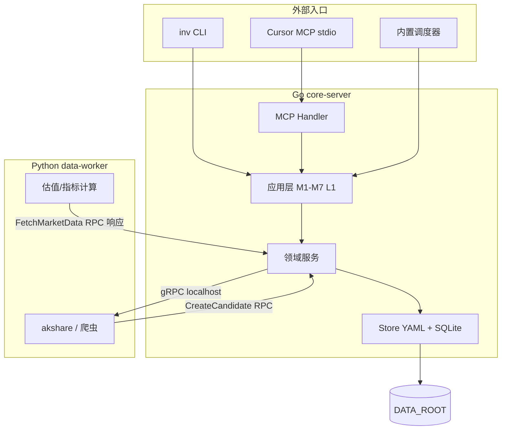
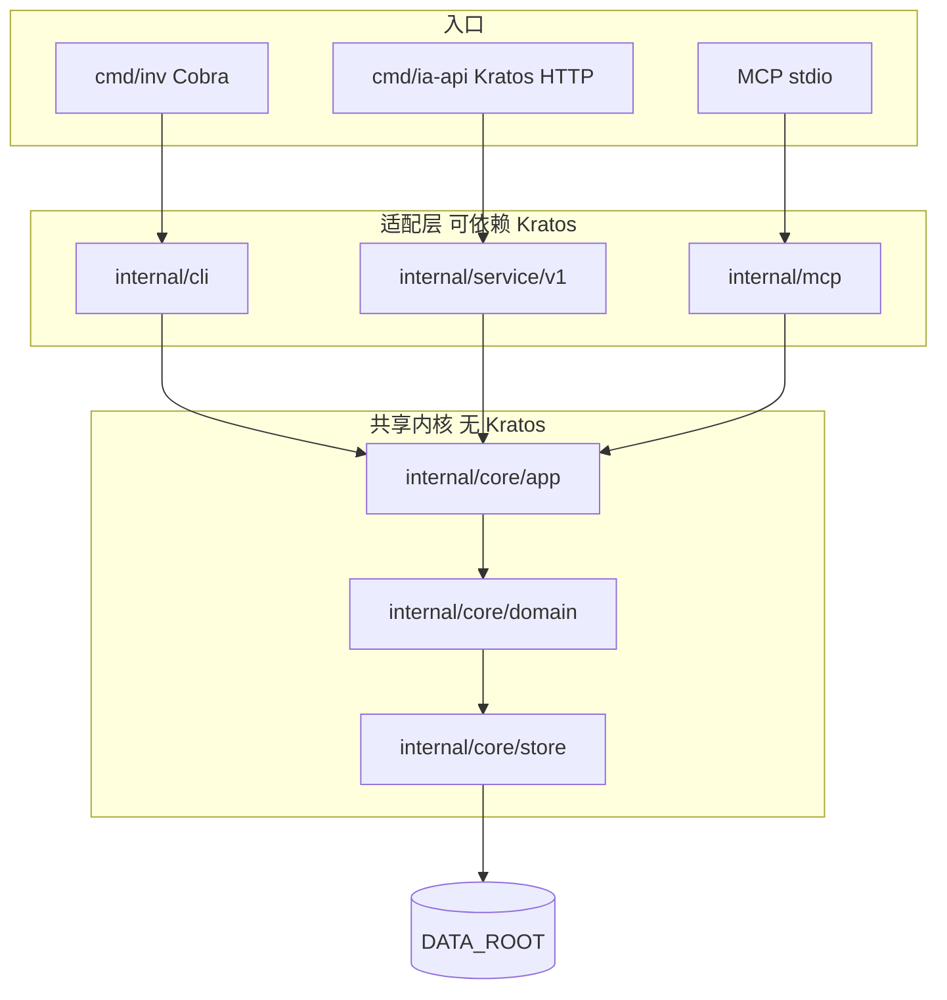
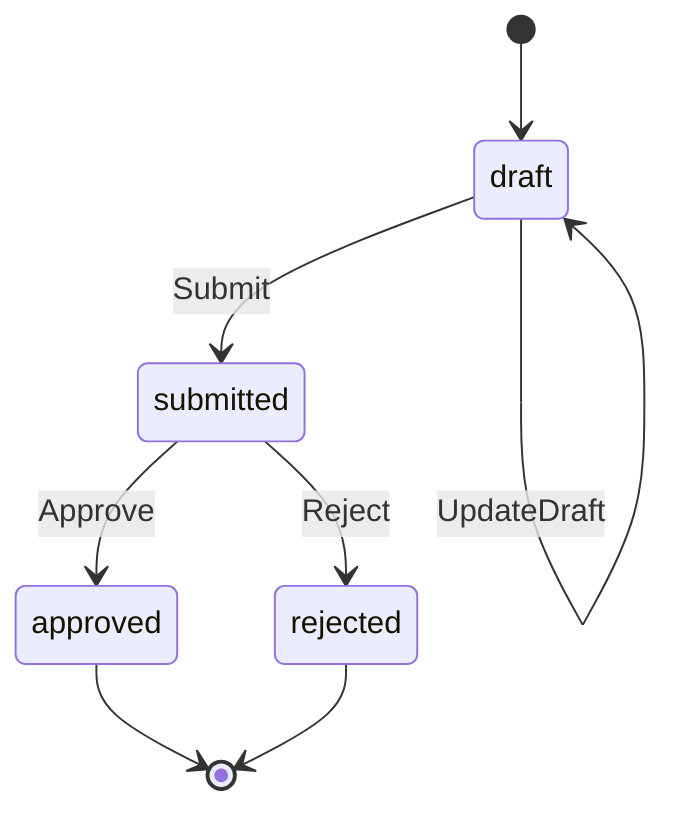
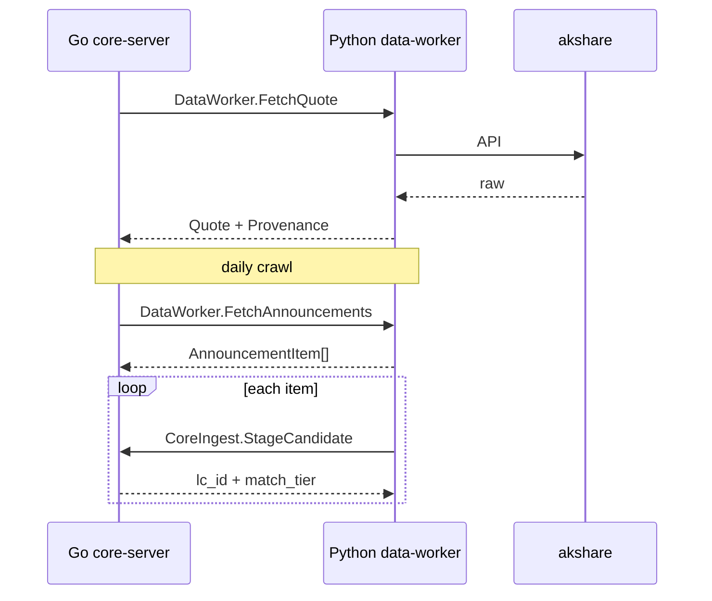

# 04 - 技术架构

> 文档版本：v0.6（Round 5 migrations + H0 骨架定稿，阶段 4 完成）
> 最后修订：2026-05-19
> 上一阶段：[03-数据架构与数据源](03-数据架构与数据源.md)（v0.9 定稿）
> 下一阶段：[05-MVP-Roadmap](05-MVP-Roadmap.md)（v0.1 定稿）

---

## 一、本阶段目标

阶段 3 已定义 **What**（实体、SoT、表结构、YAML schema、CLI 命令面、备份策略）。

阶段 4 要回答 **How**：

1. Go / Python 如何分工、如何通信？
2. 代码仓库如何组织？`inv` CLI 与 `core-server` / `data-worker` 的关系？
3. `AccountContext`、YAML 读写、SQLite 访问、事务边界如何实现？
4. Checklist approve → Journal + YAML + lot 的原子性如何保证？
5. MCP Server 如何暴露只读工具？调度器如何跑 daily crawl？
6. MVP-1 实现顺序是什么？

本文档 **不重复** 03 的字段字典；实现须严格对齐 03 §九 / §十A / §十B / §十C / §十D。

---

## 二A、代码与注释规范 ✅

> Cursor 规则：`.cursor/rules/chinese-comments.mdc`（`alwaysApply: true`）。

| 范围 | 语言 | 说明 |
|---|---|---|
| Go / Python 注释与 docstring | **简体中文** | 导出符号必注释；复杂逻辑说明业务意图 |
| Go 结构体字段 | **简体中文** | 与 03 schema 对齐的类型：**每字段**行尾/行上注释（业务含义） |
| Go 未导出函数 | **简体中文** | 含业务/SQL 校验的私有 `func` 必须注释职责与文档章节 |
| Protobuf `//` 注释 | **简体中文** | 每个 rpc/message/关键字段 |
| 架构文档 `docs/` | 简体中文 | 专有名词可保留英文 |
| 标识符 / JSON 字段名 | 英文 | 不变 |
| MCP tool `description` | 简体中文 | 须含【边界】声明（§二十二） |

**原则**：注释解释「为什么」与文档章节引用，不复述代码字面意思。涉及 AI 边界、SoT、M7 处必须写清。

**补充（H1 起强制执行）**：

1. **结构体字段**：`yamlstore` / `domain` 等映射 03 YAML 或 SQLite 的类型，每个字段须有中文注释（行尾 `//` 或字段上方），说明业务含义；可对齐 `docs/03` 章节号。
2. **未导出函数**：`checkXxx`、`validateYyy` 等包内函数，只要实现 doctor 规则、M7、FIFO 等业务逻辑，必须有中文函数注释，即使不导出。

示例见 `.cursor/rules/chinese-comments.mdc`「结构体字段」「未导出函数」两节。

---

## 二、继承的架构决策（不可违背）

来源：[00-讨论历史与决策日志](00-讨论历史与决策日志.md)、[01-产品定位与思路](01-产品定位与思路.md) v0.5、[02-核心场景与功能边界](02-核心场景与功能边界.md) v1.1。

| # | 决策 | 技术含义 |
|---|---|---|
| D1 | Python 取数 + Go 后端 | 爬虫/akshare/pandas **只在 Python**；对外 API / CLI / MCP **只在 Go** |
| D2 | Cursor MCP，非内置 LLM | 产品是 **Tool Server**；MCP 只读为主，不写结论字段 |
| D3 | DATA_ROOT 运行时隔离 | 所有业务 I/O 经 `AccountContext`；不进 Git |
| D4 | portfolio.yaml SoT | Go **不写**「当前持仓表」到 SQLite；YAML 与 SQLite 同步见 03 §10B.7 |
| D5 | L1 候选 → 确认 | Python 爬取结果经 gRPC 写 **candidate**；promote 必须 Go + 用户确认 |
| D6 | Journal / snapshot 不可变 | approve 后 INSERT only；无 UPDATE snapshot / approved payload |
| D7 | AI 不写结论 | 代码层校验 `author:user`（MVP-1 可 warn，**MVP-1 末强制**） |

---

## 三、系统总览



**MVP-1 运行时**：用户机器上 **1 个 Go 进程**（含 CLI 子命令或 `inv serve` 常驻）+ **1 个 Python 子进程**（由 Go supervise，gRPC 仅绑定 `127.0.0.1`）。

---

## 四、Round 1 定稿：进程与部署模型

### 4.1 进程角色

| 进程 | 名称 | 职责 |
|---|---|---|
| Go | **core-server** | 全部业务逻辑、存储、CLI、MCP、调度、M7 规则引擎 |
| Python | **data-worker** | 外部数据拉取、财务指标计算、HTML/PDF 解析；**不**持有业务 DB 连接 |

### 4.2 启动模式（T4 ✅）

| 模式 | 命令 | 场景 |
|---|---|---|
| **一次性 CLI** | `inv <subcommand>` | 默认；懒启动 Python（首次需 fetch 时） |
| **常驻服务** | `inv serve` | MCP + 调度器 + daily crawl；Cursor 长连 |
| **仅 MCP** | `inv mcp` | Cursor 配置 stdio；内部等价 `serve --mcp-only` |
| **Worker 调试** | `python -m data_worker` | 开发时单独起 Python gRPC（非用户路径） |

**定稿**：MVP-1 **不**要求用户手动起两个终端；Go supervisor 负责 pull-up / restart Python worker。

### 4.3 部署目标（T-deploy ✅）

| 阶段 | 目标 |
|---|---|
| **MVP-1** | 本机 Windows / macOS / Linux；`DATA_ROOT` 本地或 NAS 挂载 |
| **MVP-2** | 同机 systemd / Windows Service 跑 `inv serve` |
| **不做 MVP-1** | 多机分布式、K8s、公网暴露 API |

### 4.4 推送渠道（结转 MVP-2）

阶段 4 只预留 `internal/notify` 接口；MVP-1 监控输出 **Markdown + CLI**。邮件 / Server 酱在 MVP-2 实现（01 §九）。

---

## 五、仓库结构（T1 ✅）

Monorepo；Go module + Python package 同级。

```text
investment-assistant/
├── internal/                   # Go 私有包
│   ├── core/                   # ★ 共享内核（CLI / 未来 Kratos HTTP 共用）
│   │   ├── account/
│   │   ├── app/                # 用例编排
│   │   ├── domain/
│   │   └── store/              # yamlstore + sqlstore
│   ├── service/                # MVP-2：Kratos proto 薄适配（见 §十九）
│   ├── server/                 # MVP-2：HTTP transport 装配
│   ├── cli/                    # cobra
│   ├── mcp/
│   ├── scheduler/
│   └── worker/
├── api/                        # MVP-2：对外 ia/v1 proto（HTTP 注解）
│   └── ia/v1/
├── cmd/
│   ├── inv/                    # MVP-1 CLI 主入口
│   └── ia-api/                 # MVP-2 Kratos HTTP（占位，见 §十九）
├── pkg/                        # 可复用、可测试的纯逻辑（可选）
│   └── validate/               # checklist payload 校验
├── proto/                      # gRPC / protobuf
│   └── dataworker/v1/
├── migrations/                 # SQLite golang-migrate SQL
├── services/
│   └── data-worker/            # Python 包
│       ├── pyproject.toml
│       └── data_worker/
│           ├── server.py       # gRPC servicer
│           ├── fetch/          # akshare 适配
│           └── parse/          # pdf/html
├── config/                     # *.example.yaml（Git）
├── scripts/                    # backup.example.* 等
├── docs/
└── data/                       # .gitignore
```

**命名**：Go module path 占位 `github.com/<user>/investment-assistant`（首次 `go mod init` 时定）。

---

## 六、Go 内部分层

```text
cmd/inv → internal/cli → internal/core/app → internal/core/domain → internal/core/store
cmd/ia-api (MVP-2) → internal/service → internal/core/app → …
                              ↓
                        internal/worker (gRPC → Python)
                              ↓
                        internal/mcp (只读查询走 core/app)
```

| 层 | 规则 |
|---|---|
| **cli** | 解析 flag；调 `core/app`；格式化输出 |
| **service**（MVP-2） | proto 生成接口的实现；DTO 转换；**无业务规则** |
| **app（core）** | 用例事务：ApproveChecklist 等 |
| **domain（core）** | 纯业务；依赖 store 接口 |
| **store（core）** | 03 schema 落地；YAML 原子写 |
| **worker** | 调 Python；超时、重试；**不**解析业务 payload |

**跨层禁止**：domain 不 import cli/mcp；Python 不 import store。

### 6.1 UseCase Result 输出端口约定（2026-05-22 Review 追加，见 [docs/06 §D14](06-架构Review决议.md)）

每个 `internal/core/app/*` 用例方法必须返回**结构化 Result**（而非直接 fmt.Println），由各 transport 渲染：

```go
type ApproveBuyResult struct {
    JournalID   string
    LotID       string
    SnapshotID  string
    YAMLPatched []string   // 实际写入的 yaml 文件相对路径
    Warnings    []RuleHit
    SyncRepairs []string   // 失败的修复任务 id（T5）
}
```

| Transport | 渲染方式 |
|---|---|
| `internal/cli` | 默认人类可读 ASCII 表 / 摘要；`--json` flag → `json.Marshal(r)` |
| `internal/mcp` | 直接返回 Result（已是 JSON）；不组装 Markdown 结论报告 |
| `internal/service`（MVP-2 ia-api） | DTO 转换后 HTTP JSON 输出 |

> 落地时机：**H4 启动时**强制约定，避免 H7 加 MCP 时重写一遍格式化逻辑。
> MVP-1 不引入 wire / DI 框架，手写构造即可。

---

## 七、Python data-worker 职责

| 做 | 不做 |
|---|---|
| akshare 行情、估值、公告列表 | 读写 `portfolio.yaml` / SQLite |
| 返回结构化 JSON（价格、PE 分位等） | 调用 MCP / 对外 HTTP |
| 解析 URL/PDF → 文本/元数据草稿 | promote library_item |
| gRPC `CreateLibraryCandidate` 调 Go 侧已暴露的 **ingest 辅助**（见 §八） | 自行决定 tier / tags |

**依赖管理**：`uv` 或 `poetry`；pin akshare 版本；`services/data-worker/README.md` 记录安装。

---

## 八、进程间通信（Round 1 + Round 3 定稿）

> **完整 proto 见 `proto/` 与 §二十一**。

### 8.1 协议选型

| 选项 | 决策 |
|---|---|
| gRPC + protobuf | **✅ MVP-1** |
| REST | 仅调试；非主路径 |
| 共享 SQLite | **❌ 禁止** Python 直连 |
| stdin JSON | 仅 CLI 调 worker 的 **fallback**（worker 未起时） |

### 8.2 传输

| OS | 地址 |
|---|---|
| Linux / macOS | `unix:///tmp/investment-assistant-{uid}.sock` 或 `$DATA_ROOT/.run/worker.sock` |
| Windows | `127.0.0.1:{port}`（端口文件写在 `$DATA_ROOT/.run/worker.port`） |

Python **仅** listen localhost。Go 同时作为 **DataWorker client** 与 **CoreIngest server**（双向，T3/Round 3 ✅）。

### 8.3 Protobuf 服务（摘要）

| 服务 | 实现方 | 文件 |
|---|---|---|
| `dataworker.v1.DataWorker` | Python | `proto/dataworker/v1/dataworker.proto` |
| `coreingest.v1.CoreIngest` | Go | `proto/coreingest/v1/coreingest.proto` |
| `common.v1` | 共享 | `proto/common/v1/provenance.proto` |

RPC 清单与字段见 **§21.3–21.4**。

### 8.4 错误与超时

| 项 | 值 |
|---|---|
| Fetch 超时 | 30s（可配置 `state/secrets.yaml`） |
| Worker 崩溃 | Go supervisor 重启；CLI 报错「data-worker unavailable」 |
| 部分失败 | crawl 按标的记录 error；不阻断其他标的 |

---

## 九、AccountContext

```go
type AccountContext struct {
    AccountID   string
    DataRoot    string
    StateDir    string // .../state
    DBPath      string // .../db/assistant.sqlite
    LibraryDir  string
    ReportsDir  string
    BackupRoot  string
}
```

| 方法 | 说明 |
|---|---|
| `ResolveFromEnv()` | 读 `DATA_ROOT`、`IA_ACCOUNT_ID` |
| `EnsureInitialized()` | 无 state 时从 `config/*.example.yaml` 复制 |
| `WithAccount(id)` | CLI `--account` |

**所有** store / app / mcp handler 首参为 `ctx context.Context, ac *AccountContext`。

---

## 十、数据访问层约定

### 10.1 SQLite（MVP-1 唯一运行时方言）

| 项 | 选型 |
|---|---|
| 驱动 | `modernc.org/sqlite`（纯 Go，免 CGO，Windows 友好） |
| 迁移 | `golang-migrate` + `migrations/*.sql`（**SQLite 方言 DDL**） |
| WAL | 默认 ON；backup 前 `PRAGMA wal_checkpoint(TRUNCATE)` |
| 一 account 一库 | 路径见 03 §4.1；**不** MVP-1 单库多 account |

> **逻辑类型与 MySQL 等方言的映射、REAL 精度策略、未来第二套迁移目录** → **§10.4**（Round 5 补充定稿）。

### 10.4 逻辑类型与关系型数据库兼容 ✅

> **背景**：`migrations/001_initial.up.sql` 与 03 §十A 字段表使用 `TEXT` / `INTEGER` / `REAL`——这是 **SQLite 合法语法**，也是本项目 MVP-1 的**物理实现**。  
> 03 字段表中的「类型」列应理解为 **逻辑类型**（以 SQLite 存储类作 shorthand），**不是**「所有未来数据库都必须用 TEXT 存 id」的武断选择。

#### 10.4.1 SQLite 类型系统（为何全是 TEXT 也合法）

SQLite 只有五种 [存储类](https://www.sqlite.org/datatype3.html)：`NULL`、`INTEGER`、`REAL`、`TEXT`、`BLOB`。特点：

| 特性 | 含义 |
|---|---|
| **动态类型** | 列声明的类型是「类型亲和性（affinity）」提示，不强制每行同类型 |
| **TEXT 存 id** | 完全合法；`cs_20260519_001` 这类 **字符串主键** 是 T9 的有意设计，不是偷懒 |
| **无原生 DECIMAL** | 金额/比例常用 `REAL`（IEEE 754 浮点）或 `TEXT` 存十进制字符串；**无** MySQL 式 `DECIMAL(18,6)` |

因此：**当前 migration 是 SQLite 方言 DDL**，不能原样在 MySQL 上 `SOURCE` 执行——这是预期行为，不是疏漏。

#### 10.4.2 逻辑类型 → 方言映射表（权威）

实现与 Review 时以 **逻辑类型** 为准；`sqlstore` 读写不得依赖方言特有函数（除非包在 dialect 适配层内）。

| 逻辑类型 | 含义 | SQLite（MVP-1） | MySQL 8+（未来可选） | PostgreSQL（未来可选） |
|---|---|---|---|---|
| `STRING_ID` | 业务主键 / 外键，如 `j_20260519_001` | `TEXT PRIMARY KEY` | `VARCHAR(64) PRIMARY KEY` | `VARCHAR(64) PRIMARY KEY` |
| `STRING` | 短文本、枚举、股票代码 | `TEXT` | `VARCHAR(n)` / `ENUM`（慎用 ENUM） | `VARCHAR(n)` / `TEXT` |
| `TEXT` | 长文本、Markdown 路径 | `TEXT` | `TEXT` | `TEXT` |
| `JSON` | 结构化 payload | `TEXT` + 应用层 `json` | `JSON` | `JSONB` |
| `TIMESTAMP` | 时间点，**统一 ISO8601** | `TEXT NOT NULL` | `DATETIME(3)` 或 `VARCHAR(30)` | `TIMESTAMPTZ` |
| `DATE` | 日历日 `YYYYMMDD` | `TEXT` | `DATE` 或 `CHAR(8)` | `DATE` |
| `BOOL` | 0/1 | `INTEGER NOT NULL` | `TINYINT(1)` | `BOOLEAN` |
| `INT` | 计数、schema_version | `INTEGER` | `INT` / `BIGINT` | `INTEGER` / `BIGINT` |
| `DECIMAL` | 金额、仓位比例、成本价 | `REAL`（见下） | `DECIMAL(18,6)` | `NUMERIC(18,6)` |
| `BLOB` | 二进制（MVP-1 几乎不用） | `BLOB` | `BLOB` | `BYTEA` |

**TIMESTAMP 用 TEXT 的原因**：ISO8601 字符串（`2026-05-19T14:30:00+08:00`）在 SQLite 上 **字典序 = 时间序**；跨方言时应用层始终 parse 为 `time.Time`，不在 SQL 里做时区函数耦合。

**STRING_ID 不用 BIGINT 自增的原因**：

1. 与 03 T9、日序可读 ID（`cs_20260519_003`）一致，备份/日志/YAML 引用可 human-read；
2. 每 account 独立库文件，**无需**全局自增序列；
3. 迁移到 MySQL 时 **VARCHAR 主键** 比「重建 BIGINT + 映射表」成本低。

#### 10.4.3 真正的兼容风险点：`DECIMAL` / `REAL`

| 字段族 | 涉及表 | 风险 |
|---|---|---|
| 仓位比例 | `lots.initial_pct`, `current_pct`, `lot_allocations.allocated_pct` | 浮点累加误差 |
| 成本与收益 | `cost_basis`, `proceeds_pct`, `realized_return_pct` | 金融场景忌用 float 比较 |

**定稿（T24）**：

| 层 | 规则 |
|---|---|
| **DDL（SQLite）** | 暂保留 `REAL`（与 03 §10A.6 一致）；H0 已发布 migration 不因「将来 MySQL」整体改成 TEXT |
| **domain / store** | 读写 `DECIMAL` 字段 **必须** 经 `shopspring/decimal`（或等价），**禁止** `float64` 做相等比较与累加 |
| **MySQL 迁移（若做）** | 同名字段映射为 `DECIMAL(18,6)`；数据迁移脚本做 `REAL → DECIMAL` 一次性转换 |
| **测试** | `lot` / FIFO 单测用十进制断言，覆盖 `0.1 + 0.2` 类边界 |

> 若未来在 **无生产数据前** 决定 SQLite 也存十进制字符串，应新增 `002_decimal_as_text.up.sql` 改列类型，**不修改** `001_initial.up.sql`。

#### 10.4.4 架构分层：如何避免「一套 SQL 打天下」

```text
docs/03 §十A          ← 逻辑字段字典（方言中立语义 + SQLite 类型 shorthand）
        ↓
migrations/          ← MVP-1：仅 SQLite 方言（001_*.sql）
  （未来）mysql/      ← MVP-2+ 若需要：平行版本号，同 schema_version
        ↓
internal/core/store/sqlstore
  ├── 所有 SQL 仅在此包
  ├── 参数化查询（? 占位）；禁止拼接用户输入
  └── （未来）Dialect 接口：Placeholder、Upsert、JSON 提取
        ↓
internal/core/domain   ← 不 import database/sql；只用 Go 类型 + decimal
```

| 规则 | 说明 |
|---|---|
| **不追求单文件跨方言** | `IF NOT EXISTS`、无 FK、`PRAGMA` 均为 SQLite 习惯；MySQL 用独立 `migrations/mysql/` |
| **golang-migrate** | 支持 `-path migrations/mysql` 换库；版本号与 SQLite **对齐**（同为 schema_version=1） |
| **业务 SQL 禁方言** | 避免 `strftime`、`JSON_EXTRACT` 散落；聚合/统计放 Go 或 repository 方法 |
| **03 为语义权威** | 加列/改列先改 03，再各方言 migration |

#### 10.4.5 何时需要 MySQL？（T25）

| 场景 | 存储 |
|---|---|
| **MVP-1 本机 / NAS 单用户** | **SQLite 足够**（03/04 已定）；不必为「兼容」提前上 MySQL |
| MVP-2 只读 HTTP API（Kratos） | 仍可读 **同一** `assistant.sqlite`（只读连接 + WAL） |
| 多用户 SaaS、跨机并发写、集中式运维 | 评估 MySQL/Postgres + 单库多 `account_id`（03 §2.1 已留演进路径） |
| go-template 默认 MySQL 栈 | **不采纳**为 MVP-1 主库（§十九 已定） |

**结论**：当前 `TEXT` id **不阻碍** 未来 MySQL；阻碍迁移的主要是 **方言 DDL 混用** 与 **REAL 金融字段**——后者用 domain 十进制 + 平行 migration 解决，而非 MVP-1 强行上 MySQL。

#### 10.4.6 Round 5 兼容定稿 ✅

| 编号 | 决策 |
|---|---|
| **T23** | 03 字段「类型」= **逻辑类型**；`migrations/*.sql` = **SQLite 方言实现** |
| **T24** | `DECIMAL` 在 Go 层用 `decimal`；SQLite `REAL` 仅存储；MySQL 用 `DECIMAL(18,6)` |
| **T25** | 未来第二方言放 `migrations/mysql/`（或 `postgres/`），**不**改已发布 SQLite up 文件 |
| **T26** | 新增/修改表须带 `-- logical: XXX` 注释（见 `001_initial.up.sql` 文件头约定） |

### 10.2 YAML

| 项 | 规则 |
|---|---|
| 库 | `gopkg.in/yaml.v3` |
| 写 | 写 `*.yaml.tmp` → fsync → rename（同目录） |
| 读 | 解析后校验 schema_version；失败则 doctor 报错 |
| 锁 | MVP-1 单进程单写者；`inv serve` 持有 flock（MVP-2 多 CLI 并发） |

### 10.3 事务边界（Checklist Approve 概要）

> **Round 2 完整设计见 §二十**。

```text
Validate → M7 → SQL Tx → YAML Bundle → 回填 checklist → doctor（可选）
```

**Round 2 定稿**：YAML 写失败写入 `sync_repairs` 表，**不**回滚已 commit 的 SQL（T5）。

---

## 十一、CLI 架构

基于 **spf13/cobra**；与 03 §十C / §十D 命令表一一对应。

```text
inv
├── serve / mcp / version
├── doctor
├── account list|create          # MVP-1 list stub
├── backup create|list|restore|prune
├── library …                    # 03 §十C
├── tags …
├── checklist …                  # Round 2 阶段 4
├── journal …
├── portfolio …                  # pos 别名
└── watch …
```

| 原则 | 说明 |
|---|---|
| 薄 CLI | 逻辑在 `internal/core/app` |
| `--json` | 所有 list/show 支持机器可读 |
| 交互 | `survey` 或简单 stdin prompt；L1 review 优先文本 UI |

---

## 十二、MCP Server（Round 4 定稿见 §二十二）

| 项 | 定稿 |
|---|---|
| SDK | 官方 Go MCP SDK |
| 传输 | stdio（Cursor 启动 `inv mcp`） |
| 工具数 MVP-1 | **9**（T6 ✅，只读） |

概要清单见 §二十二；**禁止** MVP-1 注册写操作 tool。

---

## 十三、secrets.yaml

路径：`data/accounts/{account_id}/state/secrets.yaml`（**不进 Git**）。

```yaml
schema_version: 1

providers:
  tushare:
    token: ""
  akshare:
    # 一般无需 key；预留 proxy 等
    http_proxy: ""

worker:
  grpc_timeout_sec: 30
  core_ingest_addr: "127.0.0.1:50051"

# MVP-2
notify:
  smtp: {}
  serverchan: {}
```

`.gitignore` 已忽略 `data/`；另在 `config/` **不**提供 secrets example 进仓库（防误提交模板填真 key）。

---

## 十四、调度器（2026-05-22 Review 修订，见 [docs/06 §D18](06-架构Review决议.md)）

**MVP-1 决议：删除 cron / `inv serve` 长驻**，daily crawl 推到 MVP-2。

| 任务 | MVP-1 | MVP-2 |
|---|---|---|
| `library_crawl` | **用户手动** `inv library crawl --since=7d` | 调度器 daily 08:00 |
| `library expire` | **用户手动** `inv library prune` | 调度器 weekly |
| `backup warn` | checklist 提交前 app 读 backup 元数据（保留） | 同 MVP-1 |
| `emotion_retrospect`（sell 30/90d 回溯，见 [docs/06 §D3](06-架构Review决议.md)） | ❌ | 调度器 daily |

**理由**：
1. Windows 用户后台长驻进程受关机 / 休眠 / 杀软干扰，稳定性黑洞；
2. MVP-1 真正需要自动化的只有 `library_crawl`，而每天早晨手动一行命令反而更可控；
3. MVP-1 `inv serve` 仅保留 **MCP stdio** 模式（Cursor 连接），不内嵌 cron。

`inv serve` 在 MVP-1 与 MVP-2 的差异：

| 模式 | MVP-1 | MVP-2 |
|---|---|---|
| `inv mcp` | ✅ stdio | ✅ stdio |
| `inv serve` | = `inv mcp`（行为相同） | + robfig/cron + Python supervisor |

---

## 十五、阶段 4 讨论顺序

| 轮次 | 主题 | 状态 |
|---|---|---|
| **Round 1** | 进程模型、仓库结构、gRPC 边界 | ✅ |
| **Round 1.5** | Kratos / HTTP / go-template 评估 | ✅（§十九） |
| **Round 2** | core/store + domain + ApproveChecklist | ✅（§二十） |
| **Round 3** | protobuf + Python worker + supervisor | ✅（§二十一 + `proto/`） |
| **Round 4** | MCP tools schema + 只读约束 | ✅（§二十二） |
| **Round 5** | 迁移 SQL v1；Makefile；H0 Hello World | ✅（§二十三） |

---

## 十六、MVP-1 实现顺序（建议）

| 里程碑 | 交付 | 验证 |
|---|---|---|
| **H0** | `inv version` + AccountContext + 空 SQLite migrate | doctor 空跑 |
| **H1** | YAML 读写 portfolio/watchlist + doctor | 手改 yaml 校验 |
| **H2** | library ingest → candidate + review TUI | 03 §十C 流程 |
| **H3** | Python worker HealthCheck + FetchQuote | gRPC 通 |
| **H4** | checklist draft/submit + M7 | 02 §16.2 建仓 |
| **H5** | approve → journal + snapshot + yaml + lot | doctor 一致 |
| **H6** | sell + lot_allocations Q4C | FIFO 交互 |
| **H7** | backup + MCP 只读 **9** tool | Cursor 可调 |

---

## 十七、已定稿与待决

### 17.1 Round 1 已定稿 ✅

| 编号 | 问题 | 决策 |
|---|---|---|
| T1 | 仓库布局 | Monorepo：`cmd` + `internal` + `services/data-worker` + `proto` |
| T2 | 存储访问权 | **仅 Go** 写 DATA_ROOT；Python 经 gRPC 提交草稿 |
| T3 | IPC | **gRPC + protobuf**；localhost only |
| T4 | 启动 | `inv` 懒启动 worker；`inv serve` 常驻 |
| T-deploy | 部署 | MVP-1 本机；NAS 只换 DATA_ROOT |
| **T-K1** | Kratos 引入时机 | **MVP-1 不引入**；MVP-2 Web/API 再接入 |
| **T-K2** | go-template | **借鉴分层与 proto 约定**，不复制 Nacos/Java 栈 |
| **T-K3** | go-framework | **不整体依赖**；Web 阶段按需抽取 log/中间件 |
| **T-K4** | HTTP 演进 | 新增 `cmd/ia-api`（Kratos HTTP）；与 `cmd/inv` 共享 core |
| **T5** | SQL commit 后 YAML 失败 | **`sync_repairs` 队列** + doctor；不回滚 SQL |
| **T8** | `author:user` 强制 | Submit 时 warn；**Approve 前 enforce** |
| **T9** | ID 生成 | Go `internal/core/domain/id`；单进程日序 seq |
| **T7** | Windows worker 地址 | **`$DATA_ROOT/.run/worker.port`** + 动态端口 |
| **T12** | proto 工具链 | **buf** lint + `make proto` |
| **T13** | CoreIngest 绑定 | Go **`127.0.0.1:50051`**（可配置 secrets） |
| **T6** | MCP 工具数量 | **9** 个只读 tool（§二十二） |

### 17.2 待决（后续 Round）

| 编号 | 问题 | 建议 |
|---|---|---|
| — | Round 5 已定 T19–T22 | 见 §二十三；阶段 5 排期见 05-MVP-Roadmap |

---

## 十九、Round 1.5：Kratos / HTTP / go-template 评估与整合

> 背景：后续需要 PC Web、小程序、App；希望架构可长期演进，并参考 `go-template` + `go-framework`。  
> 本节结论：**现在不必上 Kratos；现在必须留好接入面。**

### 19.1 问题 1：是否要引入 Kratos？

#### 结论：**需要，但不在 MVP-1**

| 维度 | 判断 |
|---|---|
| **长期是否需要** | **是**。多端接入 = 稳定 HTTP/gRPC API、中间件链、配置与生命周期；Kratos v2 适合作为 **API 宿主**，不是业务核心 |
| **MVP-1 是否需要** | **否**。当前主路径是 CLI + MCP stdio + 本地 `DATA_ROOT`；上 Kratos 全栈会拖慢 H0–H7 |
| **复杂度是否过高** | **整包复制 go-template 会过高**；按本文「瘦身接入」则可控 |
| **晚点接入是否来得及** | **来得及**，前提是遵守 Round 1 分层：**业务只在 `internal/app` + `internal/domain` + `internal/store`**，HTTP 只是新 transport |

#### 为何 MVP-1 不引入

1. **产品形态**：01 / 02 已定 MVP-1 = CLI + Markdown；Web 在 MVP-2。
2. **存储模型**：03 定稿 SQLite + YAML 文件 SoT；go-template 默认 **MySQL + Redis + Mongo + Nacos**，与项目根本不一致。
3. **go-framework 耦合**：模板依赖 Java JWT、shop/platform 权限、Kafka 事件、XXL-Job——面向泰尔电商微服务，**与个人投资助手场景不匹配**。
4. **进程模型**：MVP-1 是「单用户本地工具 + 可选 `inv serve`」，不是多副本微服务。

#### 何时引入 Kratos（建议触发条件）

满足 **任一** 即启动 `cmd/ia-api`：

- 需要 **PC Web** 或 **小程序** 调 REST/JSON API；
- 需要 **局域网/ NAS 上多设备** 访问同一 `DATA_ROOT`（HTTP + 简单鉴权）；
- 需要 **OpenAPI 契约** 驱动前后端协作；
- 需要 **gRPC 对外**（App 原生客户端）。

预计对应 **MVP-2 前半**（H8+），而非 H0。

### 19.2 问题 2：go-template 借鉴什么、不搬什么

#### 应对齐（结构思想）

| go-template | investment-assistant 映射 | 说明 |
|---|---|---|
| `api/*/v1/*.proto` | `api/ia/v1/*.proto` | 对外契约；HTTP 注解提前写，实现可后补 |
| `internal/service/*` | `internal/service/*` | **薄适配层**：proto ↔ `internal/app` DTO |
| `internal/biz/*` | `internal/app/*` | 用例编排（ApproveChecklist 等） |
| `internal/domain/repository` | `internal/domain` + `store` 接口 | 仓储接口；实现放 `internal/store` |
| `internal/data/*` | `internal/store/sqlstore` + `yamlstore` | **SQLite + YAML**，非 GORM MySQL |
| `cmd/*/wire.go` | `cmd/ia-api/wire.go`（MVP-2） | DI 图；MVP-1 CLI 可手写构造 |
| Kratos `transport/http` | `cmd/ia-api` only | 统一 `{code,data,success}` 可保留 |

#### 不应照搬（强行复用会伤害项目）

| go-template 能力 | 不搬原因 |
|---|---|
| Nacos 远程配置 | MVP 本地 `config/*.yaml` + `state/` 足够 |
| Java JWT + authz proto | 个人助手需 **account 级** 简单鉴权，非 mall shop perm |
| Kafka + eventhandler | 03 无消息队列；调度用内嵌 cron |
| XXL-Job | 用 `inv serve` + robfig/cron |
| user-api / admin-api 双入口 | 改为 **`inv` CLI + `ia-api` HTTP** 双入口即可 |
| GORM + MySQL 主库 | 03 已定 SQLite per account |
| third_party Java auth proto | 无关 |

#### go-framework 使用策略

| 包 | 建议 |
|---|---|
| `pkg/log` | MVP-2 可考虑抽取 **Zap + Kratos Logger** 模式；或继续标准库 + slog |
| `pkg/config` struct 风格 | 可参考；字段改为 `DataRoot`、`Backup` 等 |
| `pkg/database` MySQL/Redis | **不用** |
| `pkg/middleware/auth` Java | **不用** |
| `pkg/nacos`、`pkg/kafka`、`pkg/event` | **不用** |
| `pkg/trace` SkyWalking | MVP-2 可选；MVP-1 不需要 |

**定稿（T-K3）**：不 `require go-framework` 全模块。若团队希望统一日志，可在本仓库新增轻量 `internal/platform/log`（从 framework **复制 50 行** 级 idea，不引电商依赖）。

### 19.3 整合后的仓库结构（演进版）

在 §五 Round 1 结构上演进，**不推翻**：

```text
investment-assistant/
├── cmd/
│   ├── inv/                      # MVP-1：Cobra CLI（主入口）
│   └── ia-api/                   # MVP-2：Kratos HTTP (+ 可选 gRPC)
│       ├── main.go
│       ├── wire.go
│       └── wire_gen.go
├── api/                          # 对外 API proto（MVP-2 起实现）
│   └── ia/v1/
│       ├── portfolio.proto
│       ├── checklist.proto
│       └── library.proto
├── internal/
│   ├── core/                     # ★ 共享内核（Kratos/CLI 共用）
│   │   ├── account/
│   │   ├── app/                  # 用例（原 Round 1 app）
│   │   ├── domain/
│   │   └── store/
│   ├── service/                  # Kratos service 层（薄）
│   │   └── v1/                   # 实现 api/ia/v1 生成的 Server 接口
│   ├── server/                   # Kratos transport 装配（仅 ia-api）
│   │   ├── http.go
│   │   └── middleware.go         # account token / CORS / 限流
│   ├── cli/                      # Cobra 命令
│   ├── mcp/
│   ├── scheduler/
│   └── worker/
├── proto/dataworker/v1/          # 内部：Go ↔ Python（保持 Round 1）
└── ...
```

**关键规则**

1. **`internal/core/*` 不 import** `kratos`、`cobra`、`transport/http`。
2. **`cmd/inv`** 直接 `core.app.New(...)` 或小型 wire set。
3. **`cmd/ia-api`** 通过 `internal/service` 调同一套 `core.app`。
4. **Python worker 协议不变**；HTTP 只增加「对外」维度，不改变 DATA_ROOT SoT。

### 19.4 分层对照（避免双份业务逻辑）



| go-template 层 | 本仓库 | MVP-1 | MVP-2 |
|---|---|---|---|
| service | `internal/service/v1` | — | ✅ |
| biz | `internal/core/app` | ✅ | ✅ |
| domain/repo | `internal/core/domain` + store 接口 | ✅ | ✅ |
| data | `internal/core/store` | ✅ | ✅ |

### 19.5 HTTP API 演进路线

| 阶段 | 交付 | 技术 |
|---|---|---|
| **MVP-1** | CLI + MCP + localhost Python gRPC | 无对外 HTTP |
| **MVP-2A** | `ia-api` 只读 API | Kratos HTTP：portfolio / watchlist / library / journal GET |
| **MVP-2B** | Checklist 提交/approve | POST + SSE 进度；须鉴权 |
| **MVP-2C** | 小程序 / App | 同一 `api/ia/v1`；加 token middleware |

**鉴权（替代 Java JWT）**

| 场景 | 方案 |
|---|---|
| 本地 CLI | 无鉴权（操作系统用户） |
| 局域网 NAS | 简单 **API Token** 或 Basic；`state/secrets.yaml` |
| 公网（若 ever） | 不在 MVP 范围；需 OAuth2 另议 |

**响应格式**：可与 go-template 一致 `{code, data, success}`，便于前端统一；错误用 Kratos `errors`。

### 19.6 MVP-1 现在应做的「预留」动作（低成本）

| 动作 | 工作量 | 说明 |
|---|---|---|
| 保持 `internal/core` 纯净 | 0（规范） | 已写在 Round 1 |
| proto 目录占位 `api/ia/v1/` | 小 | 可先写 1 个 `health.proto`，不生成 server |
| `internal/service` 空包 README | 极小 | 注明 MVP-2 职责 |
| **不**引入 wire / kratos 到 `go.mod` | 0 | H7 后再加依赖 |
| 019 决策写入 00 日志 | 小 | 避免重复讨论 |

**不必现在做**：Nacos、双 cmd wire、OpenAPI 全量、MySQL 迁移。

### 19.7 与 Round 1 里程碑的关系

| 里程碑 | 变更 |
|---|---|
| H0–H7 | **不变**；`cmd/inv` + `internal/core` |
| **H8**（新增） | 引入 Kratos；`cmd/ia-api`；只读 HTTP 3 端点 |
| **H9** | Checklist write API + 鉴权 |
| **H10** | 小程序联调 |

Round 1 的 `internal/app` 在文档中统一改名为 **`internal/core/app`**（实现时可逐步迁移目录）。

### 19.8 Round 1.5 定稿 ✅

| 编号 | 问题 | 决策 |
|---|---|---|
| T-K1 | 是否现在引入 Kratos | **否**；MVP-2 Web/API 再引入 |
| T-K2 | go-template | **借鉴** proto + service/biz/data 映射；**不复制**基础设施 |
| T-K3 | go-framework | **不整体依赖**；按需抽取或自研 `internal/platform` |
| T-K4 | 多端 HTTP | MVP-2 增加 `cmd/ia-api`；与 `cmd/inv` 共享 `internal/core` |
| T-K5 | 复杂度控制 | MVP-1 零 Kratos 依赖；避免过早优化 |

---

## 二十、Round 2：core/store、core/domain 与 ApproveChecklist 事务

> **范围**：Go 共享内核的仓储接口、领域服务、Checklist 用例与跨 SQLite/YAML 事务。  
> **对齐**：03 §10A / §10B.7、02 §16 / §18 M7、§10B.8 doctor。

### 20.1 包结构与依赖规则

```text
internal/core/
├── account/          # AccountContext（§九）
├── store/            # 仓储接口 + 实现
│   ├── yamlstore/    # portfolio, watchlist, candidates, rules, tags
│   ├── sqlstore/     # checklist, journal, lot, library, …
│   └── models/       # 与 03 schema 对齐的 Go struct（YAML + SQL 共用部分）
├── domain/           # 无 I/O 的领域逻辑
│   ├── id/           # ID 与日序 seq
│   ├── checklist/    # payload 校验、状态机
│   ├── risk/         # M7 规则引擎
│   ├── lot/          # FIFO 推荐、仓位汇总
│   ├── snapshot/     # data_snapshot 组装
│   └── sync/         # YamlPatch 纯函数（portfolio/watchlist 变更计算）
└── app/              # 用例编排
    ├── checklist.go  # Submit / Approve / Reject
    ├── doctor.go
    └── ports.go      # 对外依赖接口（WorkerClient 等）
```

| 规则 | 说明 |
|---|---|
| `domain` **不** import `store` 具体实现 | 可 import `store/models` 值类型 |
| `app` 注入 `store` 接口 | 便于单测 mock |
| `yamlstore` / `sqlstore` **不** import `app` | |
| 跨存储编排 **只在** `app` | |

### 20.2 `store/models` — 与 03 对齐的类型

YAML 与 SQL 共用命名，JSON tag 用于 `payload_json` 解析：

| Go type | 来源 | 说明 |
|---|---|---|
| `Portfolio`, `Position`, `PortfolioMeta` | 03 §10B.2 | `yaml` tag 映射文件 |
| `Watchlist`, `WatchlistItem` | §10B.3 | |
| `Candidates`, `CandidateBatch`, `CandidateItem` | §10B.4 | |
| `RiskRules`, `PersonalRedlines` | §10B.5–6 | |
| `ChecklistSubmission` | §10A.2 | SQL 行 + 解析后的 `Payload any` |
| `Journal`, `Lot`, `LotAllocation`, `DataSnapshot` | §10A.4–10A.7 | |
| `RiskException`, `InspectionRecord`, `ReviewReport` | §10A.8–9 | |

`Payload` 按 `checklist_type` 反序列化为强类型 struct（`BuyPayload`, `SellPayload`…），定义在 `domain/checklist/payload/`。

### 20.3 仓储接口（`internal/core/store`）

#### 20.3.1 YAML 仓储

```go
// 文件级原子读写；内部 temp+rename（§10.2）
type PortfolioStore interface {
    Load(ctx context.Context, ac *account.Context) (*models.Portfolio, error)
    Save(ctx context.Context, ac *account.Context, p *models.Portfolio) error
}
// 同理：WatchlistStore, CandidatesStore, RiskRulesStore, RedlinesStore, ControlledTagsStore
```

| 实现 | 文件 |
|---|---|
| `yamlstore.FilePortfolioStore` | `state/portfolio.yaml` |
| 写前 | 更新 `meta.updated_at` |
| 并发 | MVP-1 `flock` 在 `Save` 内（同 account state 目录） |

#### 20.3.2 SQL 仓储

```go
type SQLDB interface {
    WithTx(ctx context.Context, fn func(Tx) error) error
}

type ChecklistStore interface {
    Get(ctx context.Context, id string) (*models.ChecklistSubmission, error)
    SaveDraft(ctx context.Context, cs *models.ChecklistSubmission) error
    UpdateStatus(ctx context.Context, id, status string, fields map[string]any) error
    // approved 后回填 generated_*_id
}

type JournalStore interface {
    Insert(ctx context.Context, tx Tx, j *models.Journal) error
    GetByChecklistID(ctx context.Context, checklistID string) (*models.Journal, error) // 幂等
}

type LotStore interface {
    Insert(ctx context.Context, tx Tx, lot *models.Lot) error
    UpdateStatus(ctx context.Context, tx Tx, lotID string, patch LotPatch) error
    ListOpenByCode(ctx context.Context, code string) ([]*models.Lot, error) // FIFO 序
}

type SnapshotStore interface {
    Insert(ctx context.Context, tx Tx, snap *models.DataSnapshot) error
}

type LotAllocationStore interface {
    InsertBatch(ctx context.Context, tx Tx, rows []*models.LotAllocation) error
}

type RiskExceptionStore interface {
    InsertBatch(ctx context.Context, tx Tx, rows []*models.RiskException) error
}

type LibraryLinkStore interface {
    InsertBatch(ctx context.Context, tx Tx, links []*models.LibraryLink) error
}

type SyncRepairStore interface {
    Insert(ctx context.Context, tx Tx, repair *models.SyncRepair) error
    ListPending(ctx context.Context) ([]*models.SyncRepair, error)
    MarkResolved(ctx context.Context, id string) error
}
```

**`Tx`**：`*sql.Tx` 包装；所有 INSERT 在 approve 同一事务内。

#### 20.3.3 `sync_repairs` 表（T5 ✅）

| 字段 | 说明 |
|---|---|
| `id` | `sr_{timestamp}_{seq}` |
| `checklist_submission_id` | 触发源 |
| `journal_id` | SQL 已写入的产物 |
| `yaml_files_json` | 应写但未写的文件列表 + 目标内容 hash |
| `error_message` | |
| `status` | `pending` / `resolved` / `aborted` |
| `created_at` | |

doctor：`sync_repairs.status=pending` → **exit 3**；`inv sync repair --id`（MVP-1）重试 YAML 写。

### 20.4 `domain` 服务

| 包 | 职责 | 输入 → 输出 |
|---|---|---|
| `domain/id` | 日序 ID | `Next("cs")` → `cs_20260519_003`（SQLite `id_sequences` 表） |
| `domain/checklist` | 状态机 + JSON schema 校验 | draft→submitted→approved/rejected |
| `domain/checklist/validate` | 按 type 校验 payload；library id 须 active | 02 §16 规则 |
| `domain/risk` | M7 | `Evaluate(ctx, scenario, plan)` → warnings + hard blocks |
| `domain/lot` | Q4C FIFO | `RecommendAllocations(sellPct, openLots)` → plan |
| `domain/lot` | 汇总 | `SumOpenPct(lots)`、`WeightedCost(lots)` |
| `domain/snapshot` | 冻结 | `BuildBuySnapshot(...)` → `snapshot_json` |
| `domain/sync` | YAML 纯函数 | `ApplyBuy(portfolio, payload, journalID, lotID)` → 新 `Portfolio` |

**M7 输入**：当前 `Portfolio` + `RiskRules` + `Redlines` + 本次 checklist plan（拟 `position_pct_after`）。

**M7 输出**写入 `checklist.risk_guardrail_result_json`；hard block 须 `exception_json` 才能 Submit。

### 20.5 `app/checklist` 用例

| 方法 | 说明 |
|---|---|
| `CreateDraft(type, code)` | 空 payload + status=draft |
| `UpdateDraft(id, payload)` | 仅 draft；校验 optional |
| `Submit(id)` | draft→submitted；跑 validate + M7；写 submitted_at |
| `Approve(id, opts)` | **核心**；见 §20.6 |
| `Reject(id, reason)` | submitted→rejected |

CLI：`inv checklist start|edit|submit|approve|show`。

### 20.6 Checklist 状态机



| 约束 | 说明 |
|---|---|
| approved / rejected **不可逆** | 修正走新 submission |
| Approve 仅 `status=submitted` | |
| Submit 前 | M7 hard block 无 exception → 拒绝 Submit |
| 幂等 Approve | 若已有 `generated_journal_id`（或 inspect/review id）→ 返回已有结果，不重复写 |

### 20.7 `ApproveChecklist` 流水线

```text
1. Load submission (must submitted)
2. Idempotency check → early return if already approved
3. domain/checklist validate (final) + author:user enforce (T8)
4. handler := ApproveRegistry[type]
5. handler.Prepare(ctx)        // 读 YAML/SQL；sell 时 FIFO plan
6. sqlTx := BEGIN
7.   handler.PersistSQL(tx)     // journal, lots, snapshot, links, risk_exceptions, …
8.   Update checklist → approved + generated_*_id
9. COMMIT
10. yamlPatch := handler.YamlPatch()
11. yamlstore.Save* (portfolio, watchlist, …)
12. IF step 11 fail → Insert sync_repairs (step 9 不回滚)
13. Return ApproveResult
```

### 20.8 分类型 `ApproveHandler`

```go
type ApproveHandler interface {
    Prepare(ctx context.Context, ac *account.Context, cs *models.ChecklistSubmission) error
    PersistSQL(ctx context.Context, tx store.Tx, cs *models.ChecklistSubmission) (*SQLResult, error)
    YamlPatch() *sync.YamlBundle // 可能 nil（仅 inspect 可选）
}
```

| type | PersistSQL 产物 | YamlPatch |
|---|---|---|
| `watch` | submission approved only | `watchlist` 增/改 item |
| `buy` | journal + snapshot + lot + links + risk_exceptions | `portfolio` 新 holding |
| `add` | 同上 + 新 lot | `portfolio` ↑pct + lot_ids |
| `sell` | journal + allocations + snapshot(可选) + 更新 lots | `portfolio` ↓pct 或 closed |
| `inspect` | inspection_record | `portfolio.monitoring` 可选 |
| `review` | review_report | rules/redlines 若用户确认变更 |
| `import` | journal(import) + lots[] + snapshot简版 | `portfolio` 批量 |

**Registry**：`app/register_handlers.go` 注入各 handler 依赖。

### 20.9 分类型要点（实现 checklist）

**buy**

1. `snapshot.BuildBuy` 调 worker.FetchQuote/FetchValuation（可 async 超时则部分空）。
2. INSERT lot：`initial_pct=current_pct=position_size_plan.initial_pct`。
3. `sync.ApplyBuy`：新 `Position` 或错误若已 holding（应走 add）。
4. watchlist：若有 `watchlist_origin_id`，标记 removed + promoted_journal_id。

**add**

1. 新 lot 独立；`linked_buy_journal_id` 写入 lot。
2. `position_pct` += `add_pct`；重算 `cost_basis`。
3. thesis/target/stop 按 payload 更新；thesis 变更时 `thesis_version++`。

**sell（Q4C）**

1. Prepare：`lot.RecommendAllocations`；校验 payload 中 `lot_allocation_plan` 与 `sell_pct` 一致。
2. PersistSQL：INSERT allocations；UPDATE lots `current_pct` / `status`。
3. YamlPatch：`position_pct=0` + `closed` 或 partial。

**import**

1. 批量：每个 position 一条 journal + lot；`legacy_flags` 由 M7 在 Submit 时计算。
2. 单 SQL tx 内循环；YamlPatch 一次写整个 portfolio。

### 20.10 `YamlBundle` 与写入顺序

```go
type YamlBundle struct {
    Portfolio  *models.Portfolio  // nil = 不写
    Watchlist  *models.Watchlist
    Candidates *models.Candidates
    RiskRules  *models.RiskRules
    Redlines   *models.PersonalRedlines
}
```

写入顺序（固定，便于 repair）：

1. `portfolio.yaml`
2. `watchlist.yaml`
3. `candidates.yaml`
4. `risk_rules.yaml` / `personal_redlines.yaml`

任一步失败：**停止后续 YAML 写**；`sync_repairs` 记录已完成与未完成文件。

### 20.11 `domain/doctor` 与 app 集成

| 检查器 | 包 |
|---|---|
| PortfolioLotConsistency | domain/lot + yaml + sql |
| JournalIndexIntegrity | sqlstore |
| WatchlistPromoteLink | yamlstore |
| SyncRepairPending | sync_repair store |

`app/doctor.Run(scope)` 聚合；CLI `inv doctor` 调用。

### 20.12 测试策略（Round 2 定稿）

| 层 | 方式 |
|---|---|
| `domain/*` | 表驱动单元测试，无 DB |
| `yamlstore` | temp dir + 真实文件 |
| `sqlstore` | `:memory:` SQLite + migrate |
| `app/Approve*` | 集成测试：temp DATA_ROOT；approve 后 doctor 必须通过 |

黄金文件：`testdata/approve_buy_golden/`（yaml + sqlite snapshot）。

### 20.13 MVP-1 实现优先级（Round 2 视角）

| 顺序 | 包 | 里程碑 |
|---|---|---|
| 1 | `account` + `yamlstore` + models | H1 |
| 2 | `sqlstore` + migrations + `id` | H0–H1 |
| 3 | `domain/checklist/validate` + `domain/risk` | H4 |
| 4 | `app/checklist` Submit | H4 |
| 5 | handlers: buy → add → sell → watch | H5–H6 |
| 6 | inspect, review, import | H5 后 |
| 7 | `sync_repairs` + doctor | 与 H5 同步 |

### 20.14 Round 2 定稿 ✅

| 编号 | 决策 |
|---|---|
| T5 | SQL commit 后 YAML 失败 → `sync_repairs`，不回滚 |
| T8 | Approve 前强制 `author:user` |
| T9 | `id_sequences` 表单进程日序 |
| T10 | ApproveHandler 按 checklist_type 策略注册 |
| T11 | YamlBundle 固定写顺序 + repair 可重放 |

---

## 二十一、Round 3：protobuf、Python worker 与 supervisor

> **范围**：Go ↔ Python gRPC 契约、代码生成、worker 进程管理、crawl 回调链。  
> **产物**：`proto/` 目录（Round 3 已落库）；实现见 H3。

### 21.1 双向 gRPC 拓扑



| 方向 | 服务 | 端口 / 地址 |
|---|---|---|
| Go → Python | `DataWorker` | `$DATA_ROOT/.run/worker.sock` 或 `.run/worker.port` |
| Python → Go | `CoreIngest` | `127.0.0.1:50051`（`secrets.yaml` → `worker.core_ingest_addr`） |

**定稿**：L1 落库 **只在 Go** `StageCandidate` 内完成 dedup + INSERT `library_candidates`。

### 21.2 Proto 布局与生成

```text
proto/
├── buf.yaml
├── common/v1/provenance.proto
├── dataworker/v1/dataworker.proto
└── coreingest/v1/coreingest.proto
```

| 工具 | 用途 |
|---|---|
| **buf** | lint / breaking check |
| `protoc-gen-go-grpc` | Go server/client |
| `grpcio-tools` | Python stubs → `services/data-worker/data_worker/pb/` |

**Makefile 目标（Round 5 实现）**

```makefile
proto: ## generate Go + Python stubs
	buf lint proto
	buf generate proto
```

**版本**：proto3；**additive-only** 直到 MVP-2；字段号不可复用。

**go_package 占位**：`github.com/investment-assistant/proto/...`（`go mod init` 时替换）。

### 21.3 `DataWorker` RPC（Python 实现）

| RPC | MVP-1 | 说明 |
|---|---|---|
| `HealthCheck` | ✅ | supervisor 探活 |
| `FetchQuote` | ✅ | 现价、涨跌幅；写入 `data_snapshot.price_snapshot` |
| `FetchValuation` | ✅ | PE/PB/分位；M2 估值辅助 |
| `FetchAnnouncements` | ✅ | crawl；`since` = 上次 crawl 或 7d |
| `FetchMarketSnapshot` | ✅ | 指数摘要；`market_snapshot` |
| `ExtractDocument` | ✅ | url / file / text → 标题+正文草稿 |

**共用消息 `Provenance`**：`source` + `tier` + `captured_at` + 可选 `url`（对齐 03 §4.6）。

**部分失败**：`FetchAnnouncementsResponse.errors[]` 按 code 记录；不 fail 整批。

**超时**：Go client context **30s**（`secrets.worker.grpc_timeout_sec`）；单 code 失败不拖死 batch。

### 21.4 `CoreIngest` RPC（Go 实现）

| RPC | MVP-1 | 说明 |
|---|---|---|
| `StageCandidate` | ✅ | 单条 candidate 草稿 → dedup + similarity + INSERT |
| `StageCandidateBatch` | ✅ | crawl 批量；Go 内逐条事务 |

**`CandidateDraft` 关键字段**

| 字段 | 说明 |
|---|---|
| `source_entry` | `crawl` / `manual` / `passive_discovery` |
| `content_type` / `media_type` | 03 §8.4 |
| `summary_draft` | 事实摘要；**非**结论 |
| `crawl_batch_id` | `cb_{date}` 便于审计 |

**`StageCandidateResponse`**

| 字段 | 说明 |
|---|---|
| `candidate_id` | `lc_*` |
| `match_tier` | `none` / `exact` / `near` / `theme` |
| `duplicate_dismissed` | exact 自动 dismiss 时为 true |

Go handler 调用现有 `internal/core/app/library` 的 `StageCandidateFromDraft`（与 `inv library ingest` 共用）。

### 21.5 Python 包结构

见 `services/data-worker/README.md`。

| 模块 | 职责 |
|---|---|
| `server.py` | 注册 `DataWorkerServicer` |
| `fetch/akshare_*` | 03 §10D.7 P0 数据源 |
| `parse/` | URL/PDF 抽取；**不做** NLP 结论 |
| `ingest_client.py` | 调 Go `CoreIngest` |

**依赖（MVP-1）**

```toml
# pyproject.toml 摘要
dependencies = [
  "grpcio>=1.60",
  "protobuf>=4.25",
  "akshare>=1.14",
  "pandas>=2.0",
]
```

**禁止 import**：sqlite3 访问 DATA_ROOT、yaml 写 portfolio、promote library。

### 21.6 Go `internal/worker` 客户端

```go
type Client interface {
    HealthCheck(ctx context.Context) error
    FetchQuote(ctx context.Context, code string) (*dataworkerv1.FetchQuoteResponse, error)
    FetchValuation(ctx context.Context, code string) (*dataworkerv1.FetchValuationResponse, error)
    FetchAnnouncements(ctx context.Context, req *dataworkerv1.FetchAnnouncementsRequest) (*dataworkerv1.FetchAnnouncementsResponse, error)
    FetchMarketSnapshot(ctx context.Context, indexCodes []string) (*dataworkerv1.FetchMarketSnapshotResponse, error)
    ExtractDocument(ctx context.Context, req *dataworkerv1.ExtractDocumentRequest) (*dataworkerv1.ExtractDocumentResponse, error)
}
```

**懒连接**：首次 RPC 前 `supervisor.EnsureWorker()`。

### 21.7 Supervisor（T7 ✅）

`internal/worker/supervisor.go`：

| 步骤 | 行为 |
|---|---|
| 1 | 读 `$DATA_ROOT/.run/worker.port` 或 `.sock` |
| 2 | `HealthCheck`；成功则返回 |
| 3 | 启动 `python -m data_worker`（子进程） |
| 4 | Windows：监听随机端口，写 `worker.port`（`127.0.0.1:{port}`） |
| 5 | Unix：监听 `$DATA_ROOT/.run/worker.sock` |
| 6 | 等待 HealthCheck **最多 15s** |
| 7 | 崩溃后 exponential backoff 重启；3 次失败 → 报错 |

**Go CoreIngest server**：`inv serve` 与 supervisor 同生命周期；CLI 单次命令若需 crawl 则临时起 ingest server + worker。

**`.run/` 目录**：在 `$DATA_ROOT/.run/`；进 `.gitignore`（已在 `data/` 下）。

### 21.8 与 Checklist snapshot 的衔接

| 场景 | Go 调用 |
|---|---|
| buy/add approve | `FetchQuote` + `FetchValuation` + 可选 `FetchMarketSnapshot` |
| sell approve | `FetchQuote` |
| library ingest | `ExtractDocument` → Go `StageCandidate`（manual 路径不经过 Python 回调） |
| daily crawl | scheduler → `FetchAnnouncements` → Python 调 `StageCandidateBatch` |

snapshot 组装仍在 `domain/snapshot`（Round 2）；worker 只供 **客观事实**。

### 21.9 错误码与重试

| gRPC code | 含义 | Go 行为 |
|---|---|---|
| `Unavailable` | worker 未起 | supervisor 重启一次 |
| `DeadlineExceeded` | 超时 | 快照字段留空 + warning |
| `InvalidArgument` | code 格式错 | 返回 CLI 错误 |
| `Internal` | akshare 异常 | 记录日志；crawl 写入 `FetchError` |

**不重试**：StageCandidate duplicate exact dismiss（正常路径）。

### 21.10 MVP-1 vs 预留

| 能力 | MVP-1 | 预留 |
|---|---|---|
| 6 个 DataWorker RPC | ✅ | |
| CoreIngest batch | ✅ | |
| stdin JSON fallback | — | worker 不可用时 degraded |
| mTLS | — | 多机 NAS 暴露时 |
| tushare provider | — | secrets token |

### 21.11 Round 3 定稿 ✅

| 编号 | 决策 |
|---|---|
| T7 | Windows 用 `worker.port` 文件；Unix 用 socket |
| T12 | buf + 统一 `make proto` |
| T13 | CoreIngest 默认 `127.0.0.1:50051` |
| T14 | crawl 批量用 `StageCandidateBatch` |
| T15 | Python stubs 生成到 `data_worker/pb/`，不手写 |

---

## 二十二、Round 4：MCP 只读工具 schema

> **范围**：Cursor MCP 工具名、JSON Schema、实现包结构、AI 边界测试。  
> **配置**：`config/mcp_tools.example.yaml`；注释规范见 **§二A**。

### 22.1 设计原则

| 原则 | 说明 |
|---|---|
| **只读** | 所有 MVP-1 tool `readonly: true`；不触发 Checklist approve / library promote |
| **走 core** | handler 只调 `internal/core/app` 查询用例，不直连 store |
| **中文 description** | 每个 tool 描述用中文 + 固定【边界】脚注 |
| **account 上下文** | 默认 `IA_ACCOUNT_ID`；可选参数 `account_id`（MVP-2 多 account） |
| **结构化输出** | JSON object；禁止返回 Markdown 结论报告 |

**固定边界脚注**（追加在每个 tool description 末尾）：

```text
【边界】本工具仅返回客观数据与历史记录，不构成投资建议；
不得代替用户填写结论性字段（分类、行动建议、置信度等）。
```

### 22.2 包结构

```text
internal/mcp/
├── server.go          # MCP stdio 启动、RegisterTools
├── registry.go        # 工具名 → handler
├── tools/             # 每个 tool 一个文件，中文注释
│   ├── portfolio.go
│   ├── watchlist.go
│   ├── library.go
│   ├── journal.go
│   ├── checklist.go
│   └── risk.go
└── schema/            # 内嵌 JSON Schema 字符串（或 go:embed）
    └── tools.json
```

**Cursor 配置示例**（`.cursor/mcp.json` 用户本地）：

```json
{
  "mcpServers": {
    "investment-assistant": {
      "command": "inv",
      "args": ["mcp"],
      "env": { "DATA_ROOT": "./data", "IA_ACCOUNT_ID": "default" }
    }
  }
}
```

### 22.3 MVP-1 工具清单（9 个，T6 ✅）

| # | name | 数据源 | MVP |
|---|---|---|---|
| 1 | `get_portfolio` | portfolio.yaml | H7 |
| 2 | `get_watchlist` | watchlist.yaml | H7 |
| 3 | `search_library` | SQLite library_items | H7 |
| 4 | `get_library_item` | library_items + assets | H7 |
| 5 | `search_journal` | journals | H7 |
| 6 | `get_journal` | journals + data_snapshots | H7 |
| 7 | `get_checklist_template` | 内嵌 02 §16 schema | H7 |
| 8 | `get_risk_rules` | risk_rules + redlines yaml | H7 |
| 9 | `check_position_against_rules` | domain/risk 模拟 | H7 |

**禁止注册（MVP-1）**：`approve_checklist`、`promote_library_item`、`supplement_library`、`write_tags`、`update_portfolio`。

### 22.4 各 tool Input / Output Schema

#### `get_portfolio`

```json
{
  "input": {
    "type": "object",
    "properties": {
      "account_id": { "type": "string", "description": "可选，默认 IA_ACCOUNT_ID" },
      "code": { "type": "string", "description": "可选，只返回单标的 position" },
      "include_closed": { "type": "boolean", "default": false, "description": "是否包含 state=closed" }
    }
  },
  "output": {
    "type": "object",
    "properties": {
      "schema_version": { "type": "integer" },
      "meta": { "type": "object" },
      "positions": { "type": "array", "items": { "$ref": "#/$defs/position" } }
    },
    "description": "与 03 §10B.2 portfolio 结构一致"
  }
}
```

#### `get_watchlist`

```json
{
  "input": {
    "type": "object",
    "properties": {
      "account_id": { "type": "string" },
      "state": { "enum": ["watching", "removed", "all"], "default": "watching" },
      "code": { "type": "string" }
    }
  },
  "output": {
    "type": "object",
    "properties": {
      "items": { "type": "array", "description": "WatchlistItem 列表，见 03 §10B.3" }
    }
  }
}
```

#### `search_library`

```json
{
  "input": {
    "type": "object",
    "properties": {
      "query": { "type": "string", "description": "标题/notes 精确或子串" },
      "code": { "type": "string", "description": "关联标的" },
      "tag": { "type": "string", "description": "受控标签 id" },
      "content_type": { "type": "string" },
      "limit": { "type": "integer", "default": 20, "maximum": 50 }
    },
    "required": []
  },
  "output": {
    "type": "object",
    "properties": {
      "items": {
        "type": "array",
        "items": {
          "type": "object",
          "properties": {
            "id": { "type": "string" },
            "title": { "type": "string" },
            "tier": { "type": "string" },
            "content_type": { "type": "string" },
            "tags_json": { "type": "array", "items": { "type": "string" } },
            "timestamp": { "type": "string" }
          }
        }
      },
      "total": { "type": "integer" }
    }
  }
}
```

#### `get_library_item`

```json
{
  "input": {
    "type": "object",
    "properties": {
      "library_item_id": { "type": "string", "pattern": "^lib_" }
    },
    "required": ["library_item_id"]
  },
  "output": {
    "type": "object",
    "description": "library_items 行 + primary asset 摘要；不含全文 PDF",
    "properties": {
      "item": { "type": "object" },
      "primary_asset": { "type": "object" },
      "supplement_count": { "type": "integer" }
    }
  }
}
```

#### `search_journal`

```json
{
  "input": {
    "type": "object",
    "properties": {
      "code": { "type": "string" },
      "action_type": { "enum": ["buy", "add", "sell", "import", "rule_change"] },
      "since": { "type": "string", "format": "date" },
      "until": { "type": "string", "format": "date" },
      "limit": { "type": "integer", "default": 20, "maximum": 100 }
    }
  },
  "output": {
    "type": "object",
    "properties": {
      "journals": {
        "type": "array",
        "items": {
          "type": "object",
          "properties": {
            "id": { "type": "string" },
            "action_type": { "type": "string" },
            "code": { "type": "string" },
            "summary": { "type": "string" },
            "created_at": { "type": "string" }
          }
        }
      }
    }
  }
}
```

#### `get_journal`

```json
{
  "input": {
    "type": "object",
    "properties": {
      "journal_id": { "type": "string", "pattern": "^j_" }
    },
    "required": ["journal_id"]
  },
  "output": {
    "type": "object",
    "properties": {
      "journal": { "type": "object", "description": "含 payload_json 解析结果" },
      "snapshot_summary": {
        "type": "object",
        "description": "price/valuation/market 摘要；非完整 snapshot_json"
      },
      "lot_ids": { "type": "array", "items": { "type": "string" } }
    }
  }
}
```

#### `get_checklist_template`

```json
{
  "input": {
    "type": "object",
    "properties": {
      "checklist_type": {
        "enum": ["watch", "buy", "add", "inspect", "sell", "review", "import"]
      }
    },
    "required": ["checklist_type"]
  },
  "output": {
    "type": "object",
    "properties": {
      "checklist_type": { "type": "string" },
      "payload_schema_version": { "type": "integer" },
      "json_schema": { "type": "object", "description": "03 §10A.3 对应 schema" },
      "field_hints_zh": {
        "type": "object",
        "description": "字段中文说明（来自 02 §16）"
      }
    }
  }
}
```

#### `get_risk_rules`

```json
{
  "input": {
    "type": "object",
    "properties": {
      "account_id": { "type": "string" }
    }
  },
  "output": {
    "type": "object",
    "properties": {
      "position_limits": { "type": "object" },
      "legacy_over_limit": { "type": "object" },
      "redlines": {
        "type": "array",
        "description": "仅 enabled=true 的条目"
      }
    }
  }
}
```

#### `check_position_against_rules`

```json
{
  "input": {
    "type": "object",
    "properties": {
      "scenario": { "enum": ["buy", "add", "sell"], "description": "模拟场景" },
      "code": { "type": "string" },
      "planned_position_pct_after": { "type": "number", "description": "操作后该标的总仓位 %" },
      "sector_id": { "type": "string" },
      "thesis_id": { "type": "string" }
    },
    "required": ["scenario", "code", "planned_position_pct_after"]
  },
  "output": {
    "type": "object",
    "properties": {
      "warnings": { "type": "array", "items": { "$ref": "#/$defs/rule_hit" } },
      "hard_blocks": { "type": "array", "items": { "$ref": "#/$defs/rule_hit" } },
      "exposure_after": {
        "type": "object",
        "properties": {
          "single_stock_pct": { "type": "number" },
          "sector_pct": { "type": "number" },
          "total_equity_pct": { "type": "number" },
          "thesis_pct": { "type": "number" }
        }
      },
      "disclaimer": {
        "type": "string",
        "const": "模拟结果仅供参考；是否继续决策由用户自行判断"
      }
    }
  }
}
```

### 22.5 Handler 实现约定

```go
// 示例：internal/mcp/tools/portfolio.go
// GetPortfolioTool 返回 portfolio.yaml 当前持仓（只读，见 03 §10B.2）。
func GetPortfolioTool(app *app.Queries, ac *account.Context) mcp.ToolHandler
```

| 规则 | 说明 |
|---|---|
| 错误 | 统一 `{ "error": { "code": "...", "message": "中文" } }` |
| 超时 | 单 tool **10s** |
| 日志 | 记录 tool 名 + account_id；**不**记录完整 payload |
| 测试 | `internal/mcp/tools/*_test.go`：断言 output JSON 无 `recommended_action` 等结论字段 |

### 22.6 只读约束测试（MVP-1 必须）

| 测试 | 说明 |
|---|---|
| `TestRegistry_ReadOnlyOnly` | 注册表中无 `readonly: false` |
| `TestNoWriteSideEffects` | 调用全部 tool 后 portfolio.yaml mtime 不变 |
| `TestCheckRules_NoConclusion` | `check_position_against_rules` 输出无 buy/sell 建议字段 |

### 22.7 Round 4 定稿 ✅

| 编号 | 决策 |
|---|---|
| T6 | **9** 个只读 tool |
| T16 | tool description 中文 + 【边界】脚注 |
| T17 | schema 内嵌 `internal/mcp/schema/tools.json` |
| T18 | MVP-1 禁止写 tool；违规注册 panic at startup |

---

## 二十三、Round 5：SQLite migrations v1、Makefile 与 H0 起步

> **对齐**：03 §九 L1 四表 + §十A 决策流水 + Round 2 `id_sequences` / `sync_repairs`；**不重复**字段字典。

### 23.1 迁移文件与版本策略

| 文件 | 说明 |
|---|---|
| `migrations/001_initial.up.sql` | MVP-1 全表 CREATE（`IF NOT EXISTS`） |
| `migrations/001_initial.down.sql` | 开发回滚 DROP |
| `migrations/embed.go` | 嵌入 `*.up.sql`，供 `inv doctor` 无 CLI 依赖时应用 |
| `migrations/README.md` | 执行说明 |

**表清单（v1）**

| 分组 | 表 |
|---|---|
| 基础设施 | `id_sequences`, `sync_repairs`, `schema_meta` |
| 决策流水 | `checklist_submissions`, `journals`, `data_snapshots`, `lots`, `lot_allocations`, `risk_exceptions`, `inspection_records`, `review_reports` |
| L1 | `library_candidates`, `library_items`, `library_item_assets`, `library_item_media`, `library_links` |
| 监控（简版） | `monitor_events` |

| 规则 | 说明 |
|---|---|
| 一 account 一库 | `{DATA_ROOT}/accounts/{id}/db/assistant.sqlite` |
| 版本标记 | `schema_meta.schema_version = '1'` |
| 变更 | **只增** `002_*.up.sql`；禁止改已发布 up 文件 |
| 驱动 | `modernc.org/sqlite`（纯 Go，Windows 免 CGO） |
| 方言 | **SQLite 专用**；逻辑类型与 MySQL 映射见 **§10.4** |
| 外部 CLI | [golang-migrate](https://github.com/golang-migrate/migrate) + `make migrate-up`（可选） |

### 23.2 Makefile 目标

| 目标 | 作用 |
|---|---|
| `make proto` | `buf lint proto`（生成 stub 待 H3 前补全） |
| `make migrate-up` | 对 `ACCOUNT`（默认 default）执行 golang-migrate up |
| `make migrate-down` | 回滚一步 |
| `make build` | 编译 `cmd/inv` → `bin/inv.exe` |
| `make test` | `go test ./...` |
| `make inv` | build + `inv version` |

环境变量：`DATA_ROOT`（默认 `./data`）、`ACCOUNT`（默认 `default`）。

Windows 无 Make 时等价命令：

```powershell
go build -o bin/inv.exe ./cmd/inv
$env:DATA_ROOT="./data"; .\bin\inv.exe version
.\bin\inv.exe doctor --scope library
```

### 23.3 H0 已落地代码（Hello World）

```text
cmd/inv/main.go                          # 入口
internal/cli/{root,version,doctor}.go    # cobra：version、doctor
internal/core/account/context.go         # AccountContext
internal/core/store/sqlstore/migrate.go  # Open + MigrateUp + VerifyTables
migrations/{001_initial.*,embed.go}      # schema v1
go.mod                                   # module + cobra + modernc sqlite
Makefile
```

**H0 验证**（§十六）：

```bash
go build -o bin/inv ./cmd/inv
./bin/inv version
./bin/inv doctor --scope library
# 期望：schema_version=1，核心表齐全
```

| 命令 | H0 行为 |
|---|---|
| `inv version` | 打印版本 + account_id + data_root + db_path |
| `inv doctor --scope library` | 建目录 → WAL → 应用 001 迁移 → 校验表 |
| `inv doctor --scope all` | H0 同 library（portfolio/lots 校验在 H1/H5 补） |

### 23.4 H1–H7 编码顺序（阶段 4 → 阶段 5 交接）

| 里程碑 | 下一批包/文件 | 依赖 |
|---|---|---|
| **H1** | `internal/core/store/yamlstore/*`、`doctor --scope portfolio` | H0 |
| **H2** | `internal/core/app/library_*`、`internal/cli/library.go` | H1 |
| **H3** | `buf generate`、`internal/worker/*`、`services/data-worker` | proto |
| **H4** | `internal/core/app/checklist_*`、`domain/m7` | H1 |
| **H5** | `ApproveHandler`（§二十）、`sync_repairs` 写入 | H4 + sqlstore repos |
| **H6** | sell + `lot_allocations` FIFO UI | H5 |
| **H7** | `scripts/backup.*`、`internal/mcp/*` 9 tool | H1–H6 |

**原则不变**：业务只在 `internal/core/{app,domain,store}`；Python 经 gRPC；Approve SQL 不回滚。

### 23.5 Round 5 / 阶段 4 定稿 ✅

| 编号 | 决策 |
|---|---|
| T19 | SQLite schema **v1** 落盘 `migrations/001_initial.up.sql` |
| T20 | 运行时迁移：`sqlstore.MigrateUp` 读 embed；开发可选 golang-migrate |
| T21 | H0 交付：`inv version` + `doctor --scope library` |
| T22 | 阶段 4 文档 **v0.6 定稿**；下一阶段 **05-MVP-Roadmap** |
| T23–T26 | 逻辑类型分层、DECIMAL 策略、未来 `migrations/mysql/` | 见 **§10.4** |

---

## 十八、本文档变更日志

| 版本 | 日期 | 变更 |
|---|---|---|
| v0.6 | 2026-05-19 | Round 5：migrations v1、Makefile、H0 骨架、§二十三定稿；§10.4 跨库兼容策略（T23–T26）。 |
| v0.5 | 2026-05-19 | Round 4：MCP 9 tool schema；§二A 中文注释规范；proto 中文注释。 |
| v0.4 | 2026-05-19 | Round 3：proto 三文件、双向 gRPC、supervisor、Python 包结构。 |
| v0.3 | 2026-05-19 | Round 2：store 接口、domain 服务、ApproveChecklist 流水线、sync_repairs、分类型 Handler。 |
| v0.2 | 2026-05-19 | Round 1.5：Kratos/go-template/go-framework 评估；演进仓库结构；H8+ HTTP 路线；T-K1–K5 定稿。 |
| v0.1 | 2026-05-19 | 阶段 4 启动；Round 1：进程模型、仓库结构、gRPC 边界、分层、MCP/CLI 概要、H0–H7 里程碑。 |
