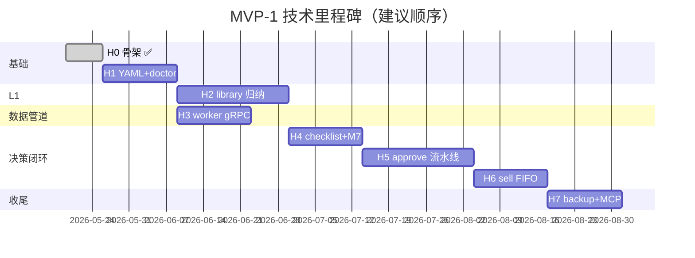

# 05 - MVP Roadmap

> 文档版本：v0.1（阶段 5 定稿 — MVP-1 H0–H7 排期与验收）
> 最后修订：2026-05-19
> 上一阶段：[04-技术架构](04-技术架构.md)（v0.6 定稿）
> 依赖文档：[01-产品定位与思路](01-产品定位与思路.md) · [02-核心场景与功能边界](02-核心场景与功能边界.md) · [03-数据架构与数据源](03-数据架构与数据源.md)

---

## 一、本阶段目标

阶段 1–4 已回答 **Why / What / How**。阶段 5 回答 **When & Done**：

1. MVP-1 / MVP-2 的边界与成功标准是什么？
2. 技术里程碑 **H0–H7**（及 MVP-2 的 H8+）如何排期、依赖关系如何？
3. 每个里程碑的 **验收清单** 是什么（可执行、可测试）？
4. 从 **H0（已完成）** 到 **MVP-1 可日常使用** 的最短路径是什么？

**本文档不重复** 02 的 Checklist 字段、03 的表结构、04 的分层细节；实现与验收须回查对应章节。

---

## 二、总览

### 2.1 两期与工期（继承 01 / 00 决策）

| 期 | 目标 | 建议工期 | 技术锚点 |
|---|---|---|---|
| **MVP-1** | 跑通 **研究 → 观察 → 建仓 → 持仓 → 卖出 → 复盘** 决策闭环；CLI + MCP 只读；AI 可辅助取数 | **13–17 周**（业余） | H0–H7 |
| **MVP-2A** | 叙事信号包 + 阶段强拦截 + 候选池自动扫描 | **+8–10 周** | H8–H11 |
| **MVP-2B** | Web 录入、FTS、机会成本、错误/错过模式扫描、推送 | **+7–11 周** | H12–H16 |
| **合计** | 完整 v0.5 产品愿景 | **约 28–38 周（7–9 月）** | — |

> **叙事子模块不进 MVP-1**（00 第六轮决策 2A）；MVP-1 工期不因 v0.5 叙事设计而膨胀。

### 2.2 里程碑时间线（MVP-1）



**并行说明**：H3 可与 H2 **部分并行**（H1 完成后即可启动 worker；library 与 snapshot 在 H5 汇合）。

### 2.3 当前进度

| 里程碑 | 状态 | 说明 |
|---|---|---|
| H0 | ✅ 完成 | `inv version`、`doctor --scope library`、migrations v1 |
| H1 | ✅ 完成 | portfolio + watchlist yamlstore、doctor 三 scope、字段字典 |
| H2 | ✅ 完成 | library CLI + tags + doctor library 扩展 |
| H3 | ✅ 完成 | data-worker gRPC + supervisor + CoreIngest |
| H4 | ✅ 完成 | checklist draft/submit + M7 + risk_exceptions |
| H5 | ✅ 完成 | approve 流水线：journal/lot/snapshot + portfolio/watchlist + sync_repairs |
| H6 | ✅ 完成 | sell + lot FIFO + lot_allocations + plan/set-payload CLI |
| H7 | ✅ 完成 | backup create/list/show/restore/prune + MCP 9 只读 tool + inv serve |

---

## 三、MVP-1 成功标准（Definition of Done）

满足 **全部** 下列条件，视为 MVP-1 可交付：

### 3.1 用户可完成的端到端路径

| # | 路径 | 最低验收 |
|---|---|---|
| E1 | **存量导入** → 持仓可见 | S0.5：`import` checklist → journal + lot + `portfolio.yaml`；`legacy_over_limit` 可标记 |
| E2 | **素材入库** → 可被决策引用 | 手动/爬取 → candidate → promote → `library_item`；Checklist 可填 `related_library_ids` |
| E3 | **观察池** → 复查 | watch checklist → `watchlist.yaml`；到期提示（CLI list 即可） |
| E4 | **建仓** → 持仓 + 流水 | buy checklist → M7 → approve → journal + snapshot + lot + yaml |
| E5 | **加仓** | add checklist → 新 lot → yaml 更新 |
| E6 | **巡检** → 报告 | inspect checklist → `inspection_record` + 可选 Markdown |
| E7 | **卖出** → lot 归因 | sell + FIFO 推荐 → 用户确认 → `lot_allocations` + yaml |
| E8 | **复盘** | review checklist → `review_report`；用户手填 `confirmed_patterns` |
| E9 | **备份恢复** | `inv backup create` → restore → `inv doctor --scope all` 通过 |
| E10 | **AI 协作** | Cursor 通过 MCP **9 个只读 tool** 取 portfolio / journal / library；**无**写 tool |

### 3.1.1 定量门槛（2026-05-22 Review 追加，见 [docs/06 §D2](06-架构Review决议.md)）

在 E1–E10 端到端路径之外，**追加以下定量门槛**。只要任一未达成，**不得**启动 MVP-2 任何里程碑。

| # | 指标 | 目标值 | 验收方式 |
|---|---|---|---|
| **Q1** | Journal 累计条数 | **≥ 20 笔**（buy/add/sell/inspect 至少各 1 笔） | `inv journal list` 计数 |
| **Q2** | 完整 quarter 复盘报告 | **≥ 1 份**，含用户手填 `confirmed_patterns` | `inv review` 输出 + 人工签收 |
| **Q3** | tier C/D 在"主要依据"占比 | **从初始未控降到 < 30%** | 复盘报告统计 |
| **Q4** | 风险护栏例外说明字数 | hard block 例外平均 ≥ 80 字（防"形同虚设"） | `inv risk exceptions stats`（H7 提供） |
| **Q5** | 完整 dogfood 周期 | **≥ 4 周**真实使用且未推翻 MVP-1 架构 | 用户书面确认 |

### 3.1.2 Dogfood 强制门禁（2026-05-22 Review 追加，见 [docs/06 §D4](06-架构Review决议.md)）

进入 MVP-2 任何里程碑前，**必须**完成一轮"真实历史交易 dogfood"：

1. **数据来源**：`docs/_baseline/02-当前持仓与个人逻辑.md` 中的真实持仓。
2. **路径**：完整跑通 import (S0.5) → S0 素材入库 → S4 巡检 → S6 复盘 至少一轮。
3. **失败标准**：用户走完后明确表达"不想再用 CLI 操作 / 流程过繁 / 价值未感知"。
4. **失败处置**：暂停 MVP-2，**回到 MVP-1 简化主路径而非加新功能**。优先简化最频繁动作（推断为 inspect / library add）。

### 3.2 非功能要求

| 项 | 标准 |
|---|---|
| AI 不可用 | 上述 E1–E9 均可纯 CLI 完成 |
| 数据一致性 | `inv doctor --scope all` 通过；`sync_repairs` 为空或已 resolved |
| 决策快照 | approve 后 `data_snapshots` 只读；L1 后续更新不回填 |
| 风险护栏 | r001–r005 默认启用；hard_block 须例外说明（02 §18） |
| 平台 | Windows 本机可运行（Go 免 CGO + Python worker） |
| 注释 | Go/Python/proto/SQL 简体中文注释（04 §二A） |

### 3.3 MVP-1 明确不做

继承 02 §十四，摘要：

- Web UI、叙事信号包（S7）、自动错误/错过模式扫描
- FTS5 全文检索、多源全自动爬虫
- 邮件/微信推送、机会成本深度归因
- Kratos HTTP、`cmd/ia-api`（MVP-2）
- MCP 写 tool、AI 填结论字段

---

## 四、MVP-1 技术里程碑 H0–H7

> 与 [04-技术架构 §十六](04-技术架构.md#十六mvp-1-实现顺序建议) 对齐；本节补充 **工期、依赖、验收清单、关联场景**。

### H0 — 骨架与迁移 ✅

| 项 | 内容 |
|---|---|
| **工期** | 1 周（已完成） |
| **交付** | `cmd/inv`、`AccountContext`、`migrations/001_initial`、`Makefile`、`doctor --scope library` |
| **依赖** | 阶段 4 定稿 |
| **验收** | `go build ./cmd/inv`；`inv doctor --scope library` → `schema_version=1` |

---

### H1 — YAML 读写与 portfolio doctor

| 项 | 内容 |
|---|---|
| **工期** | 2 周 |
| **交付** | `internal/core/store/yamlstore`；`portfolio` / `watchlist` / `candidates` / `risk_rules` / `personal_redlines` 读+原子写；`inv doctor --scope portfolio|watchlist`；`EnsureInitialized` 从 `config/*.example.yaml` 复制 |
| **依赖** | H0 |
| **关联** | 03 §十B；M1 状态机读 yaml |
| **验收清单** | |
| | ☐ 手改 `portfolio.yaml` 后 `inv doctor --scope portfolio` 报错（lot_ids 与 SQLite 不一致） |
| | ☐ 原子写：写中断不损坏原文件（tmp + rename） |
| | ☐ `schema_version` 不匹配时 doctor 明确报错 |
| | ☐ `decimal` 包引入，yaml 中 pct/price 读写不经 float 比较 |

---

### H2 — L1 归纳流水线

| 项 | 内容 |
|---|---|
| **工期** | 2–3 周 |
| **交付** | `inv library ingest|list|candidates|review|promote|dismiss`；`library_candidates` CRUD；dedup/similarity 简版；`inv tags` 受控标签；`doctor --scope library` 扩展 |
| **依赖** | H1（路径与 account） |
| **关联** | 03 §十C；S1 素材入库 |
| **验收清单** | |
| | ☐ 手动 ingest → candidate pending → promote → `library_item` + assets |
| | ☐ exact dedup 自动 dismiss |
| | ☐ supplement 合并 tags（tags:A） |
| | ☐ `merge` / `link-cluster` stub 返回明确「MVP-2」提示 |
| | ☐ 180 天 TTL → expired 状态（cron 或 `inv library prune`） |

---

### H3 — Python data-worker gRPC

| 项 | 内容 |
|---|---|
| **工期** | 2 周 |
| **交付** | `buf generate`；`services/data-worker` 实现 HealthCheck + FetchQuote + FetchValuation + FetchAnnouncements；Go `internal/worker` client + supervisor；`CoreIngest` 最小 server |
| **依赖** | H1（secrets 路径）；可与 H2 并行 |
| **关联** | 04 §二十一；03 §10D.7 P0 数据源 |
| **验收清单** | |
| | ☐ Windows：`inv` 首次 RPC 自动起 worker，`.run/worker.port` 可连 |
| | ☐ `FetchQuote("600519")` 返回结构化 JSON + tier A |
| | ☐ Python **不**读写 SQLite/YAML |
| | ☐ worker 崩溃 3 次内 supervisor 重启 |
| | ☐ `make proto` lint 通过 |

---

### H4 — Checklist draft / submit + M7

| 项 | 内容 |
|---|---|
| **工期** | 2 周 |
| **交付** | `inv checklist draft|submit|show|list`；七类 payload 校验；`domain/risk` 护栏模拟；`risk_exceptions` 预写；**不** approve |
| **依赖** | H1 + H3（snapshot 事实区可占位） |
| **关联** | 02 §十六；S2/S2a 建仓/加仓入口 |
| **验收清单** | |
| | ☑ buy checklist 缺 `initial_pct` submit 失败 |
| | ☑ C/D tier 缺 `tier_acknowledgement` submit 失败 |
| | ☑ 触发 hard_block 时 status=submitted 但 approve 门禁（H5 接） |
| | ☑ `emotion_tag` fomo/greedy/anxious → 二次确认文案 |
| | ☑ payload 持久化到 `checklist_submissions.payload_json` |

---

### H5 — Approve 流水线（核心）

| 项 | 内容 |
|---|---|
| **工期** | 2–3 周 |
| **交付** | `ApproveChecklist`（04 §二十）；buy/add/import → journal + snapshot + lot + yaml；inspect → inspection_record；review → review_report；watch → watchlist；`sync_repairs`；`id_sequences` |
| **依赖** | H4 + H3 + H2 |
| **关联** | E4/E5/E6/E8；03 §10B.7 同步矩阵 |
| **验收清单** | |
| | ☑ buy approve 后：SQLite journal + lot + yaml position 一致 |
| | ☑ snapshot 含 FetchQuote/Valuation 事实（tier 标注） |
| | ☑ yaml 写失败 → SQL 不回滚，`sync_repairs` 有记录，doctor 报错 |
| | ☑ approve 后 checklist.status=approved，`generated_journal_id` 回填 |
| | ☑ `inv doctor --scope all` 通过（空库或一致数据下） |
| | ☑ import + `legacy_over_limit` 路径（S0.5） |

---

### H6 — 卖出与 lot FIFO（Q4C）

| 项 | 内容 |
|---|---|
| **工期** | 1–2 周 |
| **交付** | sell checklist；`domain/lot` FIFO 推荐；TUI 确认/调整；`lot_allocations`；yaml 更新 closed/partial |
| **依赖** | H5 |
| **关联** | 03 §10A.7 Q4C；S5 卖出 |
| **验收清单** | |
| | ☑ 多 open lot 卖出：系统推荐 FIFO，用户可改 |
| | ☑ `lot_allocations.match_method` = recommended_fifo / user_adjusted |
| | ☑ 卖完后 lot.status=closed/partial，portfolio 同步 |
| | ☑ `realized_return_pct` 用 decimal 计算，单测覆盖 |

---

### H7 — 备份 + MCP 只读

| 项 | 内容 |
|---|---|
| **工期** | 2 周 |
| **交付** | `inv backup create|list|restore|prune`（03 §十D）；`inv mcp` + 9 tool（04 §二十二）；`inv serve` 可选常驻；scheduler 简版 daily crawl 入口 |
| **依赖** | H1–H6 |
| **关联** | E9/E10；O5 备份策略 |
| **验收清单** | |
| | ☑ lite backup 含 sqlite + state yaml + manifest.json |
| | ☑ restore 后 doctor 通过（须手动验证） |
| | ☑ Cursor 配置 `inv mcp` 可调 `get_portfolio`、`search_journal` |
| | ☑ `TestRegistry_ReadOnlyOnly` + `TestForbiddenWriteToolsNotEmpty` 通过 |
| | ☐ `library crawl`（公告）→ candidate 批量入库（**推迟 MVP-2**） |

---

## 五、场景 × 里程碑矩阵

| 场景 | 02 节 | MVP-1 里程碑 | 备注 |
|---|---|---|---|
| S0 被动发现 | §五 | H2 + H7 crawl | 简版公告列表 |
| S0.5 存量导入 | §5.x | H5 | import checklist |
| S1 素材入库 | §六 | H2 | |
| S2 建仓 | §七 | H4 + H5 | |
| S2a 加仓 | §7.x | H4 + H5 | |
| S3 监控/action_required | §八 | H7 简版 | 阈值 yaml + 事件表 |
| S4 巡检 | §九 | H5 | inspection_record |
| S5 卖出 | §十 | H6 | |
| S6 复盘 | §十一 | H5 | 无自动模式扫描 |
| S7 叙事 | §十二 | — | **MVP-2A** |
| M7 护栏 | §十八 | H4 + H5 | |

---

## 六、MVP-2 路线图（H8+ 概要）

> MVP-1 完成后再细化 v0.2；此处只定 **顺序与触发条件**，避免抢占 MVP-1 注意力。

### 6.1 触发条件

| 条件 | 动作 |
|---|---|
| MVP-1 E1–E10 全部通过 | 进入 MVP-2 规划细化 |
| 连续使用 MVP-1 ≥ 4 周 | 根据真实痛点调整 MVP-2 优先级 |
| 需要 PC Web / 小程序 | 启动 H8 `cmd/ia-api`（04 §十九） |

### 6.2 建议里程碑

| 里程碑 | 内容 | 工期 | 对应产品 |
|---|---|---|---|
| **H8** | Kratos `ia-api` 只读 GET + token 鉴权 | 2–3 周 | Web 壳 / 多端读 |
| **H9** | 叙事信号包六维 + `narrative_signals.yaml` | 3–4 周 | MVP-2A S7 |
| **H10** | `narrative_stage_assessment` 强拦截 | 1–2 周 | MVP-2A |
| **H11** | M6 候选池自动扫描 + overseas_peers | 2–3 周 | MVP-2A |
| **H12** | 简易 Web 录入（FTS5 视 H2 评估结果定，见 §3.1.1 / [docs/06 §D10](06-架构Review决议.md)） | 2–3 周 | MVP-2B |
| **H13** | 机会成本 + 回撤/集中度增强 | 2 周 | MVP-2B M7 |
| **H14** | 错误模式 + 叙事错过模式扫描 | 2–3 周 | MVP-2B M5 |
| **H15** | Checklist POST/approve API + SSE | 2–3 周 | MVP-2B Web 写 |
| **H16** | 推送（Server酱/邮件） | 1–2 周 | MVP-2B |

**MVP-2 成功标准（草案）**：S7 叙事全流程可用；Web 只读浏览 portfolio/library；至少一种推送 channel。

---

## 七、风险、缓冲与范围控制

| 风险 | 影响 | 缓解 |
|---|---|---|
| H5 approve 复杂度超预期 | +2–3 周 | 先 buy-only approve，再加 watch/inspect/review |
| akshare 接口变更 | H3/H7 阻塞 | pin 版本；snapshot 字段允许 partial |
| Windows worker 稳定性 | 数据采集 | supervisor + 降级「手动填 snapshot 事实」 |
| 范围膨胀（叙事/Web） | 工期失控 | 本文 §3.3 + 02 §十四；新需求先入 00 日志 |
| YAML/SQL 不一致 | 数据信任 | T5 sync_repairs + doctor 门禁；H5 前不写 yaml |
| 金融精度 | lot 归因错误 | T24 decimal；H1 引入 shopspring/decimal |

**缓冲建议**：MVP-1 排期按 **15 周** 做计划，留 **2 周** 集成与 dogfood。

---

## 八、编码起步顺序（H1 立即行动）

H0 已完成。推荐 **严格按序** 推进，避免跳过 doctor：

```text
H1  yamlstore + doctor(portfolio|watchlist)
  → H2  library CLI（可与 H3 并行启动 worker）
  → H3  gRPC worker
  → H4  checklist submit + M7
  → H5  approve（buy → 再扩展类型）
  → H6  sell FIFO
  → H7  backup + MCP
```

**H1 第一周任务拆分**：

1. `yamlstore.LoadPortfolio` / `SavePortfolio`（原子写）
2. `account.EnsureInitialized` 复制 example yaml
3. `inv doctor --scope portfolio`：lot_ids ↔ SQLite lots 交叉校验
4. `go.mod` 添加 `github.com/shopspring/decimal`

---

## 八点五、文档冻结与"不超前 2H"规则（2026-05-22 Review 追加，见 [docs/06 §D19](06-架构Review决议.md)）

为防止"文档完整度走在实现完整度的 7 倍之前"导致工期失控，自 H1 起执行以下纪律：

1. **冻结目标**：H1 结束前 **`docs/03` / `docs/04` 不再做细节字段或章节修改**。
2. **新需求处理**：H1–H5 期间任何新发现的字段需求、schema 调整、接口变更，**只在 `docs/00` 决策日志追加**，**不**回填 `docs/03 / 04`。
3. **回填时机**：H5 跑通后（buy approve 端到端 pass），统一回填 `docs/03 / 04` 并发布 v 次版本号。
4. **超前限制**：任何 docs/ 文件提到的功能 / 字段，**不得超前当前已完成的最高里程碑 + 2H**。
   - 例：当前 H1 进行中 → docs/ 可详写到 H3；H5+ 细节字段不许在此期间扩写。
5. **执行检查**：每个 H 完成验收时新增一项"文档同步检查"：
   - 是否有"未实现但已在 docs 中详写"的字段被引用到代码？
   - 若有，要么实现要么从 docs 删除，**不允许文档欠债**。
6. **唯一例外**：`docs/06`（Review 决议）与 `docs/00`（决策日志）可以超前——它们的职责就是记录未实现的决策。

---

## 九、文档与决策追溯

| 里程碑 | 权威文档 |
|---|---|
| Checklist 字段 | 02 §十六 |
| 表结构 / YAML | 03 §九 / §十A / §十B |
| 分层 / approve / MCP | 04 §二十 / §二十二 |
| 备份 / 数据源 | 03 §十D |
| 跨库类型 | 04 §10.4 |

关键排期决策追加至 [00-讨论历史与决策日志](00-讨论历史与决策日志.md)。

---

## 十、本文档变更日志

| 版本 | 日期 | 变更 |
|---|---|---|
| v0.1 | 2026-05-19 | 阶段 5 定稿：MVP-1 DoD、H0–H7 排期与验收、MVP-2 H8+ 概要、H1 起步指引。 |
