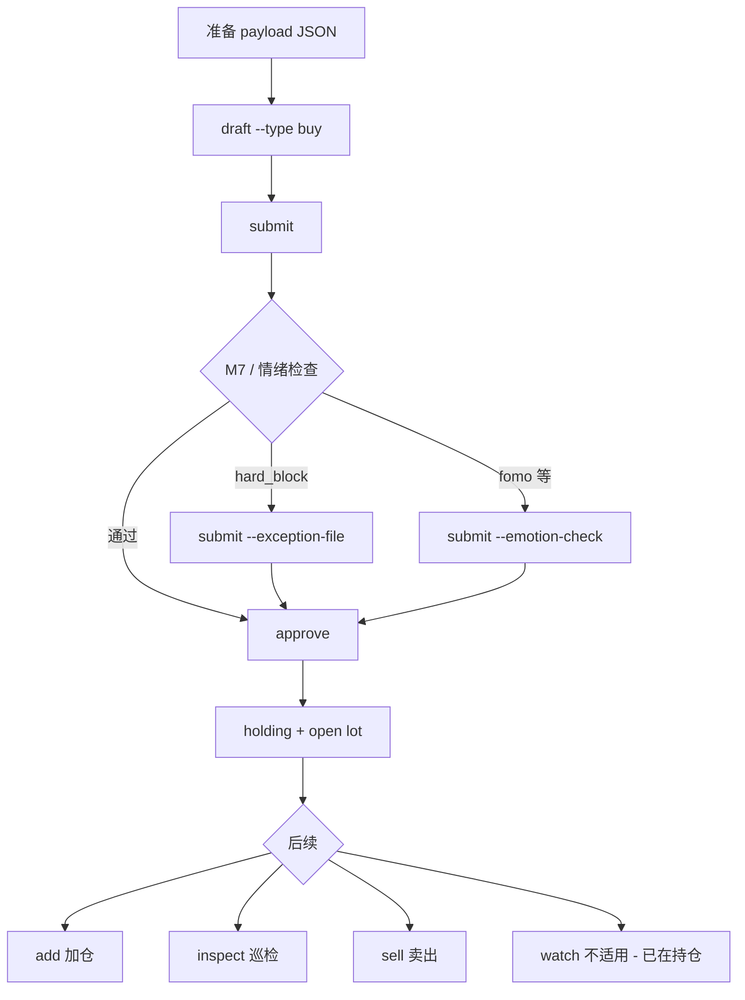
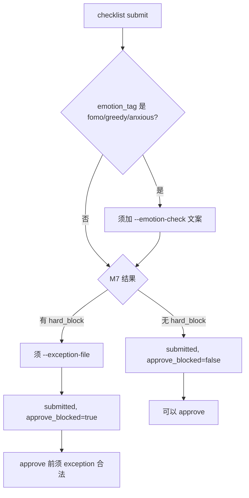

# 01 - 操作流程总览

> 目标：不看架构文档，也能知道「先做什么、再做什么、哪里会分叉」。  
> 总纲索引：[../07-接口与验证手册.md](../07-接口与验证手册.md)  
> 类型枚举详解：[ref-checklist-types.md](ref-checklist-types.md)

---

## 一、开始前（一次性）

```powershell
cd C:\Users\qs\Desktop\workspace\investment-assistant
go build -o bin/inv.exe ./cmd/inv
$env:DATA_ROOT = ".\data"
$env:IA_ACCOUNT_ID = "default"
$env:IA_CONFIG_ROOT = ".\config"
.\bin\inv.exe version
```

详见 [00-环境与快速开始.md](00-环境与快速开始.md)。

---

## 二、核心概念（30 秒）

```text
决策表单（Checklist）→ 风险检查（M7）→ 正式落库（approve）
     draft      →        submit       →       approve
```

| 阶段 | 命令 | 写入什么 |
|---|---|---|
| 填表 | `checklist draft` | SQLite `checklist_submissions`（status=draft） |
| 自检+风控 | `checklist submit` | status=submitted + M7 结果 |
| 记账 | `checklist approve` | journals / lots / portfolio.yaml 等 |

**本系统不联动券商**：买入/卖出成交价、股数在 payload 里**手动填写**（`execution_price`、`shares` / `sell_shares`）。`worker quote` 仅作参考。

---

## 三、主路径：首次建仓（最常用）

### 流程图



### 逐步操作

| 步 | 做什么 | 命令示例 |
|---|---|---|
| 0（可选） | 录入研究素材 | `inv library ingest …` → [H2](H2-library归纳流水线.md) |
| 0（可选） | 查参考现价 | `inv worker quote 600519` → [H3](H3-data-worker-gRPC.md) |
| 1 | 准备 JSON | 复制 [checklist-buy-600519.json](examples/checklist-buy-600519.json)，**填写 `execution_price` 和 `shares`** |
| 2 | 创建 draft | `.\bin\inv.exe checklist draft --type buy --code 600519 --name 贵州茅台 --file checklist-buy-600519.json` |
| 3 | 提交 + M7 | `.\bin\inv.exe checklist submit cs_YYYYMMDD_NNN` |
| 4 | 落库 | `.\bin\inv.exe checklist approve cs_YYYYMMDD_NNN` |
| 5 | 验收 | `.\bin\inv.exe doctor --scope portfolio` |

**预期**：approve 输出 journal id、lot id；`portfolio.yaml` 出现 `600519` holding。

详细参数与失败样例 → [H4](H4-checklist与M7.md) · [H5](H5-checklist-approve.md)

---

## 四、submit 分叉（所有 type 共用）



| 现象 | 原因 | 处理 |
|---|---|---|
| 要求 `--emotion-check` | payload 里 `emotion_tag` 为 fomo/greedy/anxious | 加一句自检文案重新 submit |
| 要求 `--exception-file` | M7 hard_block（如超 15% 单标的） | 用 [checklist-exception-hard.json](examples/checklist-exception-hard.json) 模板 |
| `approve_blocked=true` | 同上 | **仍可 submit**；approve 时会再校验 exception |
| payload 字段报错 | submit 才做完整校验 | 按 Error 补 JSON，必要时 `set-payload --file` 后重新 submit |

---

## 五、持仓后的分支

### 5.1 加仓 add

**前提**：该标的已在 portfolio **holding**。

```text
draft --type add → submit → approve
```

payload 须填：`linked_buy_journal_id`（首次 buy 的 journal id）、`execution_price`、`shares`、`add_pct`。

示例 JSON：[examples/checklist-add-600519.json](examples/checklist-add-600519.json)（须替换 `linked_buy_journal_id`）。

**误建了 buy checklist？** 不能改 type；先 `reject` 作废，再新建 add：

```powershell
.\bin\inv.exe checklist reject cs_YYYYMMDD_NNN --reason "误建 buy，改走 add"
.\bin\inv.exe checklist draft --type add --code 600519 --name 贵州茅台 --file docs\manual\examples\checklist-add-600519.json
```

---

### 5.2 卖出 sell

**前提**：有 open/partial lots。

```text
draft --type sell → submit → [plan 预览] → [可选 set-payload 调 plan] → approve
```

| 步 | 命令 | 说明 |
|---|---|---|
| 1 | `draft --type sell --file …` | 填 `sell_shares`、`execution_price` |
| 2 | `submit <cs_id>` | |
| 3 | `plan <cs_id>` | 可选；看 FIFO 如何分配 lot |
| 4 | `set-payload <cs_id> --file …` | 可选；改 `lot_allocation_plan` |
| 5 | `approve <cs_id>` | plan 为空则自动 FIFO |

详见 [H6-sell-FIFO.md](H6-sell-FIFO.md)。

---

### 5.3 巡检 inspect

**前提**：holding 中。

```text
draft --type inspect → submit → approve
```

不产生买卖；写入 `inspection_records`。若结论要行动 → 再走 add 或 sell。

---

### 5.4 复盘 review

```text
draft --type review → submit → approve
```

通常在 sell 之后或定期总结；写入 `review_reports`。

---

## 六、不买只观察：watch

```text
draft --type watch → submit → approve → watchlist.yaml
```

之后决定买入 → 走 **第三节** buy 流程（与 watch 条目独立）。

---

## 七、存量导入：import

```text
draft --type import → submit → approve
```

一次性迁移历史持仓；日常交易**不要**走 import，用 buy/add/sell。

---

## 八、命令与手册对照

| 你想… | `--type` | 手册 |
|---|---|---|
| 第一次买入 | buy | H4 → H5 |
| 加仓 | add | H4 → H5 |
| 卖出 | sell | H4 → H6 |
| 先看着不买 | watch | H4 → H5 |
| 持仓检查 | inspect | H4 → H5 |
| 写复盘 | review | H4 → H5 |
| 导入旧仓 | import | H4 → H5 |

**类型枚举完整说明** → [ref-checklist-types.md](ref-checklist-types.md)

---

## 九、5 分钟 smoke test（复制即用）

```powershell
# 1. 建仓
Copy-Item docs\manual\examples\checklist-buy-600519.json .\smoke-buy.json
# 编辑 smoke-buy.json：改 execution_price、shares 为你的实际值
.\bin\inv.exe checklist draft --type buy --code 600519 --name 贵州茅台 --file smoke-buy.json
# 记下输出的 cs_id
.\bin\inv.exe checklist submit cs_YYYYMMDD_001
.\bin\inv.exe checklist approve cs_YYYYMMDD_001
.\bin\inv.exe doctor --scope portfolio

# 2. 查看
.\bin\inv.exe checklist list --status approved --type buy
```

---

## 十、常见问题

| 问题 | 答案 |
|---|---|
| draft 后数据在哪？ | SQLite `checklist_submissions`，不在 `state/` 目录 |
| 价格和股数填哪？ | payload 的 `execution_price`、`shares`（sell 用 `sell_shares`） |
| submit 和 approve 区别？ | submit=风控门禁；approve=真正写入账本 |
| 能否跳过 submit 直接 approve？ | 不能；必须 submitted |
| 卖的时候 lot 怎么选？ | 默认 FIFO；`plan` 预览后可手动改 plan |
